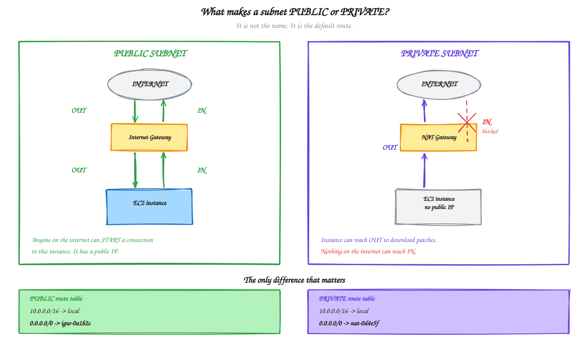
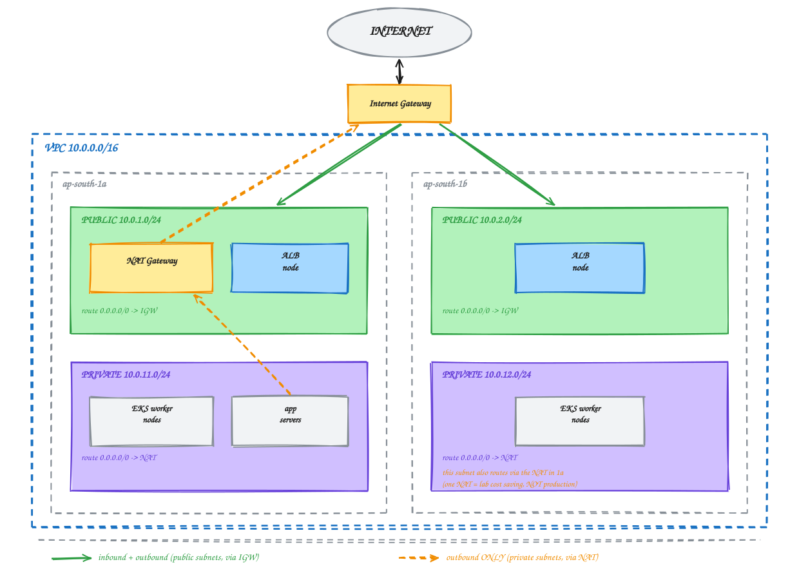

# Module 01 — AWS Networking Recap

**Duration:** 45 minutes
**You will finish this module with:** a clear picture of the network every later module runs inside, and two reusable scripts that build and destroy it in minutes.

---

## Context

Think about what happens when you pay for a Zomato order through PhonePe.

Your phone talks to a public endpoint. That endpoint talks to an order service. The order service talks to a payment service. The payment service talks to a database holding transaction records.

Now ask a simple question: which of those should be reachable from the open internet?

Exactly one. The public endpoint.

The database holding payment records must not have a public IP address at all. Not a firewalled one, not one protected by a strong password — none. If a component has no route from the internet, an attacker on the internet cannot reach it regardless of what software it is running or what vulnerabilities it has.

That is the single idea underneath everything in this module. AWS networking is not a topic you learn to pass a certification. It is the mechanism by which you decide what is reachable and what is not, and every architecture diagram you will ever draw is fundamentally a statement about reachability.

### Why this module exists

You have already worked through VPCs, subnets, CIDR, route tables, internet gateways, and NAT gateways on the AWS console. This module does not re-teach that from zero.

It does three things instead.

It fixes the **exact** network topology this workshop needs, so that when something breaks in Module 03 or Module 09, we are all debugging the same network.

It moves you from clicking to scripting. What took twenty minutes of console work yesterday will take four minutes and one command today — and that shift, from manually created infrastructure to reproducible infrastructure, is a small preview of the argument this entire workshop is making.

And it explains two design decisions that only make sense in hindsight: why we need **two** availability zones, and why the subnets carry strange-looking tags.

---

## Concept

### Rapid recall

Quick definitions to re-anchor. If any of these feel unfamiliar, flag it now rather than in Module 09.

| Term | What it is |
|---|---|
| **Region** | A geographic location — `ap-south-1` is Mumbai |
| **Availability Zone** | An isolated datacenter within a region — `ap-south-1a`, `ap-south-1b` |
| **VPC** | Your private, isolated network inside AWS |
| **CIDR** | The address range of that network — `10.0.0.0/16` gives you 65,536 addresses |
| **Subnet** | A slice of the VPC range, living in exactly one AZ |
| **Route table** | Rules deciding where traffic goes, attached to subnets |
| **Default route** | `0.0.0.0/0` — where anything not matching a more specific rule is sent |
| **Internet Gateway** | Lets a subnet send traffic to, and receive traffic from, the internet |
| **NAT Gateway** | Lets private instances reach out to the internet, but not be reached |
| **Security group** | A stateful firewall attached to an instance |

### The only rule that defines "public"

A subnet is public if, and only if, its route table has a `0.0.0.0/0` route pointing to an Internet Gateway.

That is it. Not the name. Not the CIDR block. Not a checkbox called "public". A subnet named `private-subnet-1` with a default route to an IGW is a public subnet, and it will happily expose whatever you put in it.

This is worth being blunt about because subnet misconfiguration is one of the most common ways databases end up on the public internet.

### IGW vs NAT — the direction matters

Both give internet access. They differ in who can start the conversation.

**Internet Gateway** is two-way. Traffic can go out, and traffic can come in. An instance in a subnet routed to an IGW, holding a public IP, is reachable by anyone in the world.

**NAT Gateway** is one-way. An instance in a private subnet can call out — download an OS patch, pull a package, reach an AWS API — but nothing on the internet can start a connection inward. The NAT gateway itself sits in a public subnet and does the talking on the instance's behalf.

That is why a private EC2 instance with no public IP can still run `yum update`. The traffic leaves through NAT. Nothing comes back in uninvited.



<sub>Editable source: [`02-igw-vs-nat.excalidraw`](./diagrams/excalidraw/02-igw-vs-nat.excalidraw)</sub>

### The network we are building



<sub>Editable source: [`01-vpc-topology.excalidraw`](./diagrams/excalidraw/01-vpc-topology.excalidraw) — open it at [excalidraw.com](https://excalidraw.com) via File → Open.</sub>

Four subnets, two AZs, one IGW, one NAT gateway, two route tables.

### Why two availability zones

This is not padding, and it is not optional.

An Application Load Balancer requires subnets in **at least two AZs**. AWS enforces this at creation time. If you build a single-AZ VPC, Module 03 fails immediately and the error message will not obviously say "you needed another subnet."

EKS has the same requirement for the same reason — the control plane places its endpoints across AZs, and worker nodes spread across them.

The underlying logic is worth internalising. An availability zone is a real datacenter, and real datacenters lose power, connectivity, and cooling. Netflix and Hotstar do not run in one AZ. Anything you would be upset about losing runs in at least two, and AWS builds that assumption into the services themselves.

### Why one NAT gateway (and why that is a compromise)

Production would put a NAT gateway in **each** AZ. If the AZ containing your only NAT gateway fails, every private instance in every AZ loses outbound internet.

We are using one, in `ap-south-1a`, because NAT gateways are among the more expensive things in this workshop and a lab is not production. Know that this is a deliberate cost trade-off, not the pattern to copy into a real environment.

### The strange subnet tags

The build script tags subnets like this:

```
Public subnets:   kubernetes.io/role/elb          = 1
Private subnets:  kubernetes.io/role/internal-elb = 1
```

These do nothing today. They matter in Module 12.

When the AWS Load Balancer Controller creates an ALB for a Kubernetes Ingress, it has to decide which subnets to place it in. It finds them by looking for exactly these tags. Without them, Ingress creation fails with a subnet discovery error that gives you very little to work with.

Tagging now costs nothing and saves a confusing debugging session eight modules from now.

### Security groups, briefly

A security group is a stateful firewall attached to an instance or load balancer. Stateful means that if you allow traffic in, the reply is automatically allowed out — you do not write return rules.

The pattern we will use from Module 02 onward is chaining. The ALB's security group allows port 80 from the world. The instance security group allows port 8080 **from the ALB's security group**, not from a CIDR range. That way the instances are reachable by the load balancer and by nothing else, and it stays true even when instance IPs change.

We create those in Module 02, where they have something to protect.

---

## Lab 01 — Build the Workshop Network

**Time:** 25 minutes
**Goal:** create the full VPC from the CLI, verify that public and private routing behave differently, and produce two scripts you will reuse for the rest of the workshop.

This lab is self-contained. Every AWS object it creates is destroyed at the end. The two scripts it produces are files on your machine, and those you keep.

### Step 1 — Set your region and confirm identity

```bash
export AWS_REGION=ap-south-1
aws configure set region $AWS_REGION
aws sts get-caller-identity
```

Use the same region as your instructor. Every later module assumes this value.

### Step 2 — Create a place for infrastructure scripts

```bash
mkdir -p ~/workshop-app/infra
cd ~/workshop-app/infra
```

### Step 3 — Create the network build script

Read this script before you run it. Every command in it maps to something you did on the console yesterday.

```bash
cat > ~/workshop-app/infra/create-network.sh << 'EOF'
#!/usr/bin/env bash
set -euo pipefail

REGION="${AWS_REGION:-ap-south-1}"
AZ_A="${REGION}a"
AZ_B="${REGION}b"
NAME="workshop"

echo ">>> Region: $REGION"

# ---------- VPC ----------
VPC_ID=$(aws ec2 create-vpc \
  --cidr-block 10.0.0.0/16 \
  --region "$REGION" \
  --tag-specifications "ResourceType=vpc,Tags=[{Key=Name,Value=${NAME}-vpc}]" \
  --query 'Vpc.VpcId' --output text)

aws ec2 modify-vpc-attribute --vpc-id "$VPC_ID" --enable-dns-hostnames --region "$REGION"
aws ec2 modify-vpc-attribute --vpc-id "$VPC_ID" --enable-dns-support   --region "$REGION"
echo ">>> VPC: $VPC_ID"

# ---------- Internet Gateway ----------
IGW_ID=$(aws ec2 create-internet-gateway \
  --region "$REGION" \
  --tag-specifications "ResourceType=internet-gateway,Tags=[{Key=Name,Value=${NAME}-igw}]" \
  --query 'InternetGateway.InternetGatewayId' --output text)

aws ec2 attach-internet-gateway --vpc-id "$VPC_ID" --internet-gateway-id "$IGW_ID" --region "$REGION"
echo ">>> IGW: $IGW_ID"

# ---------- Subnets ----------
create_subnet () {
  local cidr=$1 az=$2 name=$3
  aws ec2 create-subnet \
    --vpc-id "$VPC_ID" --cidr-block "$cidr" --availability-zone "$az" \
    --region "$REGION" \
    --tag-specifications "ResourceType=subnet,Tags=[{Key=Name,Value=$name}]" \
    --query 'Subnet.SubnetId' --output text
}

PUB_A=$(create_subnet 10.0.1.0/24  "$AZ_A" "${NAME}-public-1a")
PUB_B=$(create_subnet 10.0.2.0/24  "$AZ_B" "${NAME}-public-1b")
PRIV_A=$(create_subnet 10.0.11.0/24 "$AZ_A" "${NAME}-private-1a")
PRIV_B=$(create_subnet 10.0.12.0/24 "$AZ_B" "${NAME}-private-1b")

# Auto-assign public IPs in public subnets
aws ec2 modify-subnet-attribute --subnet-id "$PUB_A" --map-public-ip-on-launch --region "$REGION"
aws ec2 modify-subnet-attribute --subnet-id "$PUB_B" --map-public-ip-on-launch --region "$REGION"

# Tags required by the AWS Load Balancer Controller in Module 12
aws ec2 create-tags --region "$REGION" --resources "$PUB_A" "$PUB_B" \
  --tags Key=kubernetes.io/role/elb,Value=1
aws ec2 create-tags --region "$REGION" --resources "$PRIV_A" "$PRIV_B" \
  --tags Key=kubernetes.io/role/internal-elb,Value=1

echo ">>> Public : $PUB_A  $PUB_B"
echo ">>> Private: $PRIV_A $PRIV_B"

# ---------- NAT Gateway ----------
EIP_ALLOC=$(aws ec2 allocate-address --domain vpc --region "$REGION" \
  --tag-specifications "ResourceType=elastic-ip,Tags=[{Key=Name,Value=${NAME}-nat-eip}]" \
  --query 'AllocationId' --output text)

NAT_ID=$(aws ec2 create-nat-gateway \
  --subnet-id "$PUB_A" --allocation-id "$EIP_ALLOC" --region "$REGION" \
  --tag-specifications "ResourceType=natgateway,Tags=[{Key=Name,Value=${NAME}-nat}]" \
  --query 'NatGateway.NatGatewayId' --output text)

echo ">>> NAT $NAT_ID provisioning (this takes 1-2 minutes)..."
aws ec2 wait nat-gateway-available --nat-gateway-ids "$NAT_ID" --region "$REGION"
echo ">>> NAT ready"

# ---------- Route tables ----------
PUB_RT=$(aws ec2 create-route-table --vpc-id "$VPC_ID" --region "$REGION" \
  --tag-specifications "ResourceType=route-table,Tags=[{Key=Name,Value=${NAME}-public-rt}]" \
  --query 'RouteTable.RouteTableId' --output text)

aws ec2 create-route --route-table-id "$PUB_RT" \
  --destination-cidr-block 0.0.0.0/0 --gateway-id "$IGW_ID" --region "$REGION" >/dev/null

aws ec2 associate-route-table --route-table-id "$PUB_RT" --subnet-id "$PUB_A" --region "$REGION" >/dev/null
aws ec2 associate-route-table --route-table-id "$PUB_RT" --subnet-id "$PUB_B" --region "$REGION" >/dev/null

PRIV_RT=$(aws ec2 create-route-table --vpc-id "$VPC_ID" --region "$REGION" \
  --tag-specifications "ResourceType=route-table,Tags=[{Key=Name,Value=${NAME}-private-rt}]" \
  --query 'RouteTable.RouteTableId' --output text)

aws ec2 create-route --route-table-id "$PRIV_RT" \
  --destination-cidr-block 0.0.0.0/0 --nat-gateway-id "$NAT_ID" --region "$REGION" >/dev/null

aws ec2 associate-route-table --route-table-id "$PRIV_RT" --subnet-id "$PRIV_A" --region "$REGION" >/dev/null
aws ec2 associate-route-table --route-table-id "$PRIV_RT" --subnet-id "$PRIV_B" --region "$REGION" >/dev/null

echo ">>> Public RT : $PUB_RT  (0.0.0.0/0 -> IGW)"
echo ">>> Private RT: $PRIV_RT (0.0.0.0/0 -> NAT)"

# ---------- Save everything ----------
cat > ~/workshop-app/infra/network.env << VARS
export AWS_REGION=$REGION
export VPC_ID=$VPC_ID
export IGW_ID=$IGW_ID
export PUB_SUBNET_A=$PUB_A
export PUB_SUBNET_B=$PUB_B
export PRIV_SUBNET_A=$PRIV_A
export PRIV_SUBNET_B=$PRIV_B
export NAT_ID=$NAT_ID
export EIP_ALLOC=$EIP_ALLOC
export PUB_RT=$PUB_RT
export PRIV_RT=$PRIV_RT
VARS

echo ""
echo ">>> Network ready. IDs saved to ~/workshop-app/infra/network.env"
EOF

chmod +x ~/workshop-app/infra/create-network.sh
```

### Step 4 — Run it

```bash
~/workshop-app/infra/create-network.sh
```

Roughly three minutes, most of it waiting on the NAT gateway.

```bash
source ~/workshop-app/infra/network.env
cat ~/workshop-app/infra/network.env
```

That `source` line is how every later module picks up these IDs.

### Step 5 — Verify from the CLI

Confirm all four subnets exist in the right AZs:

```bash
aws ec2 describe-subnets \
  --filters "Name=vpc-id,Values=$VPC_ID" \
  --query 'Subnets[].{Name:Tags[?Key==`Name`]|[0].Value,CIDR:CidrBlock,AZ:AvailabilityZone,PublicIP:MapPublicIpOnLaunch}' \
  --output table
```

Now the part that actually matters — compare the two route tables:

```bash
echo "--- PUBLIC route table ---"
aws ec2 describe-route-tables --route-table-ids $PUB_RT \
  --query 'RouteTables[0].Routes[].{Dest:DestinationCidrBlock,Gateway:GatewayId,NAT:NatGatewayId}' \
  --output table

echo "--- PRIVATE route table ---"
aws ec2 describe-route-tables --route-table-ids $PRIV_RT \
  --query 'RouteTables[0].Routes[].{Dest:DestinationCidrBlock,Gateway:GatewayId,NAT:NatGatewayId}' \
  --output table
```

Both have a local route for `10.0.0.0/16`, which is what lets any instance talk to any other instance inside the VPC — that is what makes Module 02's private IP call work.

Both have a `0.0.0.0/0` default route. One points at `igw-...`, the other at `nat-...`.

**That single difference is the entire distinction between public and private.** Everything else is naming convention.

### Step 6 — Confirm the Load Balancer Controller tags

```bash
aws ec2 describe-subnets \
  --filters "Name=vpc-id,Values=$VPC_ID" \
  --query 'Subnets[].{Name:Tags[?Key==`Name`]|[0].Value,ELB:Tags[?Key==`kubernetes.io/role/elb`]|[0].Value,IntELB:Tags[?Key==`kubernetes.io/role/internal-elb`]|[0].Value}' \
  --output table
```

Public subnets show `1` under ELB. Private subnets show `1` under IntELB. Module 12 depends on this.

### Step 7 — Verify in the console

Open the VPC console and find `workshop-vpc`. Click through to Resource Map.

You are looking at the same objects you built by hand yesterday. The difference is that this one took one command and is identical on every machine in the room — which is a very small taste of the argument that runs through the rest of this workshop.

### Step 8 — Write the teardown script

```bash
cat > ~/workshop-app/infra/delete-network.sh << 'EOF'
#!/usr/bin/env bash
set -uo pipefail

source ~/workshop-app/infra/network.env
REGION="${AWS_REGION:-ap-south-1}"

echo ">>> Deleting NAT gateway $NAT_ID ..."
aws ec2 delete-nat-gateway --nat-gateway-id "$NAT_ID" --region "$REGION" >/dev/null
aws ec2 wait nat-gateway-deleted --nat-gateway-ids "$NAT_ID" --region "$REGION"

echo ">>> Releasing Elastic IP ..."
aws ec2 release-address --allocation-id "$EIP_ALLOC" --region "$REGION"

echo ">>> Detaching and deleting IGW ..."
aws ec2 detach-internet-gateway --internet-gateway-id "$IGW_ID" --vpc-id "$VPC_ID" --region "$REGION"
aws ec2 delete-internet-gateway --internet-gateway-id "$IGW_ID" --region "$REGION"

echo ">>> Deleting subnets ..."
for S in "$PUB_SUBNET_A" "$PUB_SUBNET_B" "$PRIV_SUBNET_A" "$PRIV_SUBNET_B"; do
  aws ec2 delete-subnet --subnet-id "$S" --region "$REGION"
done

echo ">>> Deleting route tables ..."
aws ec2 delete-route-table --route-table-id "$PUB_RT"  --region "$REGION"
aws ec2 delete-route-table --route-table-id "$PRIV_RT" --region "$REGION"

echo ">>> Deleting VPC ..."
aws ec2 delete-vpc --vpc-id "$VPC_ID" --region "$REGION"

rm -f ~/workshop-app/infra/network.env
echo ">>> Network destroyed."
EOF

chmod +x ~/workshop-app/infra/delete-network.sh
```

The order in that script is not arbitrary. AWS refuses to delete anything that still has a dependency, so the NAT gateway must go before its Elastic IP, the IGW must be detached before deletion, and everything inside the VPC must go before the VPC itself. Getting this order wrong is the usual reason a teardown script fails halfway through and leaves you billing for an orphaned NAT gateway.

### Step 9 — Tear it down

```bash
~/workshop-app/infra/delete-network.sh
```

Confirm nothing is left:

```bash
aws ec2 describe-vpcs \
  --query 'Vpcs[?Tags[?Value==`workshop-vpc`]].VpcId' --output text
```

Empty output means clean.

Also confirm no Elastic IP is stranded, since an unattached EIP bills continuously:

```bash
aws ec2 describe-addresses --query 'Addresses[].{IP:PublicIp,Assoc:AssociationId}' --output table
```

### Step 10 — Keep the scripts

```bash
ls -l ~/workshop-app/infra/
```

You should have `create-network.sh` and `delete-network.sh`. Every module from here begins by running the first and ends by running the second.

---

## What you built

A four-subnet, two-AZ VPC with correct public and private routing, reproducible in one command and destroyable in another.

## The idea to carry forward

| Question | Answer |
|---|---|
| What makes a subnet public? | A `0.0.0.0/0` route to an Internet Gateway. Nothing else. |
| How does a private instance patch itself? | Outbound through NAT. Nothing comes back in uninvited. |
| Why two AZs? | ALB requires it. EKS requires it. Datacenters fail. |
| Why tag the subnets? | Module 12's Ingress controller finds subnets by tag. |
| Why script it? | Twenty minutes of clicking became four minutes and one command — identical every time. |

That last row is the quiet theme of this workshop. Every module from here replaces something manual and unrepeatable with something automatic and identical.

---

**Next:** [Module 02 — EC2 Hosting and Manual Deployment](./02-ec2-hosting-manual-deployment.md)
