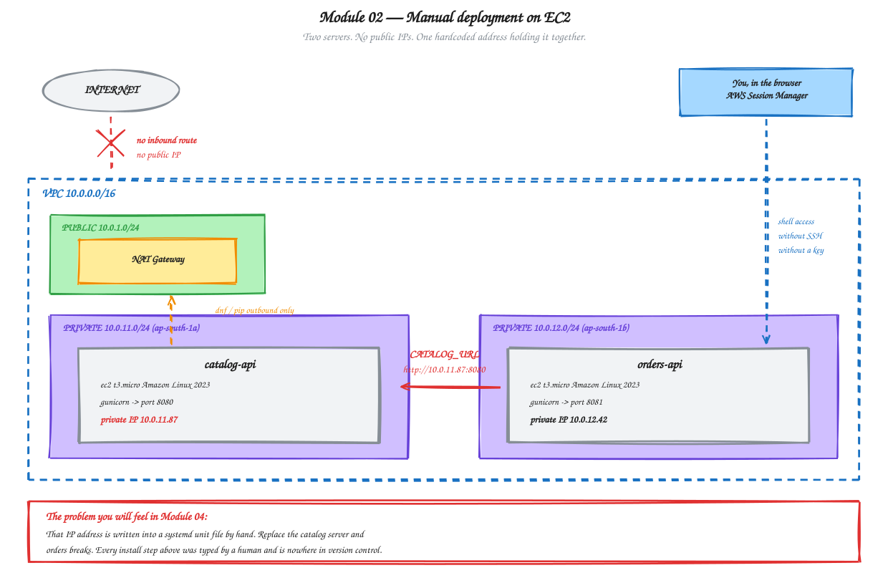

# Module 02 — EC2 Hosting and Manual Deployment

**Duration:** 60 minutes
**You will finish this module with:** both services running on two separate EC2 instances in private subnets, talking to each other over the VPC, deployed entirely by hand.

---

## Context

In 2014, deploying a service at almost any company looked like this.

Someone raised a ticket for a server. A few days later they got an IP address and an SSH key. They logged in, installed the runtime, copied a tarball of the application, wrote an init script, started it, and updated a wiki page describing what they had done — usually a week later, usually incompletely.

When traffic grew, they did it again on a second server. When the two servers behaved differently, somebody spent an afternoon finding out that server one had a slightly older library than server two, because they were built three months apart.

This was not incompetence. This was the state of the art, and enormous, successful platforms were built this way.

Today you are going to do exactly that. Deliberately, carefully, and by hand.

Do it properly and pay attention to how it feels, because the argument for everything in the rest of this workshop is built out of the friction you are about to experience. If we skipped straight to Kubernetes, you would learn the commands without ever understanding what they replaced.

### What we are building

Two instances, each running one service, both in **private** subnets with no public IP address at all.

`catalog-api` on port 8080 in `ap-south-1a`. `orders-api` on port 8081 in `ap-south-1b`. Orders calls catalog across the VPC using a private IP address that you will type in by hand.

Nothing is reachable from the internet at the end of this module. That is intentional — Module 03 adds the load balancer, and it will be the only door in.



<sub>Editable source: [`03-ec2-manual-deployment.excalidraw`](./diagrams/excalidraw/03-ec2-manual-deployment.excalidraw)</sub>

---

## Concept

### Why the servers have no public IP

Every EC2 instance you launch with a public IP is a machine on the open internet. It will be port-scanned within minutes of launching. Everything running on it is exposed to anyone who finds an open port.

An application server has no reason to be there. It only ever needs to receive traffic from a load balancer and send traffic to other internal services. Both of those live inside your VPC.

So we put the instances in private subnets. No public IP, no route in from the internet. In Module 03 the ALB sits in the public subnets and forwards to them, which means the load balancer is the single, controlled entry point — and the only thing you have to defend.

This is standard practice at any company handling real user data. PhonePe's payment processing servers are not sitting on public IPs.

### Then how do you log in?

This is the question everyone asks, and there are three answers.

**A bastion host** — one hardened public server you SSH into, and from there SSH onward to the private machines. This is what you practised yesterday. It works, but it means a permanently exposed server plus SSH key distribution.

**AWS Systems Manager Session Manager** — the instance runs an agent that makes an *outbound* connection to the AWS SSM service. When you click "Connect" in the console, AWS brokers a shell session over that existing outbound channel. No inbound port opens. No SSH key exists. No bastion is needed.

**Neither, in a mature setup** — you do not log into servers at all, because everything is automated. That is where this workshop ends up.

We are using Session Manager today. It is genuinely more secure than a bastion, it works in the browser so you have nothing to install, and it requires the NAT gateway you built in Module 01 to reach the SSM endpoints — which makes yesterday's work visibly useful.

### Security group chaining

A security group is a stateful firewall. Allow traffic in, and the reply is automatically permitted out.

The naive approach is to allow port 8080 from `10.0.0.0/16` — anything in the VPC. It works, and it is lazy. Any compromised instance anywhere in your VPC can then reach your catalog service.

The better approach is to reference **another security group** as the source:

```
catalog-sg   allows TCP 8080   FROM   orders-sg
```

This says "only instances carrying the orders security group may reach port 8080 here." It stays correct when instances are replaced and IPs change, and it stays correct when you add ten more instances. In Module 03 we extend the same pattern so the ALB's security group becomes the only permitted source of external traffic.

### systemd, and why not just run the command

Start `gunicorn` in an SSH session and it dies the moment your session closes. Start it with `nohup` and it survives that, but not a reboot, and nothing restarts it if it crashes.

A systemd unit gives you four things: it starts on boot, it restarts on failure, it captures logs into `journalctl`, and it holds environment variables in a defined place.

Pay attention to that last one. The address of the catalog service is going to live in a systemd unit file, typed in by hand, on a server. Remember where it is.

### The hardcoded IP

`orders-api` needs to reach `catalog-api`. Today it does that with a private IP address you read off the console and paste into a file.

This works. It is also the single most fragile thing in this module.

If the catalog instance is stopped and started, the private IP can change. If it is replaced, it certainly changes. If you scale to two catalog instances, there is no second address to put in the file. And the value is recorded nowhere except inside a text file on one server.

Watch for this. Solving it properly is what Kubernetes Services do in Module 11, and the shape of the problem is easier to see now than the shape of the solution will be then.

---

## Lab 02 — Deploy Both Services by Hand

**Time:** 40 minutes

This lab is self-contained. It builds the network, creates every AWS object it needs, and tears everything down at the end.

Everything in Steps 2 to 6 is done in the **AWS Console**, so you can see each object being created.

### Step 1 — Build the network

If your network from Module 01 is already up, skip to Step 2. Otherwise:

```bash
export AWS_REGION=ap-south-1
~/workshop-app/infra/create-network.sh
source ~/workshop-app/infra/network.env
```

Takes about three minutes, mostly waiting on the NAT gateway.

Confirm what you have:

```bash
echo "VPC:      $VPC_ID"
echo "Private:  $PRIV_SUBNET_A  $PRIV_SUBNET_B"
```

### Step 2 — Create the IAM role for Session Manager (console)

Without this role, the SSM agent on the instance cannot register with AWS and the Connect button will be greyed out.

1. Open the **IAM** console → **Roles** → **Create role**
2. Trusted entity type: **AWS service**
3. Use case: **EC2** → **Next**
4. In the permissions search box, type `AmazonSSMManagedInstanceCore` and tick it → **Next**
5. Role name: `workshop-ec2-ssm-role`
6. **Create role**

That single AWS-managed policy is all that is needed. Do not attach anything broader.

### Step 3 — Create the security groups (console)

Open the **VPC** console → **Security groups** → **Create security group**.

**Security group 1 — orders**

| Field | Value |
|---|---|
| Name | `workshop-orders-sg` |
| Description | `orders-api service` |
| VPC | `workshop-vpc` |

Leave inbound rules empty for now. Leave the default outbound rule alone — the instance needs it to reach the NAT gateway for package installs.

Click **Create security group**, then copy the resulting `sg-...` ID.

**Security group 2 — catalog**

| Field | Value |
|---|---|
| Name | `workshop-catalog-sg` |
| Description | `catalog-api service` |
| VPC | `workshop-vpc` |

Add **one inbound rule**:

| Type | Protocol | Port | Source |
|---|---|---|---|
| Custom TCP | TCP | 8080 | `workshop-orders-sg` |

For the Source field, choose **Custom** and start typing `sg-` — the console will offer your security groups by name. Pick `workshop-orders-sg`.

Read that rule out loud before moving on: *port 8080 is reachable only by instances carrying the orders security group.* Not by the VPC. Not by a CIDR range. By one specific group.

Click **Create security group**.

### Step 4 — Launch the catalog-api instance (console)

**EC2** console → **Instances** → **Launch instances**.

| Setting | Value |
|---|---|
| Name | `catalog-api` |
| AMI | **Amazon Linux 2023** (the default, free tier eligible) |
| Instance type | `t3.micro` |
| Key pair | **Proceed without a key pair** |

Then open **Network settings** → **Edit**:

| Setting | Value |
|---|---|
| VPC | `workshop-vpc` |
| Subnet | `workshop-private-1a` |
| Auto-assign public IP | **Disable** |
| Firewall | **Select existing security group** → `workshop-catalog-sg` |

Then open **Advanced details** and set:

| Setting | Value |
|---|---|
| IAM instance profile | `workshop-ec2-ssm-role` |

Launch it.

Pause on two of those choices. You selected **no key pair**, which means no SSH key exists for this machine anywhere in the world. And you **disabled** the public IP, which means it has no address on the internet. Both are deliberate.

### Step 5 — Launch the orders-api instance (console)

Repeat, with these differences:

| Setting | Value |
|---|---|
| Name | `orders-api` |
| Subnet | `workshop-private-1b` |
| Security group | `workshop-orders-sg` |
| Everything else | Same as Step 4 |

Different AZ, deliberately. These two services are in separate datacenters and will still talk to each other over the VPC's local route.

### Step 6 — Record the private IPs

In the EC2 console instance list, add the **Private IPv4 address** column if it is not showing, and write both down.

| Instance | Private IP |
|---|---|
| catalog-api | `10.0.11.___` |
| orders-api | `10.0.12.___` |

You are about to type the catalog IP into a file by hand. That act is the point of this module.

### Step 7 — Connect to catalog-api

Select the `catalog-api` instance → **Connect** → **Session Manager** tab → **Connect**.

If the button is greyed out, wait sixty seconds and refresh. The agent needs a moment to register, and it registers by calling *out* through your NAT gateway. If it is still greyed out after two minutes, see Troubleshooting at the end.

A shell opens in your browser. You are on a machine with no public IP, no open inbound ports, and no SSH key. Note that you land as `ssm-user`.

```bash
sudo su -
hostname -I
```

That address should match what you wrote down.

### Step 8 — Install the runtime

```bash
dnf update -y
dnf install -y python3 python3-pip
python3 --version
```

Those packages are coming down through the NAT gateway. The instance can reach out; nothing can reach in.

### Step 9 — Deploy the catalog application

```bash
mkdir -p /opt/catalog-api
cd /opt/catalog-api
```

```bash
cat > /opt/catalog-api/app.py << 'EOF'
from flask import Flask, jsonify
import os, socket

app = Flask(__name__)

SERVICE_NAME = "catalog-api"
VERSION = os.getenv("APP_VERSION", "1.0.0")

PRODUCTS = {
    1: {"id": 1, "name": "Wireless Earbuds",    "price": 2499,  "stock": 120},
    2: {"id": 2, "name": "Mechanical Keyboard", "price": 5999,  "stock": 34},
    3: {"id": 3, "name": "27 inch Monitor",     "price": 18999, "stock": 12},
    4: {"id": 4, "name": "USB-C Hub",           "price": 3499,  "stock": 87},
}

def meta():
    return {
        "service": SERVICE_NAME,
        "version": VERSION,
        "served_by": socket.gethostname(),
    }

@app.route("/health")
def health():
    return jsonify(status="ok", **meta()), 200

@app.route("/products")
def products():
    return jsonify(products=list(PRODUCTS.values()), **meta())

@app.route("/products/<int:pid>")
def product(pid):
    p = PRODUCTS.get(pid)
    if not p:
        return jsonify(error="not found", **meta()), 404
    return jsonify(product=p, **meta())

if __name__ == "__main__":
    app.run(host="0.0.0.0", port=8080)
EOF
```

Install the dependencies into a virtual environment:

```bash
python3 -m venv /opt/catalog-api/venv
/opt/catalog-api/venv/bin/pip install --quiet flask==3.0.3 gunicorn==22.0.0
/opt/catalog-api/venv/bin/gunicorn --version
```

### Step 10 — Create the systemd unit

```bash
cat > /etc/systemd/system/catalog-api.service << 'EOF'
[Unit]
Description=catalog-api
After=network.target

[Service]
Type=simple
User=root
WorkingDirectory=/opt/catalog-api
Environment="APP_VERSION=1.0.0"
ExecStart=/opt/catalog-api/venv/bin/gunicorn --bind 0.0.0.0:8080 --workers 2 app:app
Restart=always
RestartSec=3

[Install]
WantedBy=multi-user.target
EOF
```

```bash
systemctl daemon-reload
systemctl enable --now catalog-api
systemctl status catalog-api --no-pager
```

You want to see `active (running)`.

### Step 11 — Test catalog locally

```bash
curl -s http://localhost:8080/health
curl -s http://localhost:8080/products
curl -s http://localhost:8080/products/2
```

Note the `served_by` value — it is the instance's internal hostname. Module 03 uses that field as proof of load balancing.

Now confirm `Restart=always` actually works:

```bash
pkill gunicorn
sleep 4
systemctl status catalog-api --no-pager | head -5
curl -s http://localhost:8080/health
```

It came back on its own. Systemd noticed the process died and restarted it.

**This is real self-healing, and it is worth naming.** systemd will restart a *process* on *this* machine. It cannot help you if the machine itself dies, if the disk fills, or if the AZ goes offline. Module 08 is where that limit starts to matter.

Leave this shell open and open a second browser tab for the next step.

### Step 12 — Connect to orders-api and install

Select the `orders-api` instance → **Connect** → **Session Manager** → **Connect**.

```bash
sudo su -
dnf install -y python3 python3-pip
mkdir -p /opt/orders-api
```

```bash
cat > /opt/orders-api/app.py << 'EOF'
from flask import Flask, jsonify
import os, socket, requests

app = Flask(__name__)

SERVICE_NAME = "orders-api"
VERSION = os.getenv("APP_VERSION", "1.0.0")
CATALOG_URL = os.getenv("CATALOG_URL", "http://localhost:8080")

ORDERS = [
    {"order_id": "ORD-1001", "product_id": 1, "qty": 2, "status": "DELIVERED"},
    {"order_id": "ORD-1002", "product_id": 3, "qty": 1, "status": "IN_TRANSIT"},
    {"order_id": "ORD-1003", "product_id": 2, "qty": 1, "status": "PLACED"},
]

def meta():
    return {
        "service": SERVICE_NAME,
        "version": VERSION,
        "served_by": socket.gethostname(),
        "catalog_url": CATALOG_URL,
    }

@app.route("/health")
def health():
    return jsonify(status="ok", **meta()), 200

@app.route("/orders")
def orders():
    enriched = []
    for o in ORDERS:
        item = dict(o)
        try:
            r = requests.get(f"{CATALOG_URL}/products/{o['product_id']}", timeout=2)
            if r.status_code == 200:
                p = r.json()["product"]
                item["product_name"] = p["name"]
                item["unit_price"] = p["price"]
                item["line_total"] = p["price"] * o["qty"]
            else:
                item["product_name"] = "UNKNOWN"
        except Exception as e:
            item["product_name"] = "CATALOG_UNAVAILABLE"
            item["error"] = str(e.__class__.__name__)
        enriched.append(item)
    return jsonify(orders=enriched, **meta())

if __name__ == "__main__":
    app.run(host="0.0.0.0", port=8081)
EOF
```

```bash
python3 -m venv /opt/orders-api/venv
/opt/orders-api/venv/bin/pip install --quiet flask==3.0.3 gunicorn==22.0.0 requests==2.32.3
```

### Step 13 — The hardcoded address

Set the catalog IP you wrote down in Step 6:

```bash
CATALOG_IP=10.0.11.87        # <-- REPLACE with YOUR catalog-api private IP
echo "Using catalog at $CATALOG_IP"
```

Before wiring it into the service, prove the network path works:

```bash
curl -s --max-time 5 http://$CATALOG_IP:8080/health
```

If that returns JSON, three separate things just worked: the VPC local route carried traffic across two availability zones, the catalog security group accepted the connection **because this instance carries the orders security group**, and gunicorn answered.

If it hangs, that is almost always the security group. Check Step 3.

Now write the unit file with that address baked in:

```bash
cat > /etc/systemd/system/orders-api.service << EOF
[Unit]
Description=orders-api
After=network.target

[Service]
Type=simple
User=root
WorkingDirectory=/opt/orders-api
Environment="APP_VERSION=1.0.0"
Environment="CATALOG_URL=http://$CATALOG_IP:8080"
ExecStart=/opt/orders-api/venv/bin/gunicorn --bind 0.0.0.0:8081 --workers 2 app:app
Restart=always
RestartSec=3

[Install]
WantedBy=multi-user.target
EOF
```

Note the heredoc marker here is `EOF` without quotes, unlike everywhere else in this workshop. That is what allows `$CATALOG_IP` to be expanded by the shell as the file is written. Everywhere else we use `<<'EOF'` precisely to prevent that.

```bash
systemctl daemon-reload
systemctl enable --now orders-api
grep CATALOG /etc/systemd/system/orders-api.service
```

**Look at that line.** A specific IP address, for a specific machine, written into a file on a different machine. Nothing else in the world knows it is there.

### Step 14 — Test the full path

```bash
curl -s http://localhost:8081/health
curl -s http://localhost:8081/orders
```

You should see product names and line totals — resolved live, across two availability zones, from a service with no public IP.

Both services are deployed. The application works.

### Step 15 — Break it on purpose

In your **catalog-api** shell:

```bash
systemctl stop catalog-api
```

In your **orders-api** shell:

```bash
curl -s http://localhost:8081/orders
```

`CATALOG_UNAVAILABLE`, exactly as it did on your laptop in Module 00 — except now the failure is spread across two datacenters and nobody is watching for it.

Ask yourself: how would you have found out? There is no alert, no health check, no dashboard. The only way anyone learns is a customer complaining.

Restart it:

```bash
systemctl start catalog-api        # on the catalog instance
curl -s http://localhost:8081/orders   # on the orders instance
```

### Step 16 — Count what you did

Before tearing down, count honestly.

Roughly forty manual steps. Two console wizards. Two shells. Two package installs. Two unit files. One IP address transcribed by hand.

Now answer these:

- How long to deploy a bug fix? (Log into two servers, edit files, restart.)
- How long to add a third catalog server? (Repeat everything, then find every place the IP is written.)
- What happens if `orders-api` reboots and comes back with a different IP? (Nothing breaks — but do the same for catalog and orders is down.)
- Where is the record of what you installed? (Your terminal scrollback.)
- If a colleague built the same thing tomorrow, would it be identical? (No.)

None of these are hypothetical problems. They are the reason the next several modules exist.

### Step 17 — Tear down

**EC2 console** → select both instances → **Instance state** → **Terminate instance**. Wait until both show `Terminated`.

**VPC console** → **Security groups** → delete `workshop-catalog-sg` and `workshop-orders-sg`. Delete catalog first; if the console refuses, the instances are not fully terminated yet.

**IAM console** → **Roles** → delete `workshop-ec2-ssm-role`.

Then destroy the network:

```bash
~/workshop-app/infra/delete-network.sh
```

Verify nothing is left billing:

```bash
aws ec2 describe-instances \
  --filters "Name=instance-state-name,Values=running,pending,stopping,stopped" \
  --query 'Reservations[].Instances[].{ID:InstanceId,Name:Tags[?Key==`Name`]|[0].Value}' --output table

aws ec2 describe-addresses --query 'Addresses[].PublicIp' --output text
```

Both should be empty.

**If you are continuing straight to Module 03, skip this step.** Module 03 uses these exact instances.

---

## Troubleshooting

**Session Manager Connect button is greyed out.**
The instance cannot reach the SSM service. Check three things: the IAM instance profile is attached (EC2 → instance → Security tab), the instance is in a subnet whose route table points `0.0.0.0/0` at your NAT gateway, and the outbound security group rule still allows all traffic. Then wait — registration can take two to three minutes after launch.

**`curl` to the catalog IP hangs.**
Almost always the security group. Confirm the catalog inbound rule has source `workshop-orders-sg`, not a CIDR block, and confirm the orders instance actually carries `workshop-orders-sg`.

**`dnf install` hangs or times out.**
No route to the internet. The NAT gateway is missing, still provisioning, or the private route table is not associated with the subnet.

**`systemctl status` shows `activating (auto-restart)` in a loop.**
The app is crashing on start. Run `journalctl -u catalog-api -n 50 --no-pager` for the traceback. Usually a typo in the heredoc or a missing package in the venv.

---

## What you built

Two services on two servers in two availability zones, privately networked, self-restarting, and completely invisible from the internet.

## What is still wrong with it

| Problem | Where you saw it | Fixed in |
|---|---|---|
| No public entry point at all | Nothing is reachable | Module 03 |
| Catalog's IP hardcoded in a unit file | Step 13 | Module 11 |
| Every install typed by hand, recorded nowhere | Steps 8–13 | Module 06 |
| Two servers built separately will drift apart | Steps 9 and 12 | Module 04 |
| A dead instance means an outage nobody notices | Step 15 | Module 10 |
| Adding a server means repeating everything | Step 16 | Module 04 |

---

**Next:** [Module 03 — Load Balancing with ALB and NLB](./03-load-balancing-alb-nlb.md)
