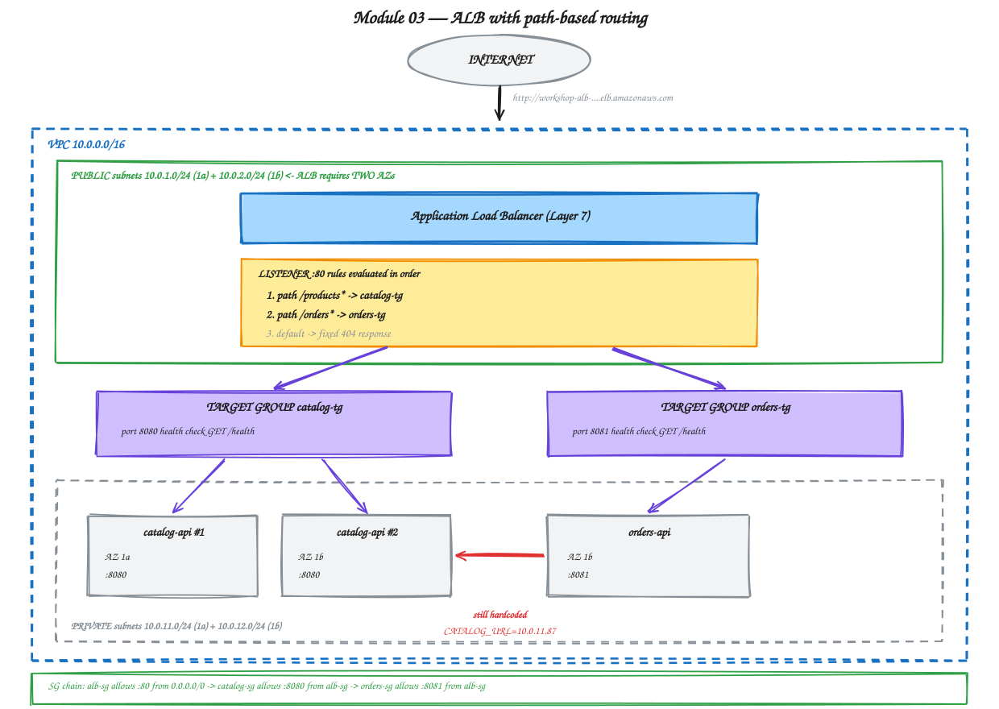

# Module 03 — Load Balancing with ALB and NLB

**Duration:** 70 minutes
**You will finish this module with:** a publicly reachable application, path-based routing across two services, three instances behind health-checked target groups, and a working understanding of when to reach for an ALB versus an NLB.

---

## Context

At the end of Module 02 you had two servers running an application that nobody outside the VPC could reach. That is a safe place to be, but it is not a product.

There is an obvious fix: give the servers public IPs and hand those out. Now think about what that actually means.

Zomato does not publish an IP address. When a restaurant listing page loads, your phone resolves one hostname, and behind that hostname there might be forty servers, some of which were replaced twenty minutes ago. When one of them fails a health check it stops receiving traffic within seconds, and no customer sees an error. When traffic climbs on a Friday evening, more servers appear behind the same hostname and nothing about the app on your phone changes.

None of that is possible if clients talk to servers directly. The moment you publish a server's address, that server can never be replaced without breaking someone.

A load balancer is what breaks that coupling. It gives you one stable, public address, and behind it a set of servers that can come and go freely. Everything else it does — health checking, routing, TLS termination — follows from that one idea.

Today you build it by hand, on the console, so that when an Ingress creates one for you in Module 12 you know exactly what appeared and why.

---

## Concept

### The three load balancer types

AWS gives you three, and one of them you should ignore.

**Application Load Balancer (ALB)** operates at Layer 7. It understands HTTP, which means it can read the path, the hostname, the headers, and the method, and make routing decisions from them. It terminates TLS, supports WebSockets and HTTP/2, and can send different URLs to different sets of servers. This is what you want for essentially all web traffic.

**Network Load Balancer (NLB)** operates at Layer 4. It knows about TCP and UDP and nothing else — it cannot see a URL because it never parses the request. In exchange it is extremely fast, handles millions of connections, adds almost no latency, and can hold a static IP address per availability zone.

**Classic Load Balancer (CLB)** is the 2009 original. AWS keeps it running for old accounts. Do not use it for anything new.

### Choosing between ALB and NLB

The question is not "which is better." It is "does the routing decision require reading the request?"

| Use ALB when | Use NLB when |
|---|---|
| Routing by URL path or hostname | Traffic is not HTTP — MQTT, databases, game protocols |
| Terminating HTTPS certificates | You need a fixed IP address to give a partner for firewall allow-listing |
| Different services behind one domain | You need extreme throughput with minimal added latency |
| You want request-level logging | You must preserve the client IP without HTTP headers |

Concretely: Hotstar's web and API traffic goes through Layer 7 load balancing, because `/api/playback` and `/api/search` are different backends. A payment gateway integration where a bank whitelists your source IP wants an NLB, because ALB IP addresses change and NLB IPs do not.

We build an ALB today, because our routing decision is `/products` versus `/orders`, and that decision requires reading the URL.

### Target groups

A target group is a named set of backends plus the rules for checking them.

It holds a protocol and port, a list of registered targets, and a health check configuration. Load balancers do not point at instances. They point at target groups, and target groups point at instances. That indirection is what lets you swap the backend set without touching the load balancer.

A target group has one job that matters more than routing: **deciding which targets are allowed to receive traffic**.

### Health checks

The load balancer calls a URL on every registered target on a fixed interval. Respond with a 200 and you stay in rotation. Fail enough consecutive checks and you are marked unhealthy and removed — traffic stops flowing to you within seconds, automatically, at 3 AM, with nobody watching.

Defaults are roughly a 30 second interval, a 5 second timeout, 5 consecutive successes to be healthy and 2 failures to be unhealthy. For a lab that is slow, so we will tighten it to see the transitions live.

This is the first genuinely automatic recovery mechanism in this workshop. In Module 02, when you stopped the catalog service, the only detection mechanism was a human noticing. Today, the platform notices.

Note carefully what it does **not** do. It removes a broken server from rotation. It does not fix it, replace it, or start a new one. That gap is what Module 10 fills.

### Listeners and rules

A listener watches a port — 80 or 443 — and holds an ordered list of rules. Each rule has a condition and an action.

Rules are evaluated **in order**, and the first match wins. The last rule is always the default action, which catches everything that matched nothing.

Our rules:

```
1.  path  /products*   ->  forward to catalog-tg
2.  path  /orders*     ->  forward to orders-tg
3.  default            ->  fixed 404 response
```

### One thing that surprises everyone: ALB does not rewrite paths

If a request arrives for `/products/2`, the ALB forwards `/products/2` to the backend. It does not strip the matched prefix.

This means a rule like `/catalog/*` sending traffic to a service that only serves `/products` will match at the load balancer and then 404 at the application. People lose real time to this.

Our path patterns are chosen to match what the applications actually serve — `catalog-api` serves `/products`, `orders-api` serves `/orders` — so no rewriting is needed. If you genuinely need to rewrite a path, that is a job for Nginx, CloudFront, or an Ingress controller, not for an ALB.

### Why the ALB needs two subnets in two AZs

AWS enforces this at creation time. An ALB is not one machine — it is a set of nodes, one per AZ you enable, and the DNS name resolves to all of them. If one AZ fails, the remaining nodes keep serving.

This is why Module 01 built four subnets instead of two.



<sub>Editable source: [`04-alb-path-routing.excalidraw`](./diagrams/excalidraw/04-alb-path-routing.excalidraw)</sub>

---

## Lab 03 — Build the Load Balancer

**Time:** 50 minutes

Steps 2 onward are done in the **AWS Console**.

### Step 1 — Prerequisites

**If you have just finished Module 02 and your instances are still running, skip to Step 2.**

If you are starting fresh, this script rebuilds the entire Module 02 state — network, IAM role, security groups, and both instances with the applications installed and running. It takes about six minutes.

```bash
cat > ~/workshop-app/infra/bootstrap-module02.sh << 'SCRIPT'
#!/usr/bin/env bash
set -euo pipefail
REGION="${AWS_REGION:-ap-south-1}"

echo ">>> Building network..."
~/workshop-app/infra/create-network.sh
source ~/workshop-app/infra/network.env

echo ">>> Creating IAM role for Session Manager..."
aws iam create-role --role-name workshop-ec2-ssm-role \
  --assume-role-policy-document '{"Version":"2012-10-17","Statement":[{"Effect":"Allow","Principal":{"Service":"ec2.amazonaws.com"},"Action":"sts:AssumeRole"}]}' >/dev/null 2>&1 || true
aws iam attach-role-policy --role-name workshop-ec2-ssm-role \
  --policy-arn arn:aws:iam::aws:policy/AmazonSSMManagedInstanceCore >/dev/null 2>&1 || true
aws iam create-instance-profile --instance-profile-name workshop-ec2-ssm-role >/dev/null 2>&1 || true
aws iam add-role-to-instance-profile --instance-profile-name workshop-ec2-ssm-role \
  --role-name workshop-ec2-ssm-role >/dev/null 2>&1 || true
sleep 12

echo ">>> Creating security groups..."
ORDERS_SG=$(aws ec2 create-security-group --group-name workshop-orders-sg \
  --description "orders-api" --vpc-id "$VPC_ID" --region "$REGION" --query GroupId --output text)
CATALOG_SG=$(aws ec2 create-security-group --group-name workshop-catalog-sg \
  --description "catalog-api" --vpc-id "$VPC_ID" --region "$REGION" --query GroupId --output text)
aws ec2 authorize-security-group-ingress --group-id "$CATALOG_SG" \
  --protocol tcp --port 8080 --source-group "$ORDERS_SG" --region "$REGION" >/dev/null

AMI=$(aws ssm get-parameters --names /aws/service/ami-amazon-linux-latest/al2023-ami-kernel-default-x86_64 \
  --region "$REGION" --query 'Parameters[0].Value' --output text)

echo ">>> Launching catalog-api..."
cat > /tmp/catalog-userdata.sh << 'UD'
#!/bin/bash
dnf install -y python3 python3-pip
mkdir -p /opt/catalog-api
cat > /opt/catalog-api/app.py << 'PYEOF'
from flask import Flask, jsonify
import os, socket
app = Flask(__name__)
VERSION = os.getenv("APP_VERSION", "1.0.0")
PRODUCTS = {
    1: {"id": 1, "name": "Wireless Earbuds",    "price": 2499,  "stock": 120},
    2: {"id": 2, "name": "Mechanical Keyboard", "price": 5999,  "stock": 34},
    3: {"id": 3, "name": "27 inch Monitor",     "price": 18999, "stock": 12},
    4: {"id": 4, "name": "USB-C Hub",           "price": 3499,  "stock": 87},
}
def meta():
    return {"service": "catalog-api", "version": VERSION, "served_by": socket.gethostname()}
@app.route("/health")
def health(): return jsonify(status="ok", **meta()), 200
@app.route("/products")
def products(): return jsonify(products=list(PRODUCTS.values()), **meta())
@app.route("/products/<int:pid>")
def product(pid):
    p = PRODUCTS.get(pid)
    if not p: return jsonify(error="not found", **meta()), 404
    return jsonify(product=p, **meta())
PYEOF
python3 -m venv /opt/catalog-api/venv
/opt/catalog-api/venv/bin/pip install flask==3.0.3 gunicorn==22.0.0
cat > /etc/systemd/system/catalog-api.service << 'SVCEOF'
[Unit]
Description=catalog-api
After=network.target
[Service]
WorkingDirectory=/opt/catalog-api
ExecStart=/opt/catalog-api/venv/bin/gunicorn --bind 0.0.0.0:8080 --workers 2 app:app
Restart=always
[Install]
WantedBy=multi-user.target
SVCEOF
systemctl daemon-reload && systemctl enable --now catalog-api
UD

CAT_ID=$(aws ec2 run-instances --image-id "$AMI" --instance-type t3.micro \
  --subnet-id "$PRIV_SUBNET_A" --security-group-ids "$CATALOG_SG" \
  --iam-instance-profile Name=workshop-ec2-ssm-role \
  --user-data file:///tmp/catalog-userdata.sh --region "$REGION" \
  --tag-specifications 'ResourceType=instance,Tags=[{Key=Name,Value=catalog-api}]' \
  --query 'Instances[0].InstanceId' --output text)

aws ec2 wait instance-running --instance-ids "$CAT_ID" --region "$REGION"
CAT_IP=$(aws ec2 describe-instances --instance-ids "$CAT_ID" --region "$REGION" \
  --query 'Reservations[0].Instances[0].PrivateIpAddress' --output text)
echo ">>> catalog-api at $CAT_IP"

echo ">>> Launching orders-api..."
sed -e "s|__CATALOG_IP__|$CAT_IP|" > /tmp/orders-userdata.sh << 'UD'
#!/bin/bash
dnf install -y python3 python3-pip
mkdir -p /opt/orders-api
cat > /opt/orders-api/app.py << 'PYEOF'
from flask import Flask, jsonify
import os, socket, requests
app = Flask(__name__)
VERSION = os.getenv("APP_VERSION", "1.0.0")
CATALOG_URL = os.getenv("CATALOG_URL", "http://localhost:8080")
ORDERS = [
    {"order_id": "ORD-1001", "product_id": 1, "qty": 2, "status": "DELIVERED"},
    {"order_id": "ORD-1002", "product_id": 3, "qty": 1, "status": "IN_TRANSIT"},
    {"order_id": "ORD-1003", "product_id": 2, "qty": 1, "status": "PLACED"},
]
def meta():
    return {"service": "orders-api", "version": VERSION,
            "served_by": socket.gethostname(), "catalog_url": CATALOG_URL}
@app.route("/health")
def health(): return jsonify(status="ok", **meta()), 200
@app.route("/orders")
def orders():
    out = []
    for o in ORDERS:
        i = dict(o)
        try:
            r = requests.get(f"{CATALOG_URL}/products/{o['product_id']}", timeout=2)
            if r.status_code == 200:
                p = r.json()["product"]
                i["product_name"] = p["name"]; i["unit_price"] = p["price"]
                i["line_total"] = p["price"] * o["qty"]
            else: i["product_name"] = "UNKNOWN"
        except Exception as e:
            i["product_name"] = "CATALOG_UNAVAILABLE"; i["error"] = str(e.__class__.__name__)
        out.append(i)
    return jsonify(orders=out, **meta())
PYEOF
python3 -m venv /opt/orders-api/venv
/opt/orders-api/venv/bin/pip install flask==3.0.3 gunicorn==22.0.0 requests==2.32.3
cat > /etc/systemd/system/orders-api.service << SVCEOF
[Unit]
Description=orders-api
After=network.target
[Service]
WorkingDirectory=/opt/orders-api
Environment="CATALOG_URL=http://__CATALOG_IP__:8080"
ExecStart=/opt/orders-api/venv/bin/gunicorn --bind 0.0.0.0:8081 --workers 2 app:app
Restart=always
[Install]
WantedBy=multi-user.target
SVCEOF
systemctl daemon-reload && systemctl enable --now orders-api
UD

ORD_ID=$(aws ec2 run-instances --image-id "$AMI" --instance-type t3.micro \
  --subnet-id "$PRIV_SUBNET_B" --security-group-ids "$ORDERS_SG" \
  --iam-instance-profile Name=workshop-ec2-ssm-role \
  --user-data file:///tmp/orders-userdata.sh --region "$REGION" \
  --tag-specifications 'ResourceType=instance,Tags=[{Key=Name,Value=orders-api}]' \
  --query 'Instances[0].InstanceId' --output text)

cat >> ~/workshop-app/infra/network.env << VARS
export CATALOG_SG=$CATALOG_SG
export ORDERS_SG=$ORDERS_SG
export CAT_ID=$CAT_ID
export ORD_ID=$ORD_ID
export CAT_IP=$CAT_IP
VARS

echo ">>> Done. Applications take ~2 more minutes to finish installing."
SCRIPT

chmod +x ~/workshop-app/infra/bootstrap-module02.sh
~/workshop-app/infra/bootstrap-module02.sh
source ~/workshop-app/infra/network.env
```

### Step 2 — Create the ALB security group (console)

**VPC** console → **Security groups** → **Create security group**.

| Field | Value |
|---|---|
| Name | `workshop-alb-sg` |
| Description | `public entry point` |
| VPC | `workshop-vpc` |

Inbound rule:

| Type | Protocol | Port | Source |
|---|---|---|---|
| HTTP | TCP | 80 | `0.0.0.0/0` |

Leave outbound as the default allow-all. Create it, and note the `sg-` ID.

This is the only security group in the entire workshop that accepts traffic from the internet. Everything else accepts traffic only from another security group.

### Step 3 — Let the ALB reach the instances (console)

The instances currently accept nothing from the load balancer. Fix both.

**Security groups** → select `workshop-catalog-sg` → **Inbound rules** → **Edit inbound rules** → **Add rule**:

| Type | Protocol | Port | Source |
|---|---|---|---|
| Custom TCP | TCP | 8080 | `workshop-alb-sg` |

Keep the existing rule allowing 8080 from `workshop-orders-sg`. Catalog now has two permitted sources: the load balancer and the orders service.

**Save**, then select `workshop-orders-sg` → **Edit inbound rules** → **Add rule**:

| Type | Protocol | Port | Source |
|---|---|---|---|
| Custom TCP | TCP | 8081 | `workshop-alb-sg` |

Save.

Notice what you did not do: you never typed an IP address. The rules reference groups, so they stay correct when instances are replaced.

### Step 4 — Create the catalog target group (console)

**EC2** console → **Target groups** (left menu, under Load Balancing) → **Create target group**.

| Field | Value |
|---|---|
| Target type | **Instances** |
| Name | `catalog-tg` |
| Protocol / Port | HTTP / **8080** |
| VPC | `workshop-vpc` |
| Protocol version | HTTP1 |

Under **Health checks**:

| Field | Value |
|---|---|
| Health check protocol | HTTP |
| Health check path | `/health` |

Expand **Advanced health check settings** and tighten them so you can watch state changes live:

| Field | Value |
|---|---|
| Healthy threshold | 2 |
| Unhealthy threshold | 2 |
| Timeout | 5 seconds |
| Interval | 10 seconds |
| Success codes | 200 |

**Next**. On the registration page, select the `catalog-api` instance, confirm the port shows 8080, click **Include as pending below**, then **Create target group**.

### Step 5 — Create the orders target group (console)

Same again, with:

| Field | Value |
|---|---|
| Name | `orders-tg` |
| Port | **8081** |
| Health check path | `/health` |
| Same advanced settings | 2 / 2 / 5s / 10s |
| Register | the `orders-api` instance |

### Step 6 — Create the Application Load Balancer (console)

**EC2** console → **Load balancers** → **Create load balancer** → **Application Load Balancer**.

| Field | Value |
|---|---|
| Name | `workshop-alb` |
| Scheme | **Internet-facing** |
| IP address type | IPv4 |
| VPC | `workshop-vpc` |
| Mappings | Tick **both** AZs, selecting `workshop-public-1a` and `workshop-public-1b` |
| Security group | `workshop-alb-sg` — **remove the default group** |
| Listener | HTTP : 80 → forward to `catalog-tg` |

Try selecting only one AZ before you fix it. The console blocks you, and now you know why Module 01 built four subnets.

**Create load balancer.** Provisioning takes two to three minutes.

### Step 7 — Watch the health checks turn green

While the ALB provisions, open **Target groups** → `catalog-tg` → **Targets** tab.

The instance starts as `unhealthy` with the reason `Health checks failed`. That is expected — the target group was only just created and needs two consecutive successes at ten second intervals.

Refresh. Within about thirty seconds it flips to **healthy**.

You just watched the platform independently verify that your application works. Nobody logged into anything.

Check `orders-tg` as well.

### Step 8 — First request through the load balancer

Copy the ALB's **DNS name** from the load balancer's Details tab. It looks like `workshop-alb-123456789.ap-south-1.elb.amazonaws.com`.

```bash
export ALB=workshop-alb-123456789.ap-south-1.elb.amazonaws.com   # <-- your DNS name

curl -s http://$ALB/health
curl -s http://$ALB/products
```

Your application is now on the public internet — served from instances that have no public IP address, no SSH key, and no inbound route of their own.

Try the orders path:

```bash
curl -s http://$ALB/orders
```

It returns catalog data, not orders. The listener currently forwards **everything** to `catalog-tg`. Step 9 fixes that.

### Step 9 — Add path-based routing (console)

**Load balancers** → `workshop-alb` → **Listeners and rules** tab → click the `HTTP:80` listener → **Add rule**.

**Rule 1:**

| Field | Value |
|---|---|
| Name | `products-route` |
| Condition | **Path** → `/products*` |
| Action | **Forward to target groups** → `catalog-tg` |
| Priority | 10 |

**Rule 2:**

| Field | Value |
|---|---|
| Name | `orders-route` |
| Condition | **Path** → `/orders*` |
| Action | **Forward to target groups** → `orders-tg` |
| Priority | 20 |

Now change the **default action**. Edit the listener's default rule and change it from forwarding to `catalog-tg` to **Return fixed response**:

| Field | Value |
|---|---|
| Status code | 404 |
| Content type | `application/json` |
| Body | `{"error":"no route matched"}` |

Save.

### Step 10 — Test the routing

```bash
curl -s http://$ALB/products      # -> catalog-api
curl -s http://$ALB/products/2    # -> catalog-api, single product
curl -s http://$ALB/orders        # -> orders-api, with product names
curl -s http://$ALB/nothing       # -> the fixed 404
curl -s http://$ALB/health        # -> the fixed 404, matches no rule
```

Look closely at the `/orders` response. It contains `"service": "orders-api"`, and inside it product names that `orders-api` fetched from `catalog-api` using the hardcoded private IP from Module 02. Two services, one hostname, one request.

Note that `/health` now returns the 404 fixed response. It matches no rule. The health checks still work because the load balancer calls the instances directly on their own ports — health checks do not pass through the listener rules.

### Step 11 — Prove the health check removes a broken target

Connect to the `catalog-api` instance with Session Manager and stop the service:

```bash
sudo systemctl stop catalog-api
```

Watch the `catalog-tg` **Targets** tab. Within about twenty seconds — two failed checks at ten second intervals — the target flips to **unhealthy**.

Now:

```bash
curl -i -s http://$ALB/products | head -3
```

You get **503 Service Unavailable** from the load balancer itself. There are no healthy targets, so the ALB refuses rather than forwarding to a broken server.

And:

```bash
curl -s http://$ALB/orders
```

Orders still responds, but with `CATALOG_UNAVAILABLE` — because `orders-api` talks to catalog by IP, directly, bypassing the load balancer entirely. The ALB's health checking cannot protect a call it never sees.

That is a real architectural observation, and worth sitting with. Internal service-to-service traffic gets none of the benefits you just built. Fixing it properly means every service being reachable through something that health checks and load balances — which is exactly what a Kubernetes Service does in Module 11.

Restart it:

```bash
sudo systemctl start catalog-api
```

Watch the target return to healthy, then confirm:

```bash
curl -s http://$ALB/products
```

Nobody intervened in the load balancer. It removed the target and put it back on its own.

### Step 12 — Add a second catalog server and see the real cost

Right now `catalog-tg` has exactly one target. Losing it means a 503. Let us add a second — and pay attention to what adding one server actually costs.

**Launch the instance (console):** EC2 → **Instances** → **Launch instances**.

| Setting | Value |
|---|---|
| Name | `catalog-api-2` |
| AMI | Amazon Linux 2023 |
| Instance type | `t3.micro` |
| Key pair | Proceed without a key pair |
| VPC | `workshop-vpc` |
| Subnet | `workshop-private-1b` ← different AZ |
| Auto-assign public IP | Disable |
| Security group | `workshop-catalog-sg` |
| IAM instance profile | `workshop-ec2-ssm-role` |

**Then install everything again.** Connect via Session Manager and repeat Steps 8, 9 and 10 from Module 02 — `dnf install`, the `app.py` heredoc, the venv, the pip install, the systemd unit, `systemctl enable --now`.

Do it. Do not skip it. The tedium is the lesson.

Verify locally on the new instance:

```bash
curl -s http://localhost:8080/health
```

**Register it (console):** Target groups → `catalog-tg` → **Targets** → **Register targets** → select `catalog-api-2`, port 8080 → **Include as pending below** → **Register pending targets**.

Wait for healthy, then:

```bash
for i in $(seq 1 10); do curl -s http://$ALB/products | python3 -c "import sys,json; print(json.load(sys.stdin)['served_by'])"; done
```

Two different hostnames alternating. That is round-robin load balancing across two availability zones, and it is the payoff for the `served_by` field we added in Module 00.

Now the honest accounting. To add **one** server you launched an instance by hand, ran roughly eight installation commands, wrote a unit file, and registered a target. Fifteen minutes, minimum, with no record of any of it anywhere.

Now imagine Big Billion Days, and you need forty.

### Step 13 — Kill a server, not a service

Stop the entire `catalog-api-2` instance from the console — **Instance state** → **Stop instance**.

```bash
for i in $(seq 1 10); do curl -s http://$ALB/products | python3 -c "import sys,json; print(json.load(sys.stdin)['served_by'])"; done
```

Every response now comes from the surviving instance. **No customer saw an error.** An entire server in an entire availability zone went away and the application stayed up.

This is genuinely good, and it is what a load balancer is for.

Now ask the harder question: **who starts a replacement?**

Nobody. The instance is stopped and it will stay stopped. You are running at half capacity with no alert, and the only person who can fix it is a human who happens to look at the console.

Start it again from the console, wait for it to become healthy, and hold that question. Module 04 is about it.

### Step 14 — NLB, briefly

You will not build one today, but know where it fits.

Create a Network Load Balancer and you would find: no listener rules, no path conditions, no HTTP health check option by default (TCP instead), and an option to assign a static Elastic IP per AZ. It cannot route `/products` differently from `/orders`, because it never reads the request.

Use it when a partner's firewall needs a fixed IP, when the protocol is not HTTP, or when you need throughput that Layer 7 inspection would slow down. For a web application with URL-based routing, the ALB is correct.

### Step 15 — Tear down

**Order matters.** The ALB must go before the target groups, and the target groups before the instances.

1. **Load balancers** → select `workshop-alb` → **Actions** → **Delete**. Wait until it disappears.
2. **Target groups** → delete `catalog-tg` and `orders-tg`.
3. **Instances** → select all three → **Terminate**. Wait for `Terminated`.
4. **Security groups** → delete `workshop-catalog-sg`, `workshop-orders-sg`, then `workshop-alb-sg`. Catalog and orders reference the ALB group, so the ALB group goes last.
5. **IAM** → **Roles** → delete `workshop-ec2-ssm-role`.

```bash
~/workshop-app/infra/delete-network.sh
```

Verify:

```bash
aws elbv2 describe-load-balancers --query 'LoadBalancers[].LoadBalancerName' --output text
aws ec2 describe-instances --filters "Name=instance-state-name,Values=running,stopped,pending" \
  --query 'Reservations[].Instances[].InstanceId' --output text
aws ec2 describe-addresses --query 'Addresses[].PublicIp' --output text
```

All three should be empty.

---

## Troubleshooting

**Target stuck unhealthy.** Three usual causes: the security group does not allow the ALB group on the target port, the application is not actually listening (check `systemctl status` on the instance), or the health check path is wrong. Hover the reason text in the console — `Health checks failed` means it got no valid response; `Request timed out` almost always means the security group.

**ALB returns 503 on every path.** No healthy targets in the target group the matched rule forwards to.

**ALB returns 502.** The target accepted the connection and then returned something invalid. Check `journalctl -u catalog-api -n 50` on the instance.

**`curl` to the ALB hangs.** The ALB security group is missing its port 80 inbound rule from `0.0.0.0/0`, or the ALB is still provisioning.

**Path rule matches but the app 404s.** The ALB forwarded the full path. Confirm the app actually serves the URL you sent — this is the no-rewrite behaviour from the concept section.

---

## What you built

One public hostname. Two services. Three servers. Automatic removal of broken targets, and traffic spread across two availability zones — with no server exposed to the internet.

## What is still wrong with it

| Problem | Where you saw it | Fixed in |
|---|---|---|
| A dead instance is never replaced | Step 13 | Module 09 onward |
| Adding one server takes fifteen manual minutes | Step 12 | Module 06 |
| Two servers built by hand will drift apart | Step 12 | Module 04 |
| Internal calls bypass all of this | Step 11 | Module 11 |
| Catalog's IP still hardcoded in a unit file | Step 11 | Module 11 |
| No record of how any server was built | Everywhere | Module 06 |

---

**Next:** [Module 04 — The Limits of EC2](./04-limits-of-ec2-scaling.md)
