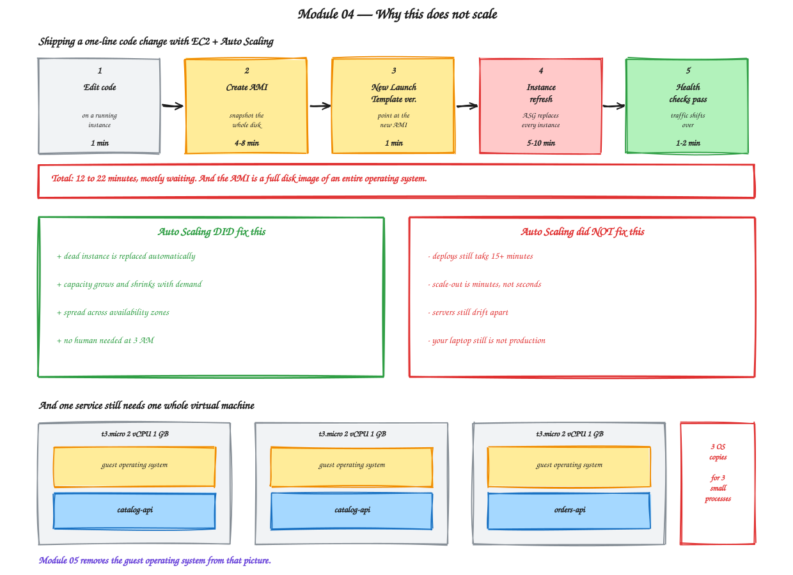

# Module 04 — The Limits of EC2

**Duration:** 60 minutes
**You will finish this module with:** a working Auto Scaling Group, a measured deployment cycle, and a precise understanding of which problems EC2 solves well and which it cannot solve at all.

---

## Context

Something dishonest happens in most container training at this point.

The instructor puts up a slide saying EC2 cannot self-heal, cannot scale, and requires manual intervention — and then presents Kubernetes as the rescue. It is a satisfying story and it is not true. AWS solved automatic replacement and automatic scaling for EC2 in 2009, with Auto Scaling Groups, and enormous production systems run happily on exactly that today.

So before we make any argument for containers, we are going to build EC2 properly. Not the manual version from Module 02, but the way a competent team would actually run it in production: an AMI, a launch template, an auto scaling group, and health-based replacement.

Then we will measure it honestly.

Some of what you are about to build genuinely does solve the problems from Module 03. A terminated instance really will be replaced without anyone being paged. Capacity really will follow demand. Those are real wins and you should not let anyone tell you otherwise.

And then we will time a deployment, and count how many copies of Linux we are running to serve three small Python processes, and the argument for the next section of this workshop will make itself.

The point is not that EC2 is bad. The point is understanding precisely what it costs, so that when you reach for containers you know what you are buying.



<sub>Editable source: [`05-limits-of-ec2.excalidraw`](./diagrams/excalidraw/05-limits-of-ec2.excalidraw)</sub>

---

## Concept

### Configuration drift

You built `catalog-api` and `catalog-api-2` by running the same commands on two machines. They are not identical.

They were created at different times, so `dnf update` pulled whatever was current at each moment. If either has been running long enough for a package to be patched, they have diverged further. And the instant anyone SSHes in to fix something urgently, that machine becomes different from every other machine in ways recorded nowhere.

The industry name for this is a **snowflake server** — unique, hand-shaped, and impossible to reproduce. The failure mode is specific and miserable: a bug appears on one server and not the others, and finding out why means comparing two live systems by hand.

Drift is not caused by carelessness. It is caused by the fact that a server's state is the accumulated result of every command ever run on it, and nothing is recording that history.

### Immutable infrastructure and AMI baking

The accepted fix is to stop modifying servers entirely.

Instead of changing a running machine, you build a new disk image with the change already in it, launch fresh instances from that image, and destroy the old ones. Servers become disposable and identical. Nobody logs in, so nothing drifts.

The artifact is an **AMI**, and creating one is called baking. It is a snapshot of an entire disk — the kernel, the OS, every package, your application, everything.

This works, and it is genuinely the right pattern. It also means that shipping a one-line code change requires producing a multi-gigabyte disk image of an entire operating system, which is what makes the loop slow.

### Launch templates and Auto Scaling Groups

A **launch template** is the recipe for an instance: which AMI, what type, which subnets, which security groups, which IAM role. Templates are versioned, and you create a new version to change anything.

An **Auto Scaling Group** maintains a count. You tell it minimum, maximum, and desired capacity, and it works continuously to keep exactly that many healthy instances running.

The ASG does three things that matter.

It **replaces failures**. If an instance fails its health check, the ASG terminates it and launches a replacement from the launch template. This is real, automatic recovery of a whole machine — better than the systemd restart from Module 02, which only recovers a process.

It **scales on a signal**. Attach a policy targeting, say, 60% average CPU, and the group adds and removes instances to hold that.

It **spreads across AZs**. Give it subnets in two zones and it balances across them, and rebalances after a zone recovers.

Combined with the target group health checks from Module 03, this is a properly resilient deployment.

### Instance refresh

Once an ASG owns your instances, you no longer deploy by logging in. You bake a new AMI, create a new launch template version, and trigger an **instance refresh** — the ASG replaces every instance with one built from the new template, in batches, waiting for health checks between them.

It is a genuine rolling deployment with automatic rollback on failure. It is also the slowest deployment mechanism you will use in this workshop, and in Step 8 you are going to time it.

### The density problem

Look at what you are running. Three `t3.micro` instances, each with a full Amazon Linux installation — kernel, systemd, package manager, shell, SSH daemon, log rotation — in order to run one small Python process.

The operating system is doing almost all of the work and none of the useful work. Each instance boots in tens of seconds because a whole kernel has to initialise before your application starts.

Now scale that mentally. A company running eighty microservices needs eighty of these, and each one is mostly idle. You cannot pack four services onto one instance without them fighting over ports, Python versions, and library conflicts — which is exactly the problem you had on your laptop in Module 00.

That is the wall. It is not a resilience problem, because the ASG fixed resilience. It is a **packaging** problem, and it is the one thing EC2 has no answer for.

---

## Lab 04 — Build EC2 Properly, Then Measure It

**Time:** 45 minutes

Have a clock or a stopwatch. Several steps ask you to time them, and the numbers are the point.

### Step 1 — Prerequisites

If your Module 03 environment is still running with the ALB, both target groups and all three instances, skip to Step 2.

Otherwise rebuild it:

```bash
export AWS_REGION=ap-south-1
~/workshop-app/infra/bootstrap-module02.sh
source ~/workshop-app/infra/network.env
```

Then follow Module 03 Steps 2 to 8 to recreate the ALB, security groups and target groups. Set your ALB DNS name:

```bash
export ALB=<your-alb-dns-name>
curl -s http://$ALB/products
```

### Step 2 — Watch drift happen

Right now `catalog-tg` has two healthy catalog instances. Confirm both are serving:

```bash
for i in $(seq 1 10); do curl -s http://$ALB/products | python3 -c "import sys,json; print(json.load(sys.stdin)['served_by'])"; done
```

Two hostnames alternating.

Now do what every engineer has done under pressure. Connect to **`catalog-api-2` only** with Session Manager and apply an urgent hotfix directly:

```bash
sudo su -
sed -i 's/"price": 2499/"price": 1999/' /opt/catalog-api/app.py
sed -i 's/APP_VERSION=1.0.0/APP_VERSION=1.0.1-hotfix/' /etc/systemd/system/catalog-api.service
systemctl daemon-reload
systemctl restart catalog-api
```

Back in your terminal:

```bash
for i in $(seq 1 8); do curl -s http://$ALB/products | python3 -c "import sys,json; d=json.load(sys.stdin); print(d['version'], d['products'][0]['price'])"; done
```

**Two servers behind one hostname are now returning different prices.** Roughly half your customers see 2499 and half see 1999, and which one you get depends on load balancer round-robin.

Sit with how bad this is. There is no alert. The target group reports both instances healthy, because both answer `/health` with a 200 — a health check verifies that a server is *responding*, not that it is *correct*.

Now try to answer, without logging in: which instance has the hotfix, what exactly was changed, and who changed it?

You cannot. That information exists only in one shell's scrollback.

This is configuration drift, produced in thirty seconds, in the most realistic way possible.

### Step 3 — Fix it the immutable way, not the manual way

The instinct is to SSH into the other instance and apply the same change. Resist it — that is how you get four slightly different servers instead of two.

The correct move is to decide what the truth is, bake it into an image, and replace every instance from that image.

Connect to `catalog-api-2` and make it the intended state:

```bash
sudo su -
grep -n "1999\|APP_VERSION" /opt/catalog-api/app.py /etc/systemd/system/catalog-api.service
curl -s http://localhost:8080/products | head -c 200
```

This instance is now our golden source. Everything else gets rebuilt from it.

### Step 4 — Bake an AMI (console) — start your timer

**EC2** console → **Instances** → select `catalog-api-2` → **Actions** → **Image and templates** → **Create image**.

| Field | Value |
|---|---|
| Image name | `catalog-api-v1.0.1` |
| Description | `catalog with hotfix pricing` |
| No reboot | leave **unchecked** |

**Create image.** Note the time.

Go to **AMIs** in the left menu and watch the status. It will sit at `Pending` for several minutes.

While you wait, look at what is being copied. This is a snapshot of an entire root volume — the kernel, systemd, the package manager, Python, the SSH daemon, your twelve-line Flask app. Gigabytes of disk image, to capture a change of four characters in one file.

**Record the time when it reaches `Available`.**

| | |
|---|---|
| AMI bake time | _______ minutes |

### Step 5 — Create a launch template (console)

**EC2** → **Launch templates** → **Create launch template**.

| Field | Value |
|---|---|
| Name | `catalog-api-lt` |
| Template version description | `v1 - AMI 1.0.1` |
| Application and OS Images | **My AMIs** → `catalog-api-v1.0.1` |
| Instance type | `t3.micro` |
| Key pair | Don't include in template |
| Subnet | Don't include in template (the ASG supplies it) |
| Security groups | `workshop-catalog-sg` |

Expand **Advanced details**:

| Field | Value |
|---|---|
| IAM instance profile | `workshop-ec2-ssm-role` |

**Create launch template.**

Everything needed to produce a catalog server is now described in one versioned object. That is a real improvement on Module 02, where the same information lived in your memory.

### Step 6 — Create the Auto Scaling Group (console)

**EC2** → **Auto Scaling Groups** → **Create Auto Scaling group**.

**Step 1:**

| Field | Value |
|---|---|
| Name | `catalog-asg` |
| Launch template | `catalog-api-lt` |

**Step 2 — Network:**

| Field | Value |
|---|---|
| VPC | `workshop-vpc` |
| Availability Zones and subnets | `workshop-private-1a` **and** `workshop-private-1b` |

**Step 3 — Load balancing:**

| Field | Value |
|---|---|
| Load balancing | **Attach to an existing load balancer** |
| Choose from | **target groups** → `catalog-tg` |
| Health checks | Tick **Turn on Elastic Load Balancing health checks** |
| Health check grace period | 120 seconds |

That tick box matters. It tells the ASG to treat the ALB's opinion as the definition of healthy. An instance that boots but whose application fails to start will now be terminated and replaced, not left running and broken.

**Step 4 — Group size:**

| Field | Value |
|---|---|
| Desired capacity | 2 |
| Minimum capacity | 2 |
| Maximum capacity | 4 |

**Step 5 — Scaling policy:** choose **Target tracking**, metric **Average CPU utilization**, target **60**.

Skip notifications and tags, then **Create Auto Scaling group**.

### Step 7 — Watch it converge, then remove the hand-built instances

The ASG immediately launches two instances from the template.

**Instances** → you now have five: the two original catalog instances, the orders instance, and two new ASG-managed ones. Wait until both new instances show healthy in `catalog-tg`.

Now retire the hand-built ones. Select the **original** `catalog-api` and `catalog-api-2` — not the new ones, check the launch time column — and **Terminate**.

Confirm every response is now identical:

```bash
for i in $(seq 1 10); do curl -s http://$ALB/products | python3 -c "import sys,json; d=json.load(sys.stdin); print(d['served_by'], d['version'], d['products'][0]['price'])"; done
```

Same version, same price, different hostnames. **The drift is gone**, and it is gone because both servers came from one image rather than from two sets of typed commands.

### Step 8 — Prove automatic replacement — time it

This is the step that answers the question Module 03 ended on.

Pick one ASG instance and **Terminate** it. Start your timer.

Watch the **Activity** tab of `catalog-asg`. You will see the group notice the loss and launch a replacement.

Keep traffic flowing while you watch:

```bash
while true; do curl -s -o /dev/null -w "%{http_code} " http://$ALB/products; sleep 2; done
```

You should see an unbroken run of `200`s. The surviving instance carried the load.

Stop the loop with `Ctrl+C` when the replacement is healthy in `catalog-tg`.

| | |
|---|---|
| Time from terminate to healthy replacement | _______ minutes |

**Be clear about what just happened: a server was destroyed and the platform replaced it with no human involvement and no customer impact.** That is real self-healing. Anyone who tells you EC2 cannot do this is wrong.

Now hold the number you just wrote down. Typically two to four minutes, because a full operating system has to boot before your application starts.

### Step 9 — Deploy a code change — time the whole loop

Here is the part that hurts. Ship a trivial change and time the complete cycle.

Connect to **one** ASG instance and make the change:

```bash
sudo su -
sed -i 's/"stock": 120/"stock": 500/' /opt/catalog-api/app.py
sed -i 's/APP_VERSION=1.0.1-hotfix/APP_VERSION=1.0.2/' /etc/systemd/system/catalog-api.service
systemctl daemon-reload && systemctl restart catalog-api
curl -s http://localhost:8080/products | head -c 120
```

**Start the timer now**, and complete the real deployment:

1. **Bake a new AMI** from that instance, named `catalog-api-v1.0.2`. Wait for `Available`.
2. **Create a new launch template version** — Launch templates → `catalog-api-lt` → **Actions** → **Modify template (Create new version)** → change the AMI to `catalog-api-v1.0.2` → create. Then **Actions** → **Set default version** → version 2.
3. **Trigger an instance refresh** — Auto Scaling Groups → `catalog-asg` → **Instance refresh** tab → **Start instance refresh** → minimum healthy percentage 50 → **Start**.
4. **Wait** for the refresh to reach 100%.

Watch traffic throughout:

```bash
while true; do curl -s http://$ALB/products | python3 -c "import sys,json; d=json.load(sys.stdin); print(d['version'], d['products'][0]['stock'])"; sleep 3; done
```

You will see `1.0.1-hotfix` responses gradually replaced by `1.0.2`. That is a rolling deployment with zero downtime, which is genuinely good engineering.

**Stop the timer when every response shows 1.0.2.**

| | |
|---|---|
| Full deploy cycle for a one-line change | _______ minutes |

Most people land between twelve and twenty-two minutes.

Now consider: a team shipping ten times a day spends most of the day waiting. And every one of those minutes was spent producing and distributing multi-gigabyte disk images to change a few bytes of Python.

### Step 10 — Count the operating systems

```bash
aws ec2 describe-instances \
  --filters "Name=instance-state-name,Values=running" \
  --query 'Reservations[].Instances[].{ID:InstanceId,Type:InstanceType,AZ:Placement.AvailabilityZone}' \
  --output table
```

Three instances. Three complete Linux installations — three kernels, three systemd instances, three package managers, three SSH daemons — running three small Python processes that would each fit comfortably in 50 MB of memory.

On any one of them:

```bash
sudo su -
free -m
ps aux --sort=-%mem | head -12
```

Your application is not the largest thing running.

Now scale the thought. Eighty microservices at two instances each is 160 virtual machines, 160 operating systems to patch, and 160 boot sequences to wait through every deployment.

The obvious fix is to run several services per instance. Try it and you immediately hit port conflicts, Python version conflicts, and library conflicts. Which is precisely the problem you had in Module 00 with two services and one laptop.

**This is the wall.** Not resilience — the ASG solved that. Packaging.

### Step 11 — The honest scorecard

| Problem from Module 03 | Did Auto Scaling fix it? |
|---|---|
| A dead instance is never replaced | **Yes.** Step 8 proved it. |
| Adding a server takes fifteen manual minutes | **Yes.** Change desired capacity. |
| Two servers drift apart | **Yes**, as long as nobody logs in. |
| Capacity does not follow demand | **Yes.** Target tracking policy. |
| Deploys take minutes and move gigabytes | **No.** Step 9. |
| Scale-out waits for a full OS boot | **No.** Step 8. |
| One service needs one whole VM | **No.** Step 10. |
| Your laptop is still not production | **No.** Nothing here touched that. |

The top half is solved. The bottom half is untouched, and every item in it comes from the same root cause: **the unit of deployment is a virtual machine.**

Make the unit of deployment smaller than a machine and all four go away at once.

That is what Module 05 is about.

### Step 12 — Tear down

Order matters — the ASG will fight you by replacing anything you delete under it.

1. **Auto Scaling Groups** → `catalog-asg` → **Delete**. This terminates its instances. Wait for it to finish.
2. **Launch templates** → delete `catalog-api-lt`.
3. **AMIs** → deregister `catalog-api-v1.0.1` and `catalog-api-v1.0.2`.
4. **Snapshots** → delete the snapshots those AMIs left behind. They bill until removed, and deregistering an AMI does not delete them.
5. **Load balancers** → delete `workshop-alb`. Wait.
6. **Target groups** → delete `catalog-tg` and `orders-tg`.
7. **Instances** → terminate `orders-api`.
8. **Security groups** → delete `workshop-catalog-sg`, `workshop-orders-sg`, then `workshop-alb-sg`.
9. **IAM** → **Roles** → delete `workshop-ec2-ssm-role`.

```bash
~/workshop-app/infra/delete-network.sh
```

Verify nothing survives:

```bash
aws autoscaling describe-auto-scaling-groups --query 'AutoScalingGroups[].AutoScalingGroupName' --output text
aws ec2 describe-images --owners self --query 'Images[].Name' --output text
aws ec2 describe-snapshots --owner-ids self --query 'Snapshots[].SnapshotId' --output text
aws elbv2 describe-load-balancers --query 'LoadBalancers[].LoadBalancerName' --output text
aws ec2 describe-instances --filters "Name=instance-state-name,Values=running,stopped" --query 'Reservations[].Instances[].InstanceId' --output text
aws ec2 describe-addresses --query 'Addresses[].PublicIp' --output text
```

All empty. The snapshot check catches the thing people most often forget.

---

## Troubleshooting

**ASG instances launch and are immediately terminated in a loop.** The ALB health check is failing, and with ELB health checks enabled the ASG kills the instance and tries again. Increase the health check grace period, or check that the application actually starts from the AMI — `journalctl -u catalog-api` on a surviving instance.

**Instance refresh stalls at some percentage.** New instances are not reaching healthy in the target group. Same causes as above.

**Terminated instances keep reappearing.** That is the ASG doing its job. Delete the ASG rather than the instances.

**AMI stuck at Pending for a long time.** Normal for larger volumes. It is snapshotting the whole disk.

**Cannot delete a security group.** Something still references it. The ALB and instances must be fully gone first, and `workshop-alb-sg` must go last because the other two reference it.

---

## What you built

A properly engineered EC2 deployment — immutable AMIs, versioned launch templates, an Auto Scaling Group with health-based replacement and CPU-based scaling, and zero-downtime rolling deployments.

This is a legitimate production architecture. Plenty of real systems run exactly this today.

## The three numbers

| Measurement | Your result |
|---|---|
| Time to replace a failed instance | _______ min |
| Time to deploy a one-line change | _______ min |
| Operating systems running per application process | 1 |

Those three numbers are the entire argument for what comes next.

---

**Next:** [Module 05 — Docker Fundamentals](./05-docker-fundamentals.md)
