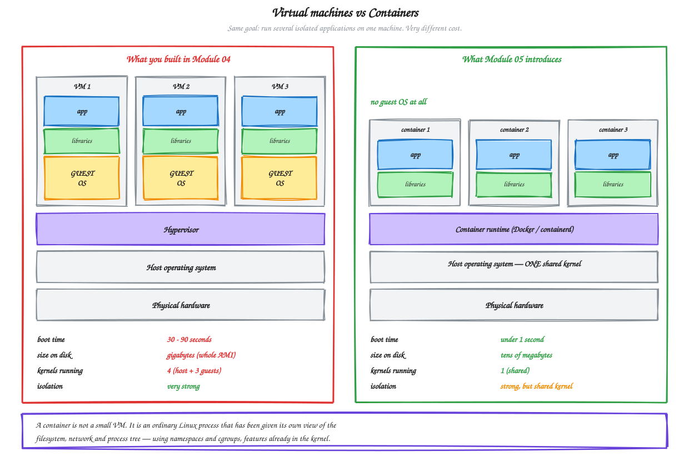
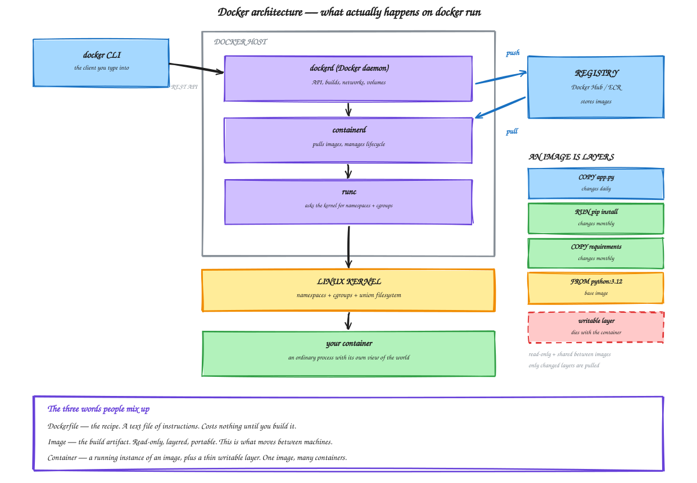

# Module 05 — Docker Fundamentals

**Duration:** 60 minutes
**You will finish this module with:** a working mental model of what a container actually is, hands-on experience with images, layers, namespaces and cgroups, and a measured comparison against the numbers you wrote down in Module 04.

---

## Context

You ended Module 04 holding three numbers.

Two to four minutes to replace a failed instance. Twelve to twenty-two minutes to ship a one-line change. One entire operating system per application process.

All three trace back to one decision: **the unit of deployment is a virtual machine.** Every deploy means producing and distributing a disk image of a whole OS. Every scale-out means booting a kernel. Every service needs its own machine because two services on one machine fight over ports and library versions.

So the question for this module is narrow and specific. Can we make the unit of deployment smaller than a machine, while keeping the isolation that made separate machines necessary in the first place?

The answer turns out to have been sitting inside the Linux kernel since around 2008, and Docker's contribution in 2013 was not inventing it but making it usable.

### What Docker actually did

The kernel features that make containers work — namespaces and cgroups — existed before Docker. Google was running everything in containers internally for years using them. But using them directly required deep kernel knowledge, and there was no standard way to package or share the result.

Docker added three things that mattered: a simple command line over those kernel features, a **format** for packaging a filesystem plus metadata into a portable artifact, and a **registry** to move those artifacts around.

That packaging format is the important one. It is what lets you build something on your laptop and know it will behave identically on an EC2 instance in Mumbai, which is the problem you have had since Module 00.

---

## Concept

### A container is not a small virtual machine

This is the single most useful correction to make early, because almost everyone arrives with the wrong model.

A virtual machine works by simulating hardware. The hypervisor presents a fake CPU, fake disk and fake network card, and a complete guest operating system boots on top of it, with its own kernel. That is why booting takes thirty seconds and why the disk image is measured in gigabytes.

A container does none of that. A container is **an ordinary process running on the host kernel**, which the kernel has been asked to lie to about what it can see.

Run a container and there is no second kernel, no boot sequence, no virtual hardware. There is a process. Its `ps` output shows only its own processes because it has its own PID namespace. Its `/` looks like a different Linux distribution because it has its own mount namespace. Its network interfaces are its own because it has its own network namespace.

Take those away and it is just a process on your machine, which is exactly why it starts in milliseconds.



<sub>Editable source: [`06-vm-vs-container.excalidraw`](./diagrams/excalidraw/06-vm-vs-container.excalidraw)</sub>

### The two kernel features doing the work

**Namespaces** control what a process can *see*. There are several, and each isolates one kind of resource:

| Namespace | Isolates |
|---|---|
| `pid` | Process IDs — your process sees itself as PID 1 |
| `mnt` | Filesystem mount points — its own root filesystem |
| `net` | Network interfaces, ports, routing table |
| `uts` | Hostname |
| `ipc` | Shared memory between processes |
| `user` | User and group ID mappings |

**Cgroups** (control groups) control what a process can *use* — how much CPU, how much memory, how much disk I/O. This is what stops one container starving the others.

Namespaces are the walls. Cgroups are the budget. That is the whole isolation model, and you will demonstrate both in the lab.

Note what is **not** isolated: the kernel itself is shared. A kernel vulnerability is a boundary that containers do not defend, and that is the honest trade-off against a VM's stronger isolation. It is also why Module 07 spends time on hardening rather than assuming containers are secure by default.

### Docker's architecture

When you type `docker run`, four pieces are involved.

The **Docker CLI** is just a client. It sends an HTTP request to a daemon and prints the reply — it does not create containers itself.

**dockerd**, the daemon, receives that API call. It handles builds, networks, volumes, and orchestrating the rest.

**containerd** manages the container lifecycle — pulling images from registries, unpacking layers, starting and stopping.

**runc** does the final step. It makes the actual kernel calls that create the namespaces and cgroups and starts your process inside them. It runs, does its job, and exits.

A **registry** — Docker Hub, or Amazon ECR in Module 07 — stores images so other machines can pull them.



<sub>Editable source: [`07-docker-architecture.excalidraw`](./diagrams/excalidraw/07-docker-architecture.excalidraw)</sub>

### Dockerfile, image, container

These three get used interchangeably in conversation and they are not the same thing.

A **Dockerfile** is a text file of instructions. A recipe. It costs nothing until you build it.

An **image** is the build artifact — read-only, layered, portable. This is what moves between machines. You build it once and it is identical everywhere.

A **container** is a running instance of an image, with a thin writable layer on top. One image, many containers.

The relationship worth remembering: when Hotstar scales up during a match, nobody is building images. One image was built hours earlier, and thousands of containers are started from it.

### Layers and the union filesystem

Each instruction in a Dockerfile that changes the filesystem produces a layer, and the image is those layers stacked.

Layers are read-only and **shared across images**. If ten images on your machine build on `python:3.12`, that base is stored once. When a server pulls a new version of your application image, it downloads only the layers that changed — usually just your code, a few kilobytes, not the whole gigabyte.

Compare that with Module 04, where shipping a four-character change meant producing and distributing a multi-gigabyte AMI.

On top of the read-only stack sits a thin **writable layer**, created when the container starts and destroyed when it is removed. That is what makes containers ephemeral, and it is a feature rather than a limitation: because containers hold no state, they are disposable, and because they are disposable, an orchestrator is free to kill one and start another anywhere. Self-healing in Module 10 depends on it.

### The build cache

Docker caches every layer. On a rebuild it walks the Dockerfile top to bottom, reusing cached layers whose instruction and inputs are unchanged. The moment one layer misses, **every layer below it rebuilds too**.

This is why you copy the dependency file and install packages *before* copying application code. Code changes fifty times a day, dependencies change monthly. Ordered correctly a code change reuses the cached install. Ordered wrongly, every code change reinstalls every package.

You will build both orderings in Module 06 and time the difference.

### Tags

`catalog-api:1.0.0` is `name:tag`. Omit the tag and Docker assumes `latest`, which is a name and not a promise — it does not mean newest and it moves without warning.

We always tag explicitly. In Module 14 the pipeline tags with the Git commit SHA, so any running container traces back to the exact commit that produced it.

---

## Lab 05 — Meet Docker

**Time:** 40 minutes
**Where:** your own machine. Nothing in this lab touches AWS.

This lab uses standard public images rather than our application. Module 06 containerizes `catalog-api` and `orders-api`.

This lab is self-contained and removes everything it creates.

### Step 1 — Confirm Docker is running

```bash
docker version --format 'client {{.Client.Version}}  server {{.Server.Version}}'
docker info --format 'containers {{.Containers}}  images {{.Images}}  driver {{.Driver}}'
```

If the server line errors, the daemon is not running. Start Docker Desktop, or on Linux:

```bash
sudo systemctl start docker
```

Note that `docker info` reached a *server*. Your CLI is a client talking to a daemon, exactly as in the architecture diagram.

### Step 2 — The number that matters

Before anything else, measure the thing Module 04 made you care about.

```bash
docker pull alpine:3.20
time docker run --rm alpine:3.20 echo "container started"
```

Compare that number against what you wrote down in Module 04 Step 8 for replacing an EC2 instance.

Milliseconds versus minutes. Nothing was virtualised, nothing booted, no kernel initialised. A process started.

### Step 3 — Run something real

```bash
docker run -d --name web -p 8090:80 nginx:1.27-alpine
docker ps
curl -s -o /dev/null -w "%{http_code}\n" localhost:8090
```

Read the port mapping carefully. `-p 8090:80` maps port 8090 on your machine to port 80 **inside** the container. The container has its own network namespace, so a process listening inside it is unreachable until you map a port.

The host port is arbitrary. Prove it:

```bash
docker run -d --name web2 -p 9091:80 nginx:1.27-alpine
curl -s -o /dev/null -w "%{http_code}\n" localhost:9091
docker ps --format 'table {{.Names}}\t{{.Ports}}'
```

Two containers, one image, both listening on 80 internally, mapped to different ports outside. Nothing was rebuilt.

### Step 4 — Prove the PID namespace

Count the processes on your own machine:

```bash
ps aux | wc -l
```

Now look inside the container:

```bash
docker exec web ps aux
```

A handful of processes, and nginx is **PID 1**.

That is the PID namespace. The container cannot see your machine's processes at all — not because they are hidden by permissions, but because they do not exist in its view of the process tree.

Now the part that makes the point. On a Linux host, ask the host to look for the same process:

```bash
ps aux | grep nginx | grep -v grep
```

There it is, running on your machine with an ordinary PID, visible to your host's `ps`. **The same process has two different PIDs depending on who is asking.**

There is no virtual machine. There is a process wearing a blindfold.

*(On Docker Desktop for macOS or Windows, Docker runs inside a small Linux VM, so this final command will not show the process. The behaviour is the same on the Linux host inside that VM.)*

### Step 5 — Prove the mount and UTS namespaces

```bash
docker exec -it web sh
```

Inside:

```sh
cat /etc/os-release
ls /
hostname
whoami
exit
```

The container reports Alpine Linux with a completely different root filesystem — even if your machine runs Ubuntu, Amazon Linux, or macOS. That is the mount namespace. The hostname is a random string rather than your machine's, which is the UTS namespace.

Note also that `whoami` returns **root**. Hold that thought; Module 07 is largely about it.

### Step 6 — Prove cgroups

Namespaces control what a process sees. Cgroups control what it can consume.

```bash
docker run -d --name limited --memory=64m --cpus=0.5 nginx:1.27-alpine
docker stats --no-stream limited
```

The `MEM USAGE / LIMIT` column shows a 64 MiB ceiling, not your machine's total RAM.

Now watch the limit be enforced:

```bash
docker run --rm --memory=32m alpine:3.20 sh -c "dd if=/dev/zero of=/dev/null bs=64M count=1 2>&1 | tail -1" || echo "exit code $?"
```

Try to exceed the budget and the kernel's OOM killer terminates the process. This is why several containers can share one machine without one starving the others — the exact thing that made two services on one EC2 instance a bad idea in Module 04.

### Step 7 — Look at layers

```bash
docker pull python:3.12-slim
docker images
docker history python:3.12-slim
```

Each row in `history` is a layer, with its own size and the instruction that created it.

Now watch layer sharing. Pull a second image built on the same base:

```bash
docker pull python:3.12-alpine
docker images | grep python
```

Then inspect what layers an image is made of:

```bash
docker image inspect python:3.12-slim --format '{{range .RootFS.Layers}}{{println .}}{{end}}' | head
```

Those hashes are content addresses. Any two images sharing a layer store it once. When you push a new version of your application to ECR in Module 07, only the changed layers travel.

### Step 8 — Prove the writable layer is ephemeral

Write something inside a running container:

```bash
docker exec web sh -c "echo 'ORD-1001 PLACED' > /tmp/orders.txt && cat /tmp/orders.txt"
```

Now check whether it affected the image:

```bash
docker run --rm nginx:1.27-alpine cat /tmp/orders.txt || echo "not in the image"
```

A fresh container from the same image knows nothing about it. The write went into `web`'s writable layer only.

Now destroy and recreate:

```bash
docker rm -f web
docker run -d --name web -p 8090:80 nginx:1.27-alpine
docker exec web cat /tmp/orders.txt || echo "gone"
```

Gone.

**This is the design, not a defect.** A container that holds no state can be killed and replaced anywhere without consequence, which is precisely the property Module 10 relies on. Anything that must survive — configuration, data — has to come from outside the container. Module 09 handles configuration.

### Step 9 — Container networking and name resolution

This step previews the thing that will replace your hardcoded IP address.

By default containers land on the `bridge` network, where they can reach each other by IP but not by name. Create a user-defined network instead:

```bash
docker network create shop-net
docker network ls
```

Run two containers on it:

```bash
docker run -d --name api-a --network shop-net nginx:1.27-alpine
docker run -d --name api-b --network shop-net nginx:1.27-alpine
```

Now, from one, reach the other **by name**:

```bash
docker exec api-a sh -c "wget -qO- http://api-b | head -4"
docker exec api-a sh -c "nslookup api-b" 2>/dev/null | tail -4
```

`api-b` resolved to an IP address with no configuration, no hosts file, and nothing typed by hand.

Now recreate `api-b` and confirm it still works:

```bash
docker rm -f api-b
docker run -d --name api-b --network shop-net nginx:1.27-alpine
docker exec api-a sh -c "wget -qO- http://api-b | head -2"
```

The container was destroyed and rebuilt, almost certainly with a different IP address, and the name still resolves.

**Compare that with Module 02, Step 13**, where you typed `10.0.11.87` into a systemd unit file on a different machine, and where replacing the catalog server would have broken orders. Module 06 uses this to delete that hardcoded IP entirely.

### Step 10 — Look at what you are running

```bash
docker ps --format 'table {{.Names}}\t{{.Image}}\t{{.Status}}\t{{.Size}}'
docker system df
```

Five containers running on one machine, each isolated, each with its own filesystem and network, sharing one kernel — and the total disk footprint is smaller than a single AMI from Module 04.

Now revisit the Module 04 scorecard.

| Module 04 problem | Does Docker address it? |
|---|---|
| Deploys move gigabytes | **Yes.** Only changed layers ship. |
| Scale-out waits for an OS boot | **Yes.** Step 2 — milliseconds. |
| One service needs one whole VM | **Yes.** Step 10 — five on one machine. |
| Your laptop is not production | **Yes.** The image is identical everywhere. |
| A dead instance gets replaced | **No.** Nothing here does that. |
| Capacity follows demand | **No.** |
| Traffic spreads across machines | **No.** |

Docker solved the bottom half of Module 04's scorecard and gave back the top half. That is not a step backwards — it is the reason Module 08 exists.

### Step 11 — Clean up

```bash
docker rm -f web web2 limited api-a api-b
docker network rm shop-net
docker rmi nginx:1.27-alpine alpine:3.20 python:3.12-slim python:3.12-alpine
docker ps -a
docker images
```

Both listings should be empty of everything this lab created.

```bash
docker system df
```

If reclaimable space remains, `docker system prune` clears it. Read what it offers to delete before confirming.

---

## Command reference

| Command | Purpose |
|---|---|
| `docker run -d --name X -p H:C img` | Run a container in the background |
| `docker ps` / `docker ps -a` | Running / all containers |
| `docker exec -it X sh` | Shell inside a running container |
| `docker logs X` | Container output |
| `docker images` | Local images |
| `docker history img` | Layers of an image |
| `docker stats --no-stream` | Live resource usage |
| `docker network create NAME` | User-defined network with DNS |
| `docker rm -f X` / `docker rmi img` | Remove container / image |
| `docker system df` | Disk usage |

## Troubleshooting

**`permission denied` on the Docker socket (Linux).** Your user is not in the `docker` group. Either `sudo usermod -aG docker $USER` then log out and back in, or prefix commands with `sudo`.

**Port already allocated.** Something else is using that host port. Pick another — the host port is arbitrary.

**`docker exec` says the container is not running.** It exited. Check `docker ps -a` for the exit code and `docker logs X` for why.

**Step 4's host-side `ps` shows nothing.** You are on macOS or Windows, where Docker runs inside a Linux VM. Expected.

---

## What you learned

A container is a process with namespaces for isolation and cgroups for limits. An image is a stack of shared, read-only layers. Containers are ephemeral by design, and a user-defined network gives them DNS resolution by name.

## What is still missing

Nothing you did today runs your application, and nothing you did today survives the machine it runs on. Module 06 containerizes `catalog-api` and `orders-api` and deletes the hardcoded IP address. Module 08 asks what happens when the machine running all of this goes away.

---

**Next:** [Module 06 — Containerizing the Application](./06-containerizing-the-application.md)
