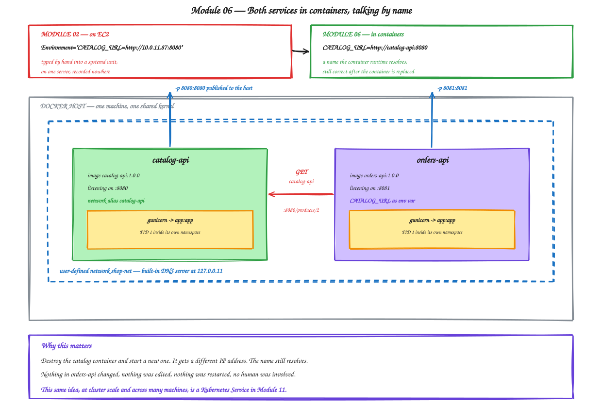

# Module 06 — Containerizing the Application

**Duration:** 60 minutes
**You will finish this module with:** both services running as containers, discovering each other by name, started by a single command — and the hardcoded IP address from Module 02 deleted.

---

## Context

Go back and reread Module 02, Step 16.

Roughly forty manual steps. Two console wizards. Two shells. Two package installs. Two systemd unit files. One IP address transcribed by hand from a console into a text file on a different server.

And Module 03, Step 12, where adding a *single* extra catalog server meant doing most of it again — fifteen minutes of typing, with no record of any of it anywhere except your terminal scrollback.

Today all of that becomes two text files that live in Git, and two commands.

The application code does not change. Not one line. `app.py` is exactly what you wrote in Module 00, and that is the entire point — every difference between "running on my laptop" and "running in production" turns out to be a packaging and configuration concern, not a code concern.

### The one thing to watch for

There is a specific moment in this lab worth waiting for.

In Module 02 you typed `CATALOG_URL=http://10.0.11.87:8080` into a systemd unit file. Today you will type `CATALOG_URL=http://catalog-api:8080` — a *name* rather than an address. Then you will destroy the catalog container entirely, start a new one with a completely different IP, and watch orders keep working with nothing changed and nobody involved.

That is the shape of service discovery. Everything Kubernetes does in Module 11 is that idea, scaled from one machine to a cluster.



<sub>Editable source: [`08-containerized-services.excalidraw`](./diagrams/excalidraw/08-containerized-services.excalidraw)</sub>

---

## Concept

### The Dockerfile instructions you actually need

There are about eighteen instructions. These eight cover almost everything.

**`FROM`** sets the base image and must come first. `FROM python:3.12` gives you Debian with Python already installed. Everything you add stacks on top.

**`WORKDIR`** sets the working directory for every instruction after it, and for the container at runtime. It creates the directory if it does not exist. Use it instead of `RUN cd /app`, which does not persist between instructions because each `RUN` is a separate layer.

**`COPY`** brings files from the build context into the image. `COPY requirements.txt .` copies one file into the current `WORKDIR`.

**`RUN`** executes a command *at build time* and commits the result as a layer. `RUN pip install -r requirements.txt` bakes the packages into the image so they are never installed again at runtime.

**`ENV`** sets an environment variable available at build time and runtime. Good for defaults. Never for secrets — anyone with the image can read it back with `docker history`.

**`EXPOSE`** is documentation only. `EXPOSE 8080` publishes nothing; it records the intended port for humans and tooling. Actual publishing happens with `-p` at run time.

**`CMD`** is the default command when a container starts. It can be overridden by anything you append to `docker run`.

**`ENTRYPOINT`** is the command that always runs, with `CMD` supplying default arguments to it.

### CMD versus ENTRYPOINT

The distinction confuses people, and the rule is simple.

With `CMD ["gunicorn", "--bind", "0.0.0.0:8080", "app:app"]`, running `docker run myimage bash` replaces the whole thing and you get a shell. Convenient for debugging.

With `ENTRYPOINT ["gunicorn"]` and `CMD ["--bind", "0.0.0.0:8080", "app:app"]`, running `docker run myimage --bind 0.0.0.0:9000 app:app` changes the arguments but gunicorn still runs. The container behaves like a gunicorn executable.

Use `CMD` alone when you want the container to be debuggable. Use `ENTRYPOINT` when the container *is* one specific tool. We use `CMD` in this workshop, because being able to drop into a shell matters more than argument purity while learning.

Also use the **exec form** — the JSON array `["gunicorn", "--bind", ...]` — not the shell form `gunicorn --bind ...`. The shell form wraps your process in `/bin/sh -c`, which means your application is not PID 1 and does not receive the `SIGTERM` that Docker and later Kubernetes send on shutdown. Your container then takes ten seconds to be force-killed on every single deploy.

### Build context and `.dockerignore`

The `.` in `docker build .` is the build context. Docker packages that entire directory and sends it to the daemon **before the build starts**.

A `.git` folder, a `venv`, or a `node_modules` makes every build slow. Worse, a `.env` file picked up by `COPY . .` is baked into a layer permanently — and deleting it in a later instruction does not remove it, because the earlier layer still contains it. That is a real and common way credentials leak.

`.dockerignore` works like `.gitignore`. It is not an optimisation; it is a control.

### Configuration comes from the environment

`orders-api` reads its catalog address like this:

```python
CATALOG_URL = os.getenv("CATALOG_URL", "http://localhost:8080")
```

This is the pattern that lets one image run everywhere. The same bytes run on your laptop pointing at localhost, in Docker pointing at a container name, and in Kubernetes pointing at a Service DNS name — because the address is supplied from outside rather than compiled in.

If you ever find yourself building a different image for staging and production, this is the principle that has been violated.

### Container DNS

When containers share a **user-defined network**, Docker runs an embedded DNS server at `127.0.0.11` inside each one, and container names and network aliases resolve to current IP addresses.

The default `bridge` network does **not** do this — legacy behaviour kept for compatibility. Always create your own network.

The important property is that resolution is dynamic. Destroy a container, start a replacement with a different IP, and the name resolves to the new address. Compare that with a systemd unit file holding `10.0.11.87`, which is correct only until it silently is not.

### Docker Compose

Running two containers by hand means two long `docker run` commands, in the right order, with the network created first.

Compose puts that in a YAML file. One `docker compose up` starts everything, creates the network, and wires it together.

Two reasons it earns its place here. It is genuinely how developers run multi-service applications locally. And it is your first taste of **declarative** infrastructure — you describe the desired state and the tool makes it so, rather than issuing imperative commands. Every Kubernetes manifest from Module 10 onward works the same way, so the mental shift happens here where the YAML is short.

---

## Lab 06 — Containerize Both Services

**Time:** 40 minutes
**Where:** your own machine. Nothing touches AWS.

Self-contained: it creates everything from scratch and removes it at the end.

### Step 1 — Clean working directory

```bash
rm -rf ~/lab06 && mkdir -p ~/lab06/catalog-api ~/lab06/orders-api
cd ~/lab06
```

### Step 2 — Create the applications

Unchanged from Module 00. Not one line differs.

```bash
cat > ~/lab06/catalog-api/app.py << 'EOF'
from flask import Flask, jsonify
import os, socket

app = Flask(__name__)

SERVICE_NAME = "catalog-api"
VERSION = os.getenv("APP_VERSION", "1.0.0")

PRODUCTS = {
    1: {"id": 1, "name": "Wireless Earbuds",    "price": 2499,  "stock": 120},
    2: {"id": 2, "name": "Mechanical Keyboard", "price": 5999,  "stock": 34},
    3: {"id": 3, "name": "27 inch Monitor",     "price": 18999, "stock": 12},
    4: {"id": 4, "name": "USB-C Hub",           "price": 3499,  "stock": 87},
}

def meta():
    return {"service": SERVICE_NAME, "version": VERSION, "served_by": socket.gethostname()}

@app.route("/health")
def health():
    return jsonify(status="ok", **meta()), 200

@app.route("/products")
def products():
    return jsonify(products=list(PRODUCTS.values()), **meta())

@app.route("/products/<int:pid>")
def product(pid):
    p = PRODUCTS.get(pid)
    if not p:
        return jsonify(error="not found", **meta()), 404
    return jsonify(product=p, **meta())

if __name__ == "__main__":
    app.run(host="0.0.0.0", port=8080)
EOF

cat > ~/lab06/catalog-api/requirements.txt << 'EOF'
flask==3.0.3
gunicorn==22.0.0
EOF
```

```bash
cat > ~/lab06/orders-api/app.py << 'EOF'
from flask import Flask, jsonify
import os, socket, requests

app = Flask(__name__)

SERVICE_NAME = "orders-api"
VERSION = os.getenv("APP_VERSION", "1.0.0")
CATALOG_URL = os.getenv("CATALOG_URL", "http://localhost:8080")

ORDERS = [
    {"order_id": "ORD-1001", "product_id": 1, "qty": 2, "status": "DELIVERED"},
    {"order_id": "ORD-1002", "product_id": 3, "qty": 1, "status": "IN_TRANSIT"},
    {"order_id": "ORD-1003", "product_id": 2, "qty": 1, "status": "PLACED"},
]

def meta():
    return {"service": SERVICE_NAME, "version": VERSION,
            "served_by": socket.gethostname(), "catalog_url": CATALOG_URL}

@app.route("/health")
def health():
    return jsonify(status="ok", **meta()), 200

@app.route("/orders")
def orders():
    out = []
    for o in ORDERS:
        i = dict(o)
        try:
            r = requests.get(f"{CATALOG_URL}/products/{o['product_id']}", timeout=2)
            if r.status_code == 200:
                p = r.json()["product"]
                i["product_name"] = p["name"]
                i["unit_price"] = p["price"]
                i["line_total"] = p["price"] * o["qty"]
            else:
                i["product_name"] = "UNKNOWN"
        except Exception as e:
            i["product_name"] = "CATALOG_UNAVAILABLE"
            i["error"] = str(e.__class__.__name__)
        out.append(i)
    return jsonify(orders=out, **meta())

if __name__ == "__main__":
    app.run(host="0.0.0.0", port=8081)
EOF

cat > ~/lab06/orders-api/requirements.txt << 'EOF'
flask==3.0.3
gunicorn==22.0.0
requests==2.32.3
EOF
```

### Step 3 — Add `.dockerignore` to both

```bash
for svc in catalog-api orders-api; do
cat > ~/lab06/$svc/.dockerignore << 'EOF'
__pycache__
*.pyc
.git
.gitignore
.env
venv
*.md
Dockerfile*
EOF
done
ls -a ~/lab06/catalog-api
```

### Step 4 — Write the catalog Dockerfile

```bash
cat > ~/lab06/catalog-api/Dockerfile << 'EOF'
FROM python:3.12

WORKDIR /app

COPY requirements.txt .
RUN pip install --no-cache-dir -r requirements.txt

COPY app.py .

ENV APP_VERSION=1.0.0
EXPOSE 8080

CMD ["gunicorn", "--bind", "0.0.0.0:8080", "--workers", "2", "app:app"]
EOF
```

Compare this against Module 02, Steps 8 to 10. The `dnf install`, the venv creation, the pip install, the systemd unit — all of it is now seven lines in a file that lives in Git.

Note the ordering: `requirements.txt` is copied and installed *before* `app.py`. Step 10 shows why.

### Step 5 — Build it

```bash
cd ~/lab06/catalog-api
time docker build -t catalog-api:1.0.0 .
docker images catalog-api
```

Apple Silicon users add `--platform linux/amd64` here and on every build for the rest of the workshop.

**Write down the image size.** It will be around 1 GB. Module 07 attacks that number.

### Step 6 — Run and test it

```bash
docker run -d --name catalog -p 8080:8080 catalog-api:1.0.0
docker ps
curl -s localhost:8080/health
curl -s localhost:8080/products
```

Compare `served_by` here with Module 02. Then it was an EC2 hostname. Now it is a container ID.

Stop it — we will start it properly on a network in a moment.

```bash
docker rm -f catalog
```

### Step 7 — Write and build the orders Dockerfile

```bash
cat > ~/lab06/orders-api/Dockerfile << 'EOF'
FROM python:3.12

WORKDIR /app

COPY requirements.txt .
RUN pip install --no-cache-dir -r requirements.txt

COPY app.py .

ENV APP_VERSION=1.0.0
EXPOSE 8081

CMD ["gunicorn", "--bind", "0.0.0.0:8081", "--workers", "2", "app:app"]
EOF
```

```bash
cd ~/lab06/orders-api
docker build -t orders-api:1.0.0 .
docker images | grep -E "catalog-api|orders-api"
```

Notice this build reused cached layers from the catalog build for `FROM python:3.12` — the base layer is stored once and shared.

### Step 8 — Create the network and run both

```bash
docker network create shop-net
docker network ls | grep shop-net
```

```bash
docker run -d --name catalog-api --network shop-net -p 8080:8080 catalog-api:1.0.0

docker run -d --name orders-api --network shop-net -p 8081:8081 \
  -e CATALOG_URL=http://catalog-api:8080 \
  orders-api:1.0.0

docker ps --format 'table {{.Names}}\t{{.Image}}\t{{.Ports}}'
```

**Stop and look at that `-e` flag.**

```
-e CATALOG_URL=http://catalog-api:8080
```

In Module 02 the same setting read `http://10.0.11.87:8080`, typed by hand into a systemd unit on a server, after reading the address off a console.

This is a name.

### Step 9 — Test the full path

```bash
curl -s localhost:8080/products
curl -s localhost:8081/orders
```

The orders response contains product names and line totals, fetched live from the catalog container.

See how the name resolved:

```bash
docker exec orders-api sh -c "getent hosts catalog-api"
docker exec orders-api sh -c "cat /etc/resolv.conf"
```

The nameserver is `127.0.0.11` — Docker's embedded DNS, present because these containers share a user-defined network.

### Step 10 — The moment

Destroy the catalog container completely and start a new one.

First, record its current address:

```bash
docker exec orders-api getent hosts catalog-api
```

Now:

```bash
docker rm -f catalog-api
curl -s localhost:8081/orders | head -c 200
```

`CATALOG_UNAVAILABLE`, as expected — it is genuinely gone.

Bring up a replacement:

```bash
docker run -d --name catalog-api --network shop-net -p 8080:8080 catalog-api:1.0.0
sleep 2
docker exec orders-api getent hosts catalog-api
curl -s localhost:8081/orders | head -c 200
```

Look at the two `getent` outputs. Different IP address. And orders works again.

**Nothing in orders-api was edited. Nothing was restarted. No file was touched. No human read an address off a console.**

Now go back and read Module 02, Step 13 — where you typed an IP into a unit file and I asked you to remember where it was. That problem is now gone, on one machine. Module 11 does the same across a cluster of machines.

### Step 11 — The layer cache, measured

Change one line of application code:

```bash
cd ~/lab06/catalog-api
sed -i 's/"price": 2499/"price": 2299/' app.py
time docker build -t catalog-api:1.0.1 .
```

Watch the output. The `pip install` step reports **CACHED**. Only the last layers ran.

Now build the same application with the instructions in the wrong order:

```bash
cat > Dockerfile.bad << 'EOF'
FROM python:3.12
WORKDIR /app
COPY . .
RUN pip install --no-cache-dir -r requirements.txt
EXPOSE 8080
CMD ["gunicorn", "--bind", "0.0.0.0:8080", "app:app"]
EOF

docker build -f Dockerfile.bad -t catalog-api:bad-1 .
sed -i 's/"price": 2299/"price": 2199/' app.py
time docker build -f Dockerfile.bad -t catalog-api:bad-2 .
```

Every package reinstalls for a one-character change, because `COPY . .` invalidated the layer above `pip install`.

| | |
|---|---|
| Correct ordering rebuild | _______ seconds |
| Wrong ordering rebuild | _______ seconds |

With two small dependencies this is a few seconds. On a real service with forty dependencies it is the difference between a two-second and a two-minute build, on every commit, for every engineer. One line of ordering.

### Step 12 — Scale a service on one machine

In Module 03, adding a second catalog server took fifteen minutes of manual installation. Watch this.

```bash
docker run -d --name catalog-2 --network shop-net --network-alias catalog-api catalog-api:1.0.0
docker run -d --name catalog-3 --network shop-net --network-alias catalog-api catalog-api:1.0.0
docker ps --format 'table {{.Names}}\t{{.Status}}'
```

Two more instances, in about two seconds, with no installation of anything.

The `--network-alias catalog-api` makes all three answer to the same name. Docker's DNS returns all matching addresses:

```bash
docker exec orders-api getent hosts catalog-api
```

Three IP addresses for one name. Watch requests spread across them:

```bash
for i in $(seq 1 12); do
  docker exec orders-api sh -c "python -c \"import requests,json; print(json.loads(requests.get('http://catalog-api:8080/health').text)['served_by'])\""
done
```

Different container IDs. That is DNS round-robin load balancing, for free.

Be precise about what this is and is not. It spreads requests. It does **not** health check, does **not** remove a broken container from rotation, and does **not** restart anything. Kill one and clients will still be sent to it until DNS caches expire.

Compare that with the ALB in Module 03, which pulled a broken target out within twenty seconds. Docker alone gives you names and round-robin. It does not give you the load balancer.

Clean up the extras:

```bash
docker rm -f catalog-2 catalog-3
```

### Step 13 — Declare it instead of typing it

Two long `docker run` commands is already awkward. Put the whole thing in one file.

```bash
cat > ~/lab06/compose.yaml << 'EOF'
services:
  catalog-api:
    build: ./catalog-api
    image: catalog-api:1.0.0
    ports:
      - "8080:8080"
    environment:
      APP_VERSION: "1.0.0"
    networks:
      - shop-net

  orders-api:
    build: ./orders-api
    image: orders-api:1.0.0
    ports:
      - "8081:8081"
    environment:
      APP_VERSION: "1.0.0"
      CATALOG_URL: "http://catalog-api:8080"
    depends_on:
      - catalog-api
    networks:
      - shop-net

networks:
  shop-net:
    driver: bridge
EOF
```

Tear down the hand-run containers and network, then let Compose do it:

```bash
docker rm -f catalog-api orders-api
docker network rm shop-net

cd ~/lab06
docker compose up -d
docker compose ps
```

```bash
curl -s localhost:8080/products
curl -s localhost:8081/orders
```

One command replaced a network creation and two container runs.

Read that YAML again and notice what it is: a **description of desired state**, not a list of steps. You did not tell Docker how to create the network or in what order to start things. You described what should exist.

That is the same shift you will make in Module 10, where a Kubernetes Deployment says "three replicas of this image should be running" and something else works out how.

```bash
docker compose down
docker compose ps
```

### Step 14 — Where this leaves us

```bash
docker images | grep -E "catalog-api|orders-api"
```

Two images, around a gigabyte each. Have a look at what is inside one:

```bash
docker compose up -d
docker exec catalog-api-1 sh -c "whoami; which gcc; python -V; ls /usr/bin | wc -l" 2>/dev/null || \
docker exec lab06-catalog-api-1 sh -c "whoami; which gcc; python -V; ls /usr/bin | wc -l"
```

Three things worth noticing.

`whoami` returns **root**. Your application has full administrative rights inside the container.

`which gcc` finds a **compiler**. A production image shipping build tools it will never use.

`/usr/bin` holds **hundreds of binaries** — a complete Debian userland, of which your app uses perhaps five.

Every one of those is attack surface, and every one is Module 07.

### Step 15 — Clean up

```bash
cd ~/lab06
docker compose down --volumes
docker rmi catalog-api:1.0.0 catalog-api:1.0.1 catalog-api:bad-1 catalog-api:bad-2 orders-api:1.0.0 2>/dev/null
docker network ls | grep shop-net || echo "network gone"
docker ps -a | grep -E "catalog|orders" || echo "no containers"
docker images | grep -E "catalog-api|orders-api" || echo "no images"
```

```bash
cd ~ && rm -rf ~/lab06
```

Keep `python:3.12` cached locally — Module 07 uses it for comparison.

---

## Troubleshooting

**`CATALOG_UNAVAILABLE` when both containers are running.** Confirm both are on `shop-net` with `docker network inspect shop-net`. Containers on the default bridge network cannot resolve each other by name.

**`docker build` is very slow or sends a huge context.** Something large is in the build directory. Check `.dockerignore`.

**Port already allocated.** Another process holds 8080 or 8081. Change the host side of `-p`; the container side must stay as the app's port.

**Compose container names differ from expected.** Compose prefixes with the project directory name, so `catalog-api` becomes `lab06-catalog-api-1`. `docker compose ps` shows the real names.

**Build fails on `pip install`.** No network from the daemon, or a typo in `requirements.txt`.

---

## What you built

Both services containerized, with their runtime, dependencies and startup command described in seven-line files that live in Git. Service discovery by name that survives container replacement. Scale-out in seconds. A declarative description of the whole application in one YAML file.

## Against Module 02

| | Module 02 (EC2) | Module 06 (Docker) |
|---|---|---|
| Deploying a service | ~40 manual steps | `docker compose up` |
| Adding an instance | ~15 minutes | ~2 seconds |
| Finding another service | Hardcoded IP in a unit file | A DNS name |
| Record of how it was built | Terminal scrollback | A Dockerfile in Git |
| Replacing a service instance | Breaks its callers | Callers never notice |

## What is still wrong with it

| Problem | Where you saw it | Fixed in |
|---|---|---|
| Image is ~1 GB | Step 5 | Module 07 |
| Runs as root | Step 14 | Module 07 |
| Ships a compiler and a full OS | Step 14 | Module 07 |
| Never scanned for vulnerabilities | We have not looked | Module 07 |
| Images exist only on your laptop | No registry | Module 07 |
| No health checking or automatic restart | Step 12 | Module 08 |
| Everything dies with this one machine | Everywhere | Module 08 |

---

**Next:** [Module 07 — Image Hardening and Security](./07-image-hardening-security.md)
