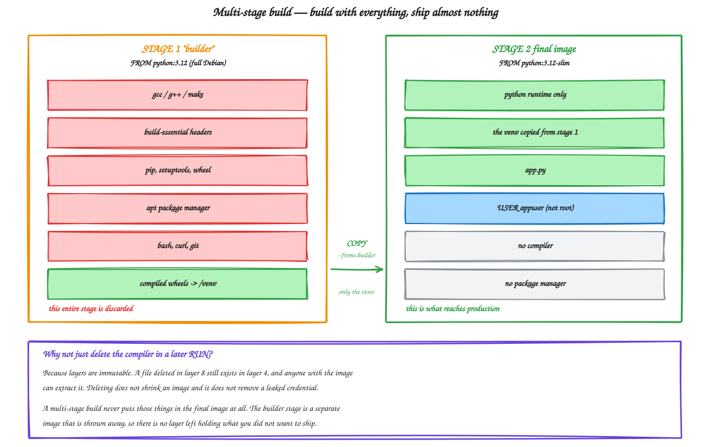
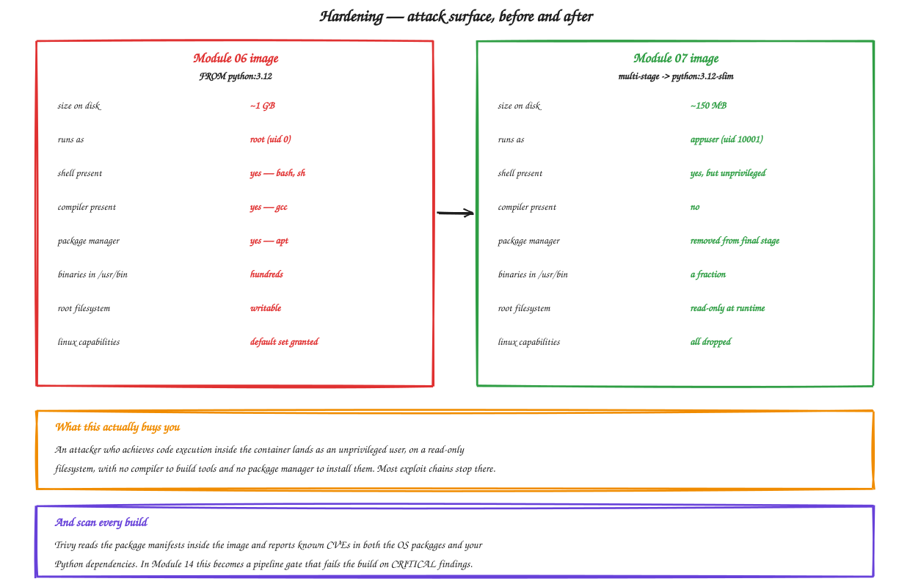

# Module 07 — Image Hardening and Security

**Duration:** 75 minutes
**You will finish this module with:** hardened multi-stage images roughly a seventh the size, running as a non-root user, scanned with Trivy, and pushed to a private Amazon ECR repository with scanning enabled.

---

## Context

At the end of Module 06 you ran three commands inside your own container and got three answers you should not be comfortable with.

`whoami` returned **root**. `which gcc` found a **compiler**. `/usr/bin` held **hundreds of binaries**.

Think about what that means in practice. Suppose an attacker finds a way to execute code inside your catalog container — a deserialization bug, a dependency with a backdoor, a path traversal in a file upload. What do they find waiting for them?

They are root. They have a full shell. They have `apt` to install anything they want. They have `gcc` to compile anything that is not packaged. They have `curl` to pull tooling in and push data out. They have a writable filesystem to stage it all on.

You did not intend to provide any of that. It came along because `FROM python:3.12` is a complete Debian operating system, and you only wanted the Python.

### This is not theoretical

The pattern behind most container breaches is boring and consistent. Initial code execution in the application, then privilege escalation and lateral movement using the tools that happened to be lying around in the image.

Remove the tools and most of that second half stops working. An attacker with a shell as an unprivileged user, on a read-only filesystem, with no compiler and no package manager, is in a much worse position than one who lands as root in a full Debian install.

That is what this module is about. Not adding security controls on top, but **removing everything that was never needed**.

There is a second half to it. Even a minimal image contains software with known vulnerabilities, and new ones are published every day against packages you already shipped. So we also scan — first by hand today, then automatically on every commit in Module 14.

---

## Concept

### What is actually inside `FROM python:3.12`

The official Python image is Debian with Python compiled in. That means a package manager, a shell, coreutils, a compiler toolchain for building native extensions, SSL libraries, and hundreds of utilities.

Your Flask application uses Python, two libraries, and nothing else.

Every other package is code you did not write, cannot audit, must patch, and that will appear in every vulnerability report you ever run. It is **liability without benefit**.

### Base image options

| Base | Size | Trade-off |
|---|---|---|
| `python:3.12` | ~1 GB | Everything present. Easiest, worst attack surface. |
| `python:3.12-slim` | ~150 MB | Debian minus docs, headers, most utilities. Good default. |
| `python:3.12-alpine` | ~50 MB | musl libc instead of glibc — some Python wheels fail or must compile from source. |
| `gcr.io/distroless/python3` | ~50 MB | No shell, no package manager at all. Excellent security, harder to debug. |
| `scratch` | 0 | Completely empty. Only for static binaries — not Python. |

We use **slim** as the working default. It removes most of the attack surface with none of the musl compatibility surprises, and it keeps a shell so you can still debug. Distroless appears as an optional step at the end.

### Multi-stage builds

Here is the tension. Installing Python packages sometimes needs a compiler, because some wheels build native extensions. But shipping a compiler to production is exactly what we are trying to avoid.

A multi-stage build resolves it. You declare two `FROM` instructions. The first stage is a full image with all the build tools, where you install dependencies into a virtual environment. The second stage starts from a clean slim image and copies **only** the finished virtual environment across.

The builder stage is discarded. Its layers are never part of the final image.



<sub>Editable source: [`09-multistage-build.excalidraw`](./diagrams/excalidraw/09-multistage-build.excalidraw)</sub>

### Why you cannot just delete things afterwards

The obvious alternative is a final `RUN apt-get remove gcc && rm -rf /var/cache`.

It does not work, and understanding why is the single most important thing in this module.

**Layers are immutable and additive.** A file added in layer 4 and deleted in layer 8 still exists in layer 4. The deletion is recorded in layer 8 as a whiteout marker, but the bytes are still in the image, and anyone who pulls it can extract them.

So deleting does not shrink the image, and — much more importantly — **deleting a leaked credential does not remove it**. You will prove this yourself in Step 5.

A multi-stage build is different in kind, not degree. The unwanted content is never in the final image at all, because the final image starts fresh.

### Running as non-root

By default a container process runs as root. Not host root, but root inside its namespace — which is still enough to write anywhere in the container filesystem, bind low ports, and make many escape techniques easier.

The fix is two instructions: create a user, then `USER` to switch to it. Every process from that point on runs unprivileged.

Do it **near the end** of the Dockerfile. Anything after `USER` that needs to write to a root-owned path will fail, which is confusing if you switch too early.

Kubernetes can enforce this at the cluster level with `runAsNonRoot: true` in a security context. Getting it right in the image means you are ready for that.

### Version pinning

`FROM python:3.12` moves. The image behind that tag is rebuilt regularly, so a build today and a build in three months produce different results from identical source.

For real reproducibility, pin the digest:

```dockerfile
FROM python:3.12-slim@sha256:abc123...
```

That is an exact set of bytes, forever. The cost is that you must deliberately update it, which is a feature — you find out when your base image changes because you changed it.

Same applies to Python packages. `flask` means anything. `flask==3.0.3` means one thing.

### Secrets never belong in an image

Three ways people leak credentials into images, all common:

**`ENV API_KEY=...`** — visible to anyone with `docker image inspect`, no effort required.

**`COPY .env .`** — baked into a layer permanently, even if a later instruction deletes it.

**`ARG` used in a `RUN`** — the build argument is recorded in the image history.

Secrets come in at **runtime**, from the environment or a secrets manager. Module 09 covers the Kubernetes side and Module 15 the pipeline side.

### Runtime hardening

The image is half of it. How you run it matters too.

| Flag | Effect |
|---|---|
| `--user 10001:10001` | Run as a specific unprivileged UID |
| `--read-only` | Root filesystem is immutable; attacker cannot stage tools |
| `--tmpfs /tmp` | Writable scratch space in memory, since read-only breaks most apps otherwise |
| `--cap-drop ALL` | Remove all Linux capabilities |
| `--security-opt no-new-privileges` | Block privilege escalation via setuid binaries |
| `--memory` / `--cpus` | cgroup limits — a compromised container cannot starve its neighbours |

Every one of these has a direct equivalent in a Kubernetes `securityContext`, which you will meet in Module 10.

### Scanning with Trivy

Trivy reads the package manifests inside an image — the Debian package database, the Python site-packages metadata — and cross-references them against public vulnerability databases.

It reports two distinct categories, and the distinction matters. **OS package vulnerabilities** come from your base image and are fixed by choosing a smaller or newer base. **Application dependency vulnerabilities** come from your `requirements.txt` and are fixed by upgrading your own dependencies.

Severity runs UNKNOWN, LOW, MEDIUM, HIGH, CRITICAL. A realistic policy fails builds on CRITICAL and HIGH with available fixes, and reports the rest. Failing on everything means developers learn to ignore the scanner.



<sub>Editable source: [`10-attack-surface.excalidraw`](./diagrams/excalidraw/10-attack-surface.excalidraw)</sub>

### Amazon ECR

Images on your laptop are useless to a cluster. A registry is the distribution mechanism.

ECR is AWS's private registry. It gives you IAM-based access control rather than shared passwords, scan-on-push using the same vulnerability databases, tag immutability so `v1.0.0` can never be quietly reassigned to different bytes, and lifecycle policies to expire old images automatically.

**Tag immutability deserves emphasis.** Without it, someone can push a new image over an existing tag, and a pod restarting six weeks later silently gets different code than the one beside it. With it, a tag is a permanent reference to exact bytes — and that is what makes an image digest a trustworthy audit record.

---

## Lab 07 — Harden, Scan and Publish

**Time:** 55 minutes
**Where:** your own machine, plus AWS for ECR.

Self-contained: creates everything from scratch, removes everything at the end.

### Step 0 — Pre-warm Trivy

Trivy downloads a vulnerability database on first use. Do it now rather than mid-lab.

```bash
trivy image --download-db-only
```

### Step 1 — Working directory and application

```bash
rm -rf ~/lab07 && mkdir -p ~/lab07/catalog-api ~/lab07/orders-api && cd ~/lab07
```

```bash
cat > ~/lab07/catalog-api/app.py << 'EOF'
from flask import Flask, jsonify
import os, socket

app = Flask(__name__)
VERSION = os.getenv("APP_VERSION", "1.0.0")

PRODUCTS = {
    1: {"id": 1, "name": "Wireless Earbuds",    "price": 2499,  "stock": 120},
    2: {"id": 2, "name": "Mechanical Keyboard", "price": 5999,  "stock": 34},
    3: {"id": 3, "name": "27 inch Monitor",     "price": 18999, "stock": 12},
    4: {"id": 4, "name": "USB-C Hub",           "price": 3499,  "stock": 87},
}

def meta():
    return {"service": "catalog-api", "version": VERSION, "served_by": socket.gethostname()}

@app.route("/health")
def health():
    return jsonify(status="ok", **meta()), 200

@app.route("/products")
def products():
    return jsonify(products=list(PRODUCTS.values()), **meta())

@app.route("/products/<int:pid>")
def product(pid):
    p = PRODUCTS.get(pid)
    if not p:
        return jsonify(error="not found", **meta()), 404
    return jsonify(product=p, **meta())
EOF

cat > ~/lab07/catalog-api/requirements.txt << 'EOF'
flask==3.0.3
gunicorn==22.0.0
EOF

cat > ~/lab07/catalog-api/.dockerignore << 'EOF'
__pycache__
*.pyc
.git
.env
venv
*.md
Dockerfile*
EOF
```

### Step 2 — Build the unhardened image and measure it

```bash
cat > ~/lab07/catalog-api/Dockerfile.v1 << 'EOF'
FROM python:3.12
WORKDIR /app
COPY requirements.txt .
RUN pip install --no-cache-dir -r requirements.txt
COPY app.py .
EXPOSE 8080
CMD ["gunicorn", "--bind", "0.0.0.0:8080", "--workers", "2", "app:app"]
EOF

cd ~/lab07/catalog-api
docker build -f Dockerfile.v1 -t catalog-api:v1-unhardened .
docker images catalog-api:v1-unhardened
```

Apple Silicon: add `--platform linux/amd64` to every build in this lab.

| | |
|---|---|
| Unhardened image size | _______ MB |

### Step 3 — Inspect the attack surface

```bash
docker run --rm catalog-api:v1-unhardened sh -c "
  echo 'user      :' \$(whoami)
  echo 'uid       :' \$(id -u)
  echo 'gcc       :' \$(which gcc || echo none)
  echo 'apt       :' \$(which apt-get || echo none)
  echo 'curl      :' \$(which curl || echo none)
  echo 'binaries  :' \$(ls /usr/bin | wc -l)
  echo 'os        :' \$(cat /etc/os-release | grep PRETTY | cut -d= -f2)
"
```

Read the output as an attacker would. Root, a compiler, a package manager, a download tool, and hundreds of binaries — in an image whose only job is to serve four JSON objects.

Prove the writable filesystem too:

```bash
docker run --rm catalog-api:v1-unhardened sh -c "touch /etc/attacker-was-here && ls -la /etc/attacker-was-here"
```

### Step 4 — Scan it

```bash
trivy image --severity HIGH,CRITICAL catalog-api:v1-unhardened
```

Then get the counts:

```bash
trivy image --severity HIGH,CRITICAL --format json catalog-api:v1-unhardened 2>/dev/null \
  | python3 -c "
import sys, json
d = json.load(sys.stdin)
n = sum(len(r.get('Vulnerabilities') or []) for r in d.get('Results') or [])
print('HIGH + CRITICAL findings:', n)
for r in d.get('Results') or []:
    v = r.get('Vulnerabilities') or []
    if v: print(' ', r.get('Target'), '->', len(v))
"
```

| | |
|---|---|
| HIGH + CRITICAL in unhardened image | _______ |

Note where they are. Almost all will be in Debian OS packages you never asked for, not in Flask.

### Step 5 — Prove that deleting a secret does not remove it

This is the step that makes the multi-stage argument concrete.

```bash
cat > ~/lab07/catalog-api/Dockerfile.leaky << 'EOF'
FROM python:3.12-slim
WORKDIR /app
ENV DB_PASSWORD=hunter2_prod_password
RUN echo "AWS_SECRET_KEY=SUPERSECRETVALUE12345" > /app/.env
COPY requirements.txt .
RUN pip install --no-cache-dir -r requirements.txt
RUN rm -f /app/.env
COPY app.py .
CMD ["gunicorn", "--bind", "0.0.0.0:8080", "app:app"]
EOF

docker build -f Dockerfile.leaky -t catalog-api:leaky .
```

The file was deleted. Confirm it is gone from the running container:

```bash
docker run --rm catalog-api:leaky ls -la /app
```

No `.env`. Looks clean.

Now read the environment variable back:

```bash
docker image inspect catalog-api:leaky --format '{{range .Config.Env}}{{println .}}{{end}}'
```

`DB_PASSWORD` in plain text, for anyone with the image.

And now recover the "deleted" file from the layers:

```bash
docker save catalog-api:leaky | tar -xO 2>/dev/null | grep -ac "SUPERSECRETVALUE12345" || echo "0"
```

A non-zero count means the secret is still in the image bytes.

If that returns 0 on your Docker version, extract more explicitly:

```bash
mkdir -p /tmp/leak && docker save catalog-api:leaky -o /tmp/leak/img.tar
cd /tmp/leak && tar -xf img.tar
find . -name "*.tar*" | while read f; do tar -xOf "$f" 2>/dev/null | grep -ac "SUPERSECRETVALUE" ; done | grep -v '^0$' | head -1
cd ~/lab07/catalog-api && rm -rf /tmp/leak
```

**The secret was deleted and it is still there.** A credential committed into an image is compromised permanently, and the only real remediation is rotating it.

```bash
docker rmi catalog-api:leaky
```

### Step 6 — Write the hardened Dockerfile

```bash
cat > ~/lab07/catalog-api/Dockerfile << 'EOF'
# ---------- Stage 1 : builder ----------
FROM python:3.12 AS builder

WORKDIR /build

RUN python -m venv /opt/venv
ENV PATH="/opt/venv/bin:$PATH"

COPY requirements.txt .
RUN pip install --no-cache-dir --upgrade pip==24.2 && \
    pip install --no-cache-dir -r requirements.txt

# ---------- Stage 2 : runtime ----------
FROM python:3.12-slim AS runtime

# unprivileged user with a fixed, high UID
RUN groupadd --gid 10001 appgroup && \
    useradd --uid 10001 --gid appgroup --no-create-home --shell /usr/sbin/nologin appuser

# only the finished virtualenv crosses over
COPY --from=builder --chown=10001:10001 /opt/venv /opt/venv
ENV PATH="/opt/venv/bin:$PATH" \
    PYTHONDONTWRITEBYTECODE=1 \
    PYTHONUNBUFFERED=1 \
    APP_VERSION=1.0.0

WORKDIR /app
COPY --chown=10001:10001 app.py .

USER 10001:10001

EXPOSE 8080

HEALTHCHECK --interval=30s --timeout=3s --start-period=5s --retries=3 \
  CMD python -c "import urllib.request,sys; sys.exit(0 if urllib.request.urlopen('http://127.0.0.1:8080/health', timeout=2).status==200 else 1)"

CMD ["gunicorn", "--bind", "0.0.0.0:8080", "--workers", "2", \
     "--access-logfile", "-", "--error-logfile", "-", "app:app"]
EOF
```

Walk through what each decision buys you:

| Line | Why |
|---|---|
| `FROM python:3.12 AS builder` | Full image with compilers, for building only |
| `python -m venv /opt/venv` | Dependencies isolated in one directory that can be copied wholesale |
| `FROM python:3.12-slim AS runtime` | Clean, minimal final base |
| `useradd --uid 10001` | Fixed high UID that Kubernetes can enforce later |
| `--shell /usr/sbin/nologin` | The user cannot be used for an interactive login |
| `COPY --from=builder` | Only the venv crosses. Compilers stay behind. |
| `--chown=10001:10001` | Files owned by the app user, not root |
| `PYTHONDONTWRITEBYTECODE` | No `.pyc` writes — needed for a read-only filesystem |
| `PYTHONUNBUFFERED` | Logs appear immediately rather than being buffered |
| `USER 10001:10001` | Everything from here runs unprivileged. Numeric so `runAsNonRoot` can verify it. |
| `HEALTHCHECK` | Uses Python, not curl — because curl is not in this image |
| `--access-logfile -` | Logs to stdout, which is where containers log |

### Step 7 — Build and compare

```bash
docker build -t catalog-api:v2-hardened .
docker images catalog-api
```

| | |
|---|---|
| Unhardened | _______ MB |
| Hardened | _______ MB |
| Reduction | _______ % |

Now re-inspect:

```bash
docker run --rm catalog-api:v2-hardened sh -c "
  echo 'user      :' \$(whoami)
  echo 'uid       :' \$(id -u)
  echo 'gcc       :' \$(which gcc || echo none)
  echo 'apt       :' \$(which apt-get || echo none)
  echo 'curl      :' \$(which curl || echo none)
  echo 'binaries  :' \$(ls /usr/bin | wc -l)
"
```

Non-root, no compiler, no package manager, no curl, a fraction of the binaries.

Confirm it still works:

```bash
docker run -d --name hardened -p 8080:8080 catalog-api:v2-hardened
sleep 3
curl -s localhost:8080/products
docker ps --format 'table {{.Names}}\t{{.Status}}'
```

The `Status` column shows `(healthy)` once the HEALTHCHECK has run — the container reports its own health, which Docker knows nothing about otherwise.

```bash
docker rm -f hardened
```

### Step 8 — Scan the hardened image

```bash
trivy image --severity HIGH,CRITICAL catalog-api:v2-hardened

trivy image --severity HIGH,CRITICAL --format json catalog-api:v2-hardened 2>/dev/null \
  | python3 -c "
import sys, json
d = json.load(sys.stdin)
n = sum(len(r.get('Vulnerabilities') or []) for r in d.get('Results') or [])
print('HIGH + CRITICAL findings:', n)
"
```

| | |
|---|---|
| Unhardened HIGH + CRITICAL | _______ |
| Hardened HIGH + CRITICAL | _______ |

Every one of those disappeared because the vulnerable package is no longer in the image. Not patched — **absent**.

Be honest about the remainder. It will not be zero, because slim is still Debian. That is what scanning on every build is for, and why Module 14 makes it a gate rather than a ritual.

### Step 9 — Generate an SBOM

A Software Bill of Materials lists everything inside the image. Increasingly a compliance requirement, and useful the day a new CVE lands and you need to know within minutes whether you ship the affected package.

```bash
trivy image --format cyclonedx --output /tmp/catalog-sbom.json catalog-api:v2-hardened
python3 -c "
import json
d = json.load(open('/tmp/catalog-sbom.json'))
c = d.get('components', [])
print('components in image:', len(c))
for x in c[:10]:
    print(' ', x.get('name'), x.get('version'))
"
```

### Step 10 — Harden the runtime

The image is hardened. Now lock down how it runs.

```bash
docker run -d --name locked \
  --read-only \
  --tmpfs /tmp:rw,noexec,nosuid,size=32m \
  --cap-drop ALL \
  --security-opt no-new-privileges \
  --memory 256m \
  --cpus 0.5 \
  -p 8080:8080 \
  catalog-api:v2-hardened

sleep 3
curl -s localhost:8080/health
```

Now try to be an attacker inside it:

```bash
docker exec locked sh -c "touch /etc/pwned" || echo "BLOCKED: filesystem is read-only"
docker exec locked sh -c "id"
docker exec locked sh -c "pip install requests" 2>&1 | tail -2
```

Read-only filesystem, unprivileged user, no capabilities, no privilege escalation, capped memory and CPU. Someone who achieves code execution here has very little to work with.

```bash
docker rm -f locked
```

Every one of those flags maps to a Kubernetes `securityContext` field, which you will apply in Module 10:

```yaml
securityContext:
  runAsNonRoot: true
  runAsUser: 10001
  readOnlyRootFilesystem: true
  allowPrivilegeEscalation: false
  capabilities:
    drop: ["ALL"]
```

### Step 11 — Harden orders-api too

Same pattern, second service.

```bash
cat > ~/lab07/orders-api/app.py << 'EOF'
from flask import Flask, jsonify
import os, socket, requests

app = Flask(__name__)
VERSION = os.getenv("APP_VERSION", "1.0.0")
CATALOG_URL = os.getenv("CATALOG_URL", "http://localhost:8080")

ORDERS = [
    {"order_id": "ORD-1001", "product_id": 1, "qty": 2, "status": "DELIVERED"},
    {"order_id": "ORD-1002", "product_id": 3, "qty": 1, "status": "IN_TRANSIT"},
    {"order_id": "ORD-1003", "product_id": 2, "qty": 1, "status": "PLACED"},
]

def meta():
    return {"service": "orders-api", "version": VERSION,
            "served_by": socket.gethostname(), "catalog_url": CATALOG_URL}

@app.route("/health")
def health():
    return jsonify(status="ok", **meta()), 200

@app.route("/orders")
def orders():
    out = []
    for o in ORDERS:
        i = dict(o)
        try:
            r = requests.get(f"{CATALOG_URL}/products/{o['product_id']}", timeout=2)
            if r.status_code == 200:
                p = r.json()["product"]
                i["product_name"] = p["name"]; i["unit_price"] = p["price"]
                i["line_total"] = p["price"] * o["qty"]
            else:
                i["product_name"] = "UNKNOWN"
        except Exception as e:
            i["product_name"] = "CATALOG_UNAVAILABLE"; i["error"] = str(e.__class__.__name__)
        out.append(i)
    return jsonify(orders=out, **meta())
EOF

cat > ~/lab07/orders-api/requirements.txt << 'EOF'
flask==3.0.3
gunicorn==22.0.0
requests==2.32.3
EOF

cp ~/lab07/catalog-api/.dockerignore ~/lab07/orders-api/.dockerignore
sed -e 's/8080/8081/g' ~/lab07/catalog-api/Dockerfile > ~/lab07/orders-api/Dockerfile

cd ~/lab07/orders-api
docker build -t orders-api:v2-hardened .
docker images | grep -E "catalog-api|orders-api"
```

Verify both together:

```bash
docker network create shop-net
docker run -d --name catalog-api --network shop-net catalog-api:v2-hardened
docker run -d --name orders-api --network shop-net -p 8081:8081 \
  -e CATALOG_URL=http://catalog-api:8080 orders-api:v2-hardened
sleep 4
curl -s localhost:8081/orders
```

Two hardened, non-root, minimal images talking to each other by name.

### Step 12 — Create ECR repositories

Console route: **ECR** → **Repositories** → **Create repository**.

| Field | Value |
|---|---|
| Visibility | Private |
| Name | `catalog-api` |
| Tag immutability | **Enabled** |
| Scan on push | **Enabled** |
| Encryption | AES-256 |

Repeat for `orders-api`. Or from the CLI:

```bash
export AWS_REGION=ap-south-1
export ACCOUNT_ID=$(aws sts get-caller-identity --query Account --output text)
echo "Account: $ACCOUNT_ID  Region: $AWS_REGION"

for repo in catalog-api orders-api; do
  aws ecr create-repository \
    --repository-name $repo \
    --region $AWS_REGION \
    --image-tag-mutability IMMUTABLE \
    --image-scanning-configuration scanOnPush=true \
    --encryption-configuration encryptionType=AES256 \
    --query 'repository.repositoryUri' --output text
done
```

### Step 13 — Push the images

Authenticate Docker to ECR. The token is valid for twelve hours.

```bash
aws ecr get-login-password --region $AWS_REGION \
  | docker login --username AWS --password-stdin $ACCOUNT_ID.dkr.ecr.$AWS_REGION.amazonaws.com
```

Note that no password exists anywhere. IAM issued a short-lived token.

```bash
export ECR=$ACCOUNT_ID.dkr.ecr.$AWS_REGION.amazonaws.com

docker tag catalog-api:v2-hardened $ECR/catalog-api:1.0.0
docker tag orders-api:v2-hardened  $ECR/orders-api:1.0.0

docker push $ECR/catalog-api:1.0.0
docker push $ECR/orders-api:1.0.0
```

Watch the push output. Each layer uploads separately, and shared layers upload once.

Prove tag immutability:

```bash
docker tag catalog-api:v1-unhardened $ECR/catalog-api:1.0.0
docker push $ECR/catalog-api:1.0.0
```

**Rejected.** `1.0.0` in that repository now permanently refers to one specific set of bytes, and nobody can quietly swap it.

### Step 14 — Read ECR's scan results

```bash
sleep 20
aws ecr describe-image-scan-findings \
  --repository-name catalog-api --image-id imageTag=1.0.0 \
  --region $AWS_REGION \
  --query 'imageScanFindings.findingSeverityCounts' --output json
```

Also look in the console — **ECR** → `catalog-api` → click the tag → **Vulnerabilities**.

Get the immutable digest, which is what you should actually deploy:

```bash
aws ecr describe-images --repository-name catalog-api \
  --image-ids imageTag=1.0.0 --region $AWS_REGION \
  --query 'imageDetails[0].{Digest:imageDigest,Size:imageSizeInBytes,Pushed:imagePushedAt}' --output json
```

A tag is a label. **A digest is the bytes.** Module 14 deploys by digest.

### Step 15 — Add a lifecycle policy

Untagged layers accumulate and cost money.

```bash
cat > /tmp/lifecycle.json << 'EOF'
{
  "rules": [
    {
      "rulePriority": 1,
      "description": "Expire untagged images after 7 days",
      "selection": {
        "tagStatus": "untagged",
        "countType": "sinceImagePushed",
        "countUnit": "days",
        "countNumber": 7
      },
      "action": { "type": "expire" }
    }
  ]
}
EOF

for repo in catalog-api orders-api; do
  aws ecr put-lifecycle-policy --repository-name $repo \
    --lifecycle-policy-text file:///tmp/lifecycle.json \
    --region $AWS_REGION --query 'repositoryName' --output text
done
```

### Step 16 — Optional: distroless

Going further — an image with no shell at all.

```bash
cat > ~/lab07/catalog-api/Dockerfile.distroless << 'EOF'
FROM python:3.11-slim-bookworm AS builder
WORKDIR /build
COPY requirements.txt .
RUN pip install --no-cache-dir --target=/packages -r requirements.txt

FROM gcr.io/distroless/python3-debian12
COPY --from=builder /packages /packages
COPY app.py /app/app.py
WORKDIR /app
ENV PYTHONPATH=/packages
USER 65532:65532
EXPOSE 8080
CMD ["-m", "gunicorn", "--bind", "0.0.0.0:8080", "app:app"]
EOF

docker build -f Dockerfile.distroless -t catalog-api:v3-distroless . && \
docker images catalog-api:v3-distroless
```

```bash
docker run -d --name distro -p 8082:8080 catalog-api:v3-distroless
sleep 3
curl -s localhost:8082/health
docker exec distro sh || echo "NO SHELL — there is nothing for an attacker to run"
docker rm -f distro
```

The trade-off is real: no shell means no `docker exec` debugging, so you rely entirely on logs and metrics. Many teams accept that for production and use a slim variant in development.

*If `gcr.io` is unreachable from your network, skip this step. It is optional.*

### Step 17 — Clean up

```bash
docker rm -f catalog-api orders-api 2>/dev/null
docker network rm shop-net 2>/dev/null
docker rmi catalog-api:v1-unhardened catalog-api:v2-hardened catalog-api:v3-distroless orders-api:v2-hardened 2>/dev/null
docker rmi $ECR/catalog-api:1.0.0 $ECR/orders-api:1.0.0 2>/dev/null
docker logout $ECR
rm -rf ~/lab07 /tmp/catalog-sbom.json /tmp/lifecycle.json
```

**Keep the ECR repositories.** Modules 10, 11 and 12 pull these images into EKS.

If you are stopping for the day and want zero cost:

```bash
for repo in catalog-api orders-api; do
  aws ecr delete-repository --repository-name $repo --force --region $AWS_REGION
done
```

---

## Troubleshooting

**`docker login` fails with "no basic auth credentials".** The token expired, or the region does not match the repository's. Re-run the `get-login-password` command.

**Push fails with "repository does not exist".** The tag must be `<account>.dkr.ecr.<region>.amazonaws.com/<repo>:<tag>` exactly.

**Container exits immediately after adding `USER`.** The app is trying to write somewhere it no longer owns. Check `docker logs`, and make sure `--chown` was applied on the `COPY` lines.

**`--read-only` breaks the app.** It needs writable scratch space. Add `--tmpfs /tmp`, and confirm `PYTHONDONTWRITEBYTECODE=1` is set so Python does not try to write `.pyc` files.

**Trivy reports zero vulnerabilities on everything.** The database did not download. Run `trivy image --download-db-only` and check network access.

**Step 5's grep returns 0.** Docker version differences in the save format. Use the explicit extraction variant given in that step.

---

## What you built

| | Before | After |
|---|---|---|
| Image size | ~1 GB | ~150 MB |
| Runs as | root | uid 10001 |
| Compiler | present | absent |
| Package manager | present | absent |
| Root filesystem | writable | read-only at runtime |
| Capabilities | default set | all dropped |
| Scanned | never | every build |
| Stored | your laptop | private ECR, immutable tags |

## What is still wrong with it

| Problem | Fixed in |
|---|---|
| Nothing restarts a crashed container | Module 08 → 10 |
| Everything dies with this one machine | Module 08 → 09 |
| No health-checked load balancing between services | Module 11 |
| Scanning is a thing you remember to do | Module 14 |
| Images are still tagged and pushed by hand | Module 14 |

---

**Next:** [Module 08 — The Limits of Docker](./08-limits-of-docker-hosts.md)
