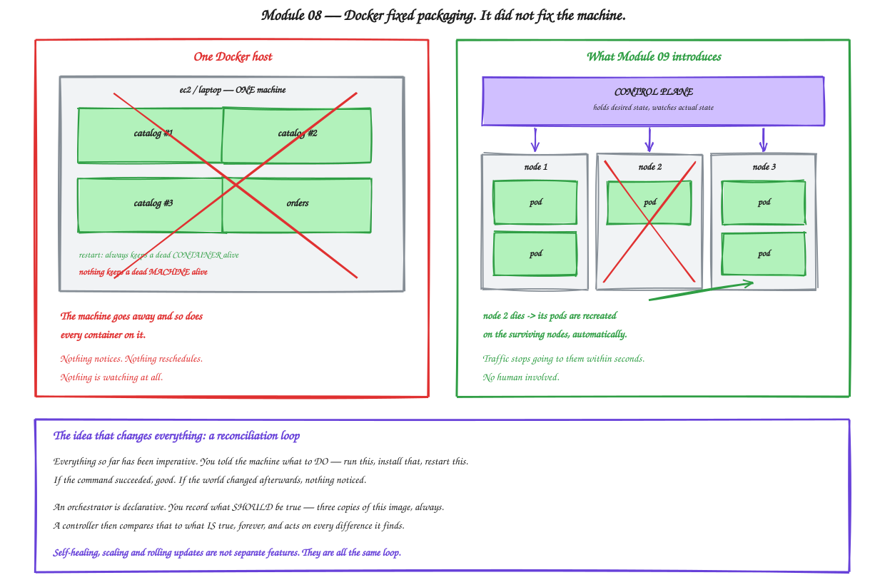

# Module 08 — The Limits of Docker

**Duration:** 50 minutes
**You will finish this module with:** Docker configured as well as it can be on a single host, and precise, measured evidence of the four things it cannot do at all.

---

## Context

Module 04 did this once already, and it is worth doing again for the same reason.

There is a lazy version of this argument that goes "Docker cannot restart containers, cannot scale, and cannot load balance, therefore Kubernetes." Every part of that is wrong, and any developer who has run Docker in anger will know it is wrong, and you will lose them.

Docker restarts crashed containers. Compose scales services. Docker's DNS spreads requests across replicas. Those are real capabilities and you are going to use all three in this lab.

So we build the best single-host Docker deployment we reasonably can — restart policies, health checks, resource limits, multiple replicas, a declarative Compose file — and then we test it honestly.

Some of it holds up remarkably well. And then four things break, in ways that no amount of Docker configuration can fix, because they are not Docker's job.

### The shape of the gap

Docker's job ends at the boundary of one machine. It is a *container runtime*. Ask it "is this container running" and it has an excellent answer. Ask it "are three copies of this service running somewhere across my fleet" and it does not understand the question — there is no fleet, there is this host.

Everything missing follows from that. Nothing schedules work across machines. Nothing notices a machine has died. Nothing knows the difference between a container that is running and a container that is *working*.

That last one is the most surprising, and you will see it in Step 5.



<sub>Editable source: [`11-limits-of-docker.excalidraw`](./diagrams/excalidraw/11-limits-of-docker.excalidraw)</sub>

---

## Concept

### Restart policies

Docker offers four:

| Policy | Behaviour |
|---|---|
| `no` | Default. A dead container stays dead. |
| `on-failure[:n]` | Restart on a non-zero exit, optionally up to n times |
| `always` | Restart whenever it stops, and start on daemon startup |
| `unless-stopped` | Same, except it stays down if you stopped it deliberately |

`always` is genuine self-healing at the process level, and it is the equivalent of the `Restart=always` systemd line from Module 02 — except now it also survives a host reboot, and it works identically for every service regardless of language.

This is real, and it covers the most common failure by far: an application crashing.

### Health checks that nothing acts on

Module 07 added a `HEALTHCHECK` to the Dockerfile. Docker runs it and records the result, which you can see in `docker ps`.

Now ask the important question: **what does Docker do when a container becomes unhealthy?**

Nothing.

It does not restart it — `restart: always` triggers on the process *exiting*, not on the health check failing. It does not remove it from DNS. It does not stop sending traffic. The status column changes from `(healthy)` to `(unhealthy)` and that is the entire consequence.

So a container whose application has hung, or lost its database connection, or is returning 500s to every request, stays in rotation indefinitely. Step 5 demonstrates this and it is the sharpest failure in the module.

Compare with the ALB in Module 03, which pulled a broken target out of rotation within twenty seconds. And note where that capability lived — in the load balancer, not in the host.

### DNS round-robin is not load balancing

Docker's embedded DNS returns all IP addresses registered under a network alias, and clients pick one. That distributes requests.

It also has no idea whether any of those addresses is alive. A dead container's IP is removed when the container is *removed*, but a container that is running-and-broken stays in the list forever. And clients cache DNS results, so even removal takes effect slowly.

Round-robin distributes. It does not health check, does not retry, and does not converge.

### Deployment means downtime

Change an image tag and run `docker compose up -d`, and Compose recreates the affected containers. It stops the old one, then starts the new one.

For a single-replica service, that is a gap where requests fail. Compose has no concept of "bring up the new one, wait for it to be healthy, shift traffic, then remove the old one" — that is a rolling update, and it needs something that owns both the old and new sets and can sequence between them.

There is also no rollback. Your previous configuration exists only in your shell history or your Git log.

### One host is one failure domain

This is the fundamental one.

Every container in this lab is on one machine. That machine's kernel, disk, network card, power supply and availability zone are a single point of failure for the entire application.

Docker cannot fix this because Docker is a program running *on* that machine. Something outside the machine has to be watching.

### Why Kubernetes rather than Swarm

Docker Swarm exists and does address multi-host scheduling. It is genuinely simpler than Kubernetes and it works.

It lost anyway, and it is worth understanding why so the choice does not feel arbitrary. Kubernetes was donated to a vendor-neutral foundation, which meant every cloud provider could offer it without strengthening a competitor — so AWS, Google and Azure all built managed services around it. That produced an ecosystem: ingress controllers, operators, service meshes, monitoring, all assuming Kubernetes. The gap became self-reinforcing.

The practical consequence for you is that Kubernetes skills transfer between employers and clouds, and Swarm skills largely do not.

### The reconciliation loop

Here is the idea underneath everything from Module 09 onward, and it is worth stating before you meet any Kubernetes syntax.

Everything in this workshop so far has been **imperative**. You told a machine what to *do*. `docker run`. `systemctl start`. `pip install`. Each command executed once. If it succeeded, good. If the world changed five minutes later, nothing noticed, because nothing was watching.

An orchestrator is **declarative**. You record what should be *true* — three copies of this image, always — and a controller compares that against reality on a loop, forever, acting on every difference.

Once you have that loop, several features you might think of as separate turn out to be the same thing:

- A container dies → actual is 2, desired is 3 → start one. That is **self-healing**.
- You change desired to 10 → start seven. That is **scaling**.
- You change the image → replace them a few at a time, checking health. That is a **rolling update**.
- A node dies → three pods vanish → recreate them elsewhere. That is **rescheduling**.

Docker has no such loop. Compose applies your file once and then stops thinking about it.

---

## Lab 08 — Push Docker to Its Limits

**Time:** 35 minutes
**Where:** your own machine.

Self-contained. Creates everything from scratch and removes it at the end.

### Step 1 — Build the best single-host deployment we can

```bash
rm -rf ~/lab08 && mkdir -p ~/lab08/catalog-api ~/lab08/orders-api && cd ~/lab08
```

Applications, unchanged since Module 00:

```bash
cat > ~/lab08/catalog-api/app.py << 'EOF'
from flask import Flask, jsonify
import os, socket

app = Flask(__name__)
VERSION = os.getenv("APP_VERSION", "1.0.0")
STATE = {"healthy": True}

PRODUCTS = {
    1: {"id": 1, "name": "Wireless Earbuds",    "price": 2499,  "stock": 120},
    2: {"id": 2, "name": "Mechanical Keyboard", "price": 5999,  "stock": 34},
    3: {"id": 3, "name": "27 inch Monitor",     "price": 18999, "stock": 12},
    4: {"id": 4, "name": "USB-C Hub",           "price": 3499,  "stock": 87},
}

def meta():
    return {"service": "catalog-api", "version": VERSION, "served_by": socket.gethostname()}

@app.route("/health")
def health():
    if not STATE["healthy"]:
        return jsonify(status="unhealthy", **meta()), 500
    return jsonify(status="ok", **meta()), 200

# deliberately present so we can simulate a sick-but-running process
@app.route("/break")
def break_it():
    STATE["healthy"] = False
    return jsonify(status="now unhealthy", **meta()), 200

@app.route("/products")
def products():
    if not STATE["healthy"]:
        return jsonify(error="internal error", **meta()), 500
    return jsonify(products=list(PRODUCTS.values()), **meta())

@app.route("/products/<int:pid>")
def product(pid):
    if not STATE["healthy"]:
        return jsonify(error="internal error", **meta()), 500
    p = PRODUCTS.get(pid)
    if not p:
        return jsonify(error="not found", **meta()), 404
    return jsonify(product=p, **meta())
EOF

cat > ~/lab08/catalog-api/requirements.txt << 'EOF'
flask==3.0.3
gunicorn==22.0.0
EOF
```

The `/break` endpoint is the instrument for Step 5. It makes the process report itself as sick while continuing to run — which is exactly what a real application does when it loses a database connection.

```bash
cat > ~/lab08/orders-api/app.py << 'EOF'
from flask import Flask, jsonify
import os, socket, requests

app = Flask(__name__)
VERSION = os.getenv("APP_VERSION", "1.0.0")
CATALOG_URL = os.getenv("CATALOG_URL", "http://localhost:8080")

ORDERS = [
    {"order_id": "ORD-1001", "product_id": 1, "qty": 2, "status": "DELIVERED"},
    {"order_id": "ORD-1002", "product_id": 3, "qty": 1, "status": "IN_TRANSIT"},
    {"order_id": "ORD-1003", "product_id": 2, "qty": 1, "status": "PLACED"},
]

def meta():
    return {"service": "orders-api", "version": VERSION,
            "served_by": socket.gethostname(), "catalog_url": CATALOG_URL}

@app.route("/health")
def health():
    return jsonify(status="ok", **meta()), 200

@app.route("/orders")
def orders():
    out = []
    for o in ORDERS:
        i = dict(o)
        try:
            r = requests.get(f"{CATALOG_URL}/products/{o['product_id']}", timeout=2)
            if r.status_code == 200:
                p = r.json()["product"]
                i["product_name"] = p["name"]; i["unit_price"] = p["price"]
                i["line_total"] = p["price"] * o["qty"]
            else:
                i["product_name"] = "CATALOG_ERROR_" + str(r.status_code)
        except Exception as e:
            i["product_name"] = "CATALOG_UNAVAILABLE"; i["error"] = str(e.__class__.__name__)
        out.append(i)
    return jsonify(orders=out, **meta())
EOF

cat > ~/lab08/orders-api/requirements.txt << 'EOF'
flask==3.0.3
gunicorn==22.0.0
requests==2.32.3
EOF
```

Hardened Dockerfiles, same pattern as Module 07:

```bash
cat > ~/lab08/catalog-api/Dockerfile << 'EOF'
FROM python:3.12 AS builder
WORKDIR /build
RUN python -m venv /opt/venv
ENV PATH="/opt/venv/bin:$PATH"
COPY requirements.txt .
RUN pip install --no-cache-dir -r requirements.txt

FROM python:3.12-slim AS runtime
RUN groupadd --gid 10001 appgroup && \
    useradd --uid 10001 --gid appgroup --no-create-home --shell /usr/sbin/nologin appuser
COPY --from=builder --chown=10001:10001 /opt/venv /opt/venv
ENV PATH="/opt/venv/bin:$PATH" PYTHONDONTWRITEBYTECODE=1 PYTHONUNBUFFERED=1
WORKDIR /app
COPY --chown=10001:10001 app.py .
USER 10001:10001
EXPOSE 8080
HEALTHCHECK --interval=5s --timeout=3s --start-period=5s --retries=2 \
  CMD python -c "import urllib.request,sys; sys.exit(0 if urllib.request.urlopen('http://127.0.0.1:8080/health',timeout=2).status==200 else 1)"
CMD ["gunicorn","--bind","0.0.0.0:8080","--workers","2","--access-logfile","-","app:app"]
EOF

sed -e 's/8080/8081/g' ~/lab08/catalog-api/Dockerfile > ~/lab08/orders-api/Dockerfile
for s in catalog-api orders-api; do
  printf '__pycache__\n*.pyc\n.git\n.env\nvenv\nDockerfile*\n' > ~/lab08/$s/.dockerignore
done
```

The health check interval is 5 seconds rather than 30, so state changes are visible live.

Now the Compose file, with every resilience feature Docker offers:

```bash
cat > ~/lab08/compose.yaml << 'EOF'
services:
  catalog-api:
    build: ./catalog-api
    image: catalog-api:8.0
    restart: always
    environment:
      APP_VERSION: "1.0.0"
    networks:
      shop-net:
        aliases:
          - catalog-api
    deploy:
      resources:
        limits:
          memory: 256M
          cpus: "0.5"
    security_opt:
      - no-new-privileges:true
    cap_drop:
      - ALL

  orders-api:
    build: ./orders-api
    image: orders-api:8.0
    restart: always
    ports:
      - "8081:8081"
    environment:
      APP_VERSION: "1.0.0"
      CATALOG_URL: "http://catalog-api:8080"
    depends_on:
      - catalog-api
    networks:
      - shop-net
    security_opt:
      - no-new-privileges:true
    cap_drop:
      - ALL

networks:
  shop-net:
    driver: bridge
EOF
```

```bash
cd ~/lab08
docker compose up -d --build
docker compose ps
curl -s localhost:8081/orders | head -c 200
```

### Step 2 — Scale it

```bash
docker compose up -d --scale catalog-api=3
docker compose ps
```

Three catalog replicas in seconds. Confirm requests spread:

```bash
for i in $(seq 1 9); do
  docker compose exec -T orders-api python -c "
import requests, json
print(json.loads(requests.get('http://catalog-api:8080/health').text)['served_by'])"
done
```

Three different hostnames. **This genuinely works**, and it is a real improvement on Module 03, where a third server took fifteen minutes.

### Step 3 — Prove restart policies work

Kill a container's main process outright:

```bash
CID=$(docker compose ps -q catalog-api | head -1)
docker exec $CID sh -c "kill 1" 2>/dev/null
sleep 6
docker compose ps catalog-api
```

It came back. `restart: always` did its job.

Now be more brutal — kill the process from the host:

```bash
docker kill $CID
sleep 6
docker ps --filter "id=$CID" --format '{{.Names}} {{.Status}}'
```

Back again, with a restart count.

**Docker really does self-heal crashed containers.** Write that down as a genuine win, because the next step is where it stops.

### Step 4 — Prove resource limits hold

```bash
docker stats --no-stream $(docker compose ps -q) --format 'table {{.Name}}\t{{.MemUsage}}\t{{.CPUPerc}}'
```

Each container is capped at 256 MB. One misbehaving service cannot starve the rest — the thing that made two services on one EC2 instance a bad idea in Module 04.

### Step 5 — The failure Docker cannot see

This is the important step in the module.

Confirm all three replicas are healthy:

```bash
docker compose ps --format 'table {{.Name}}\t{{.Status}}'
```

Now break **one** of them from the inside — the process keeps running, but its application is sick:

```bash
VICTIM=$(docker compose ps -q catalog-api | head -1)
VICTIM_HOST=$(docker exec $VICTIM hostname)
echo "Breaking container $VICTIM_HOST"
docker exec $VICTIM python -c "
import urllib.request; print(urllib.request.urlopen('http://127.0.0.1:8080/break').read().decode())"
```

Wait for the health check to notice:

```bash
sleep 12
docker compose ps --format 'table {{.Name}}\t{{.Status}}'
```

One container now reports `(unhealthy)`. Docker knows.

**Now watch what Docker does about it.**

```bash
for i in $(seq 1 15); do
  docker compose exec -T orders-api python -c "
import requests
r = requests.get('http://catalog-api:8080/products')
print(r.status_code)" 2>/dev/null
done
```

Roughly a third of those are **500**s.

The unhealthy container is still receiving traffic. It is still in DNS. It was never restarted, because `restart: always` fires when a process *exits*, and this process is alive and answering — badly.

Look at the customer impact:

```bash
for i in $(seq 1 9); do curl -s localhost:8081/orders | python3 -c "
import sys,json; d=json.load(sys.stdin); print(d['orders'][0]['product_name'])"; done
```

Some responses show real product names. Others show `CATALOG_ERROR_500`. Same URL, same second, different answers — **exactly the drift symptom from Module 04, Step 2**, arrived by a completely different route.

Now go back and compare this with Module 03, Step 11. There, when catalog broke, the ALB marked the target unhealthy and stopped sending it traffic within twenty seconds. Automatically.

Docker has the health information and does nothing with it, because acting on it requires something that owns both the health status *and* the routing decision. That is what a Kubernetes Service plus a readiness probe is, and you will build it in Module 11.

Confirm nothing recovers on its own:

```bash
sleep 20
docker compose ps --format 'table {{.Name}}\t{{.Status}}'
```

Still unhealthy. Still serving. Only a human fixes this:

```bash
docker restart $VICTIM
sleep 8
docker compose ps --format 'table {{.Name}}\t{{.Status}}'
```

### Step 6 — Deploy a new version and watch the gap

Change the application:

```bash
sed -i 's/"price": 2499/"price": 2199/' ~/lab08/catalog-api/app.py
sed -i 's/image: catalog-api:8.0/image: catalog-api:8.1/' ~/lab08/compose.yaml
```

Start a traffic monitor in a second terminal:

```bash
while true; do
  curl -s -o /dev/null -w "%{http_code} " localhost:8081/orders
  sleep 0.4
done
```

Then in the first terminal:

```bash
cd ~/lab08
docker compose up -d --build --scale catalog-api=3
```

Watch the monitor. `orders-api` is recreated as a single container, and during that window you will see failures — `000` or a connection error — because Compose stops the old container before the new one is ready.

Stop the monitor with `Ctrl+C`.

There is no `--strategy rolling`. Compose recreates. For a multi-replica service the impact is partial, and for a single-replica service like orders it is total.

And rollback:

```bash
git log --oneline 2>/dev/null || echo "no version history for this configuration"
```

Your previous state exists in your shell history and nowhere else.

### Step 7 — The host is the whole world

```bash
docker info --format 'Docker sees {{.Containers}} containers on {{.Name}} — {{.NCPU}} CPUs, {{.OperatingSystem}}'
```

One host. Every container in this application is on it.

Simulate losing it:

```bash
docker compose stop
docker compose ps
curl -s --max-time 3 localhost:8081/orders || echo "APPLICATION IS DOWN"
```

Everything is gone. Now wait, and notice what happens.

```bash
sleep 20
docker compose ps
curl -s --max-time 3 localhost:8081/orders || echo "STILL DOWN"
```

**Nothing came back.** No process is watching. `restart: always` is enforced by the Docker daemon, which lives on the machine that we just simulated losing.

Ask the question directly: if this were an EC2 instance and it had failed, what would restore service?

Only a human. And there is no alert to tell them.

```bash
docker compose start
```

### Step 8 — What you cannot even attempt here

Three problems that need more than one machine, which is why the lab stops rather than continues.

**Scheduling.** With ten Docker hosts and forty containers, which container goes where? You decide, by hand, and you keep a spreadsheet. Nothing rebalances when a host fills up.

**Cross-host discovery.** `catalog-api` resolves only within one host's network. A container on host A cannot reach `catalog-api` on host B by name — you are back to IP addresses and Module 02.

**Cross-host failover.** A host dies and its containers do not move. There is nowhere for them to go and nothing to move them.

Each of these needs a component that sits *above* the machines, holds the desired state, and reconciles.

### Step 9 — The scorecard

| Requirement | Module 02 (EC2) | Module 06/08 (Docker) | Needed |
|---|---|---|---|
| Packaged, reproducible deploys | No | **Yes** | |
| Deploy in seconds | No | **Yes** | |
| Service discovery by name | No | **Yes**, on one host | across hosts |
| Restart a crashed process | Yes (systemd) | **Yes** | |
| Resource isolation | No | **Yes** | |
| Scale on one machine | No | **Yes** | |
| Remove a sick instance from traffic | Yes (ALB) | **No** — Step 5 | yes |
| Rolling update, no downtime | Yes (ASG refresh) | **No** — Step 6 | yes |
| Rollback | Partly | **No** | yes |
| Survive host failure | Yes (ASG) | **No** — Step 7 | yes |
| Schedule across machines | n/a | **No** | yes |

Read the shape of that table carefully. **Docker gave us the top half. The ALB and ASG in Modules 03 and 04 gave us the bottom half.**

We have never had both at once.

That is what Kubernetes is: the ASG's reconciliation and the ALB's health-aware routing, applied to containers rather than virtual machines — so replacement takes seconds instead of minutes, and a machine can hold forty services instead of one.

### Step 10 — Clean up

```bash
cd ~/lab08
docker compose down --volumes --remove-orphans
docker rmi catalog-api:8.0 catalog-api:8.1 orders-api:8.0 orders-api:8.1 2>/dev/null
docker ps -a | grep -E "catalog|orders" || echo "no containers"
docker network ls | grep shop-net || echo "network gone"
cd ~ && rm -rf ~/lab08
```

Nothing in this lab touched AWS. Your ECR repositories from Module 07 are untouched and Module 10 needs them.

---

## Troubleshooting

**`docker compose exec -T` fails.** Older Compose versions need `docker-compose` with a hyphen. Check with `docker compose version`.

**Scaling fails with a port conflict.** A service with a fixed host port cannot have multiple replicas. That is why `catalog-api` publishes no port in the Compose file — only `orders-api` does.

**All three replicas return 500 in Step 5.** You broke more than one. `docker compose restart catalog-api` and retry, breaking exactly one container.

**Health status never changes.** Check `docker inspect --format '{{json .State.Health}}' <container>`. The health check runs inside the container using Python, since curl is not present in a hardened image.

---

## What you proved

Docker on one host does packaging, isolation, fast scaling and process restart genuinely well.

It cannot act on its own health checks, cannot roll out without downtime, cannot roll back, and cannot survive the machine it runs on — because none of those are a container runtime's job.

## The one sentence

Everything Docker does, it does **to containers on this machine**. Everything missing requires something that watches **all the machines** and continuously reconciles what is true against what should be true.

---

**Next:** [Module 09 — Kubernetes Concepts and the EKS Cluster](./09-kubernetes-concepts-eks-cluster.md)
