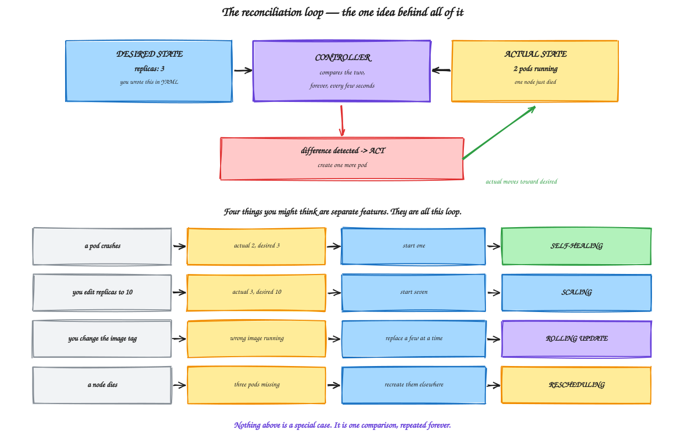
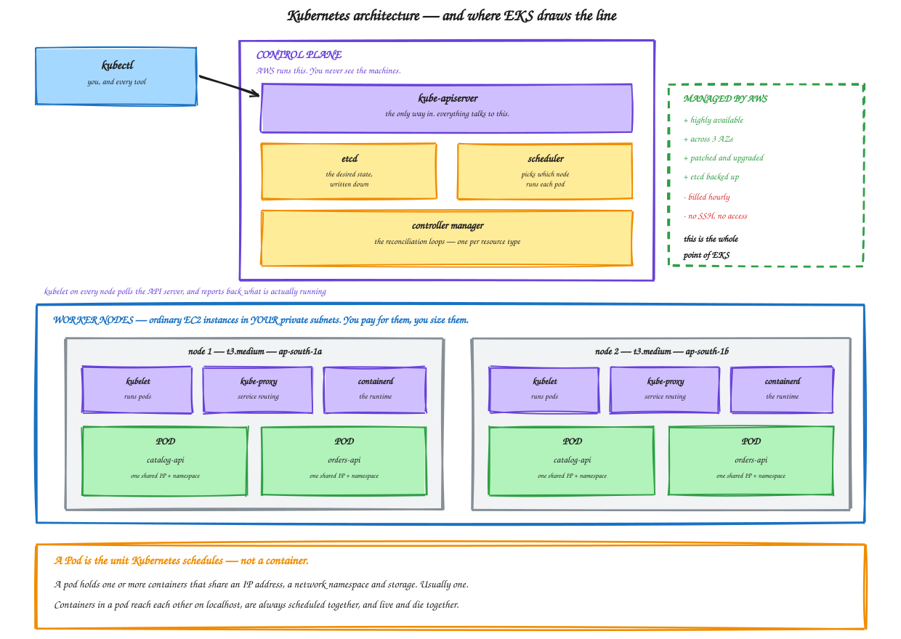

# Module 09 — Kubernetes Concepts and the EKS Cluster

**Duration:** 75 minutes (25 minutes of it is the cluster building itself)
**You will finish this module with:** a running EKS cluster across two availability zones, `kubectl` working, and a clear model of what each control plane component does.

> **Cost warning.** From the moment this cluster exists, AWS bills for the control plane by the hour plus the worker nodes, the NAT gateway, and later a load balancer. The teardown at the end of Module 12 removes everything. Do not leave a cluster running overnight by accident.

---

## Context

Look again at the scorecard you finished Module 08 with.

The top half — packaging, fast deploys, service discovery by name, process restart, resource isolation, scaling on one machine — Docker gave you all of that.

The bottom half — removing a sick instance from traffic, rolling updates without downtime, rollback, surviving host failure, scheduling across machines — the ALB and Auto Scaling Group gave you that back in Modules 03 and 04.

**You have never had both halves at once.** Docker works inside one machine. The ASG works on whole machines and takes minutes to do anything.

Kubernetes is what happens when you take the reconciliation idea from the Auto Scaling Group and the health-aware routing idea from the load balancer, and apply them to containers instead of virtual machines. The result acts in seconds rather than minutes, and one machine can hold forty services rather than one.

That is the entire pitch. Everything else is detail.

### What this module deliberately does not do

We are not deploying the application today. That is Module 10.

Today is about understanding the machine you are about to work with, and getting it built — because the build takes fifteen to twenty minutes and you may as well spend that time learning what is being created.

Start the cluster early. Step 4 kicks it off, and Steps 5 onward are things to read and discuss while it provisions.

---

## Concept

### Declarative, not imperative

This is the mental shift, and it is worth being explicit before any YAML appears.

Every command in this workshop so far has been **imperative**. `docker run`. `systemctl start`. `aws ec2 run-instances`. You told a machine what to *do*, it did it once, and then nothing was watching.

Kubernetes is **declarative**. You submit a document describing what should be true — three copies of this image, always, reachable at this name — and a controller compares that against reality on a loop, forever, acting on every difference.

You never tell Kubernetes to start a pod. You tell it three pods should exist, and it works out the rest.



<sub>Editable source: [`13-reconciliation-loop.excalidraw`](./diagrams/excalidraw/13-reconciliation-loop.excalidraw)</sub>

### The control plane

Four components, each with one job.

**kube-apiserver** is the only way in. `kubectl`, the kubelet on every node, every controller, every tool — all of them talk to the API server and nothing talks to anything else. It authenticates, authorises, validates, and persists.

**etcd** is the database. It holds the desired state you submitted and the observed state reported back. If etcd is lost, the cluster's memory is lost — which is why "AWS manages and backs up etcd" is one of the more valuable things you get from EKS.

**kube-scheduler** answers one question: for a pod that has no node yet, which node should run it? It filters nodes that could work — enough CPU and memory, matching labels, tolerating taints — then scores the survivors and picks the best.

**controller-manager** runs the reconciliation loops. One controller per resource type, each watching its own resources and driving actual toward desired. The Deployment controller in Module 10 is one of these.

On EKS, all four run on machines AWS owns, across three availability zones, and you cannot SSH to them. That is what the hourly control plane charge buys.

### The nodes

Worker nodes are ordinary EC2 instances in your own private subnets. You choose the type, you pay for them, and three things run on each.

**kubelet** is the agent. It watches the API server for pods assigned to its node, tells the container runtime to start them, runs the probes, and reports status back.

**kube-proxy** programs the node's networking so that Service virtual IPs route to the right pods. Module 11 depends on it.

**containerd** is the runtime that actually runs containers — the same containerd from Module 05's architecture diagram. Docker Engine itself is not installed on Kubernetes nodes any more, though images built with Docker run perfectly well because the image format is a standard.



<sub>Editable source: [`12-kubernetes-architecture.excalidraw`](./diagrams/excalidraw/12-kubernetes-architecture.excalidraw)</sub>

### Pods

Kubernetes does not schedule containers. It schedules **pods**.

A pod is one or more containers that share a network namespace, an IP address, and storage volumes. Containers in a pod reach each other on `localhost`, are always placed on the same node, and are created and destroyed together.

Almost always a pod holds exactly one application container. The multi-container case exists for **sidecars** — a log shipper, a proxy, a metrics exporter — helpers that must live beside the application rather than beside the cluster.

Two properties matter for everything that follows. A pod gets **its own IP address**, routable inside the cluster, and it is **mortal** — pods are never repaired, only replaced, and a replacement gets a new IP. That mortality is why Services exist in Module 11, and it is only tolerable because containers are ephemeral, which you proved in Module 05.

### Namespaces

A namespace partitions the cluster into virtual sub-clusters. Names must be unique within a namespace, not across the cluster.

`default` is where things land if you say nothing. `kube-system` holds the cluster's own components — CoreDNS, kube-proxy, the VPC CNI. In real clusters you would separate teams or environments this way, with resource quotas and network policies per namespace.

### What EKS actually is

| | Who runs it |
|---|---|
| API server, etcd, scheduler, controller manager | **AWS** — across 3 AZs, patched, backed up, unreachable to you |
| Worker nodes | **You** — your EC2 instances, your subnets, your bill |
| The application | **You** |
| Cluster networking (VPC CNI) | Shared — AWS supplies the plugin, you supply the VPC |

The trade is straightforward. You give up control of the control plane and pay for it hourly, and in exchange you never patch etcd at 2 AM.

### Pods get real VPC IP addresses

The AWS VPC CNI gives every pod an IP address **from your subnet's CIDR range**. Not an overlay network — a real address in `10.0.11.0/24`.

This is genuinely useful. Security groups, VPC flow logs, and anything else that works with VPC addresses works for pods directly.

It also has a consequence people hit in production: **you can run out of IP addresses**. Each node can hold a limited number of pods depending on its instance type, because each pod consumes an address from the subnet. A `/24` subnet holds around 250 addresses in total. Size your subnets with that in mind.

### Authentication is IAM, authorisation is Kubernetes

Two separate systems, and confusing them is the most common EKS access problem.

**Who you are** is decided by AWS IAM. `kubectl` signs a request with your AWS credentials and the API server verifies it with AWS.

**What you may do** is decided by Kubernetes RBAC. Roles and RoleBindings inside the cluster grant permissions.

The mapping between the two used to live in a ConfigMap called `aws-auth`. Newer clusters use **EKS access entries**, which are managed through the AWS API instead. The IAM principal that *creates* the cluster is automatically granted admin, which is why your `kubectl` will work immediately and a colleague's will not until you grant them access.

### Node group options

| Option | What it means |
|---|---|
| **Managed node group** | AWS runs an Auto Scaling Group of EC2 instances for you, with coordinated drain and upgrade. The sane default. |
| **Self-managed nodes** | You build the ASG and launch template yourself. Full control, more work. |
| **Fargate** | No nodes at all. Each pod gets its own micro-VM. No capacity planning, higher per-pod cost, several limitations. |

We use a managed node group. Notice what is underneath it: an Auto Scaling Group — the same object you built by hand in Module 04. Kubernetes did not replace it. It layered a faster, finer-grained scheduler on top of it.

### Why eksctl

Three ways to create a cluster. The console is slow and hard to reproduce. Terraform is what you would use in production. **eksctl** takes one YAML file and creates the cluster, node group, IAM roles, and OIDC provider in one command — which makes it right for learning, because the whole cluster definition fits on one screen.

---

## Lab 09 — Build the Cluster

**Time:** 55 minutes, of which about 20 is waiting.

**Read Steps 1 to 4 first, start the cluster, then use the wait to work through Steps 5 to 7.**

### Step 1 — Verify tooling

```bash
aws --version
eksctl version
kubectl version --client
aws sts get-caller-identity
```

If `eksctl` is missing on Amazon Linux:

```bash
ARCH=amd64
curl -sLO "https://github.com/eksctl-io/eksctl/releases/latest/download/eksctl_Linux_$ARCH.tar.gz"
tar -xzf eksctl_Linux_$ARCH.tar.gz -C /tmp && rm eksctl_Linux_$ARCH.tar.gz
sudo mv /tmp/eksctl /usr/local/bin && eksctl version
```

And `kubectl`:

```bash
curl -sLO "https://dl.k8s.io/release/$(curl -sL https://dl.k8s.io/release/stable.txt)/bin/linux/amd64/kubectl"
chmod +x kubectl && sudo mv kubectl /usr/local/bin/ && kubectl version --client
```

### Step 2 — Build the network

The cluster goes into the VPC from Module 01 — the one with the `kubernetes.io/role/elb` subnet tags, which Module 12 will need.

```bash
export AWS_REGION=ap-south-1
aws configure set region $AWS_REGION

~/workshop-app/infra/create-network.sh
source ~/workshop-app/infra/network.env

echo "VPC:      $VPC_ID"
echo "Public:   $PUB_SUBNET_A  $PUB_SUBNET_B"
echo "Private:  $PRIV_SUBNET_A $PRIV_SUBNET_B"
```

If those variables are empty, the network was not created. Fix that before continuing.

### Step 3 — Write the cluster definition

```bash
mkdir -p ~/workshop-app/k8s && cd ~/workshop-app/k8s

cat > ~/workshop-app/k8s/cluster.yaml << EOF
apiVersion: eksctl.io/v1alpha5
kind: ClusterConfig

metadata:
  name: workshop-eks
  region: $AWS_REGION
  version: "1.31"

vpc:
  id: $VPC_ID
  subnets:
    public:
      ${AWS_REGION}a: { id: $PUB_SUBNET_A }
      ${AWS_REGION}b: { id: $PUB_SUBNET_B }
    private:
      ${AWS_REGION}a: { id: $PRIV_SUBNET_A }
      ${AWS_REGION}b: { id: $PRIV_SUBNET_B }

iam:
  withOIDC: true

managedNodeGroups:
  - name: workshop-nodes
    instanceType: t3.medium
    desiredCapacity: 2
    minSize: 2
    maxSize: 4
    volumeSize: 30
    privateNetworking: true
    iam:
      withAddonPolicies:
        imageBuilder: true
        albIngressController: true
        cloudWatch: true
    labels:
      role: worker
    tags:
      Project: docker-to-eks-workshop

addons:
  - name: vpc-cni
  - name: coredns
  - name: kube-proxy

cloudWatch:
  clusterLogging:
    enableTypes: ["api", "audit", "authenticator"]
EOF

cat ~/workshop-app/k8s/cluster.yaml
```

Four lines deserve attention.

`privateNetworking: true` puts worker nodes in the **private** subnets. No public IPs, exactly like Module 02's application servers. They reach the internet outbound through your NAT gateway.

`withOIDC: true` creates an OIDC identity provider for the cluster. This is what lets a pod assume an IAM role directly — IRSA — which Module 12's load balancer controller needs.

`imageBuilder: true` grants nodes permission to pull from ECR, which is how your Module 07 images get in.

`instanceType: t3.medium` is not arbitrary. The VPC CNI limits pods per node by instance type, and `t3.micro` allows so few that system pods leave almost no room for yours.

### Step 4 — Create the cluster and start the clock

```bash
time eksctl create cluster -f ~/workshop-app/k8s/cluster.yaml
```

**This takes 15 to 20 minutes.** Leave it running and read on.

While it works, eksctl is creating a CloudFormation stack for the cluster, the EKS control plane itself, IAM roles for cluster and nodes, an OIDC provider, a second stack for the node group with its own launch template and Auto Scaling Group, the managed add-ons, and your kubeconfig entry.

Watch it in another terminal if you like:

```bash
aws cloudformation describe-stacks \
  --query 'Stacks[?contains(StackName,`workshop-eks`)].{Name:StackName,Status:StackStatus}' \
  --output table
```

### Step 5 — While you wait: what is being built

Three questions worth discussing as it provisions.

**Why does the control plane take so long?** AWS is provisioning a highly available API server and etcd cluster across three availability zones, with load balancers and certificates. You are getting in fifteen minutes something that takes an experienced team days to build correctly.

**What is the node group, underneath?** An Auto Scaling Group with a launch template — the objects you built by hand in Module 04. Kubernetes did not replace them. It put a faster scheduler on top of them, so the *pod* moves in seconds even though the *node* still takes minutes.

**Where does the reconciliation happen?** In the controller manager, continuously. Once this is up, the cluster is not waiting for instructions. It is comparing desired against actual, over and over, forever.

### Step 6 — Verify the cluster

```bash
kubectl cluster-info
kubectl get nodes -o wide
```

Two nodes, `Ready`, in two availability zones, with private IPs from `10.0.11.0/24` and `10.0.12.0/24`. No public IPs — check the `EXTERNAL-IP` column.

Confirm kubeconfig is pointing where you think:

```bash
kubectl config current-context
aws eks describe-cluster --name workshop-eks \
  --query 'cluster.{Status:status,Version:version,Endpoint:endpoint}' --output json
```

### Step 7 — Look at what is already running

You deployed nothing, but the cluster is not empty.

```bash
kubectl get pods -A
```

`coredns` is the cluster's DNS server — it is what will resolve `catalog-api` to a Service IP in Module 11. Note there are two replicas, on different nodes.

`aws-node` is the VPC CNI, one per node, handing out VPC IP addresses to pods.

`kube-proxy` is one per node, programming Service routing.

```bash
kubectl get nodes -o custom-columns=NAME:.metadata.name,ZONE:.metadata.labels.'topology\.kubernetes\.io/zone',TYPE:.metadata.labels.'node\.kubernetes\.io/instance-type',IP:.status.addresses[0].address
```

```bash
kubectl get namespaces
kubectl api-resources --namespaced=true | head -20
```

That last command lists every resource type the API server understands. `deployments`, `services`, `ingresses`, `configmaps`, `secrets` — the next three modules are all in there.

### Step 8 — Your first pod, and why it is the wrong way

Create a pod directly, without a controller:

```bash
kubectl run standalone --image=nginx:1.27-alpine --restart=Never
kubectl get pods -o wide
```

Watch it start, and note which node the scheduler chose. You did not pick — kube-scheduler did.

```bash
kubectl describe pod standalone | tail -20
```

The Events section at the bottom is a narrative: scheduled to a node, image pulled, container created, container started. **This is the first place to look when a pod misbehaves.**

Now delete it and see what happens:

```bash
kubectl delete pod standalone
sleep 5
kubectl get pods
```

**It is gone and it stays gone.**

That is the whole lesson of this step. A bare pod has no controller watching it, so there is no desired state recorded anywhere — nothing to compare against, nothing to act on. Deleting it just deletes it.

This is exactly the position Docker was in throughout Module 08. Kubernetes on its own does not give you self-healing. A **controller** gives you self-healing, and that is Module 10.

### Step 9 — Prove the scheduler is making decisions

```bash
for i in 1 2 3 4; do
  kubectl run spread-$i --image=nginx:1.27-alpine --restart=Never
done
sleep 12
kubectl get pods -o custom-columns=NAME:.metadata.name,NODE:.spec.nodeName,STATUS:.status.phase
```

The pods are distributed across both nodes. Nobody chose that. The scheduler filtered for nodes with capacity and scored them, preferring the less loaded one.

Compare with Module 08, Step 8, where placing containers across hosts was a spreadsheet exercise you did by hand.

```bash
kubectl delete pod spread-1 spread-2 spread-3 spread-4
```

### Step 10 — See the node underneath

```bash
kubectl describe node $(kubectl get nodes -o jsonpath='{.items[0].metadata.name}') \
  | grep -A 12 "Allocated resources"
```

CPU and memory requests and limits per node, and how much is already committed. This is the information the scheduler uses.

And confirm the ASG is really there:

```bash
aws autoscaling describe-auto-scaling-groups \
  --query 'AutoScalingGroups[?contains(AutoScalingGroupName,`workshop`)].{Name:AutoScalingGroupName,Min:MinSize,Max:MaxSize,Desired:DesiredCapacity}' \
  --output table
```

There it is. The same object from Module 04, now with Kubernetes scheduling on top of it.

### Step 11 — Optional: kill a node

Only if you have ten minutes to spare, because node replacement is slow — that is rather the point.

```bash
NODE=$(kubectl get nodes -o jsonpath='{.items[0].metadata.name}')
INSTANCE=$(aws ec2 describe-instances \
  --filters "Name=private-dns-name,Values=$NODE" \
  --query 'Reservations[0].Instances[0].InstanceId' --output text)
echo "Terminating $INSTANCE"
aws ec2 terminate-instances --instance-ids $INSTANCE >/dev/null

watch -n 10 kubectl get nodes
```

The node goes `NotReady`, then disappears, and the ASG launches a replacement that joins the cluster. Two to four minutes — the same number you measured in Module 04, Step 8, because it is the same mechanism.

Hold that contrast. **Nodes recover in minutes. Pods recover in seconds.** Which is why you want many pods per node rather than one service per machine.

Press `Ctrl+C` when a second node is `Ready`.

### Step 12 — Confirm ECR access

Module 10 pulls your images, so check the plumbing now rather than debugging it later.

```bash
export ACCOUNT_ID=$(aws sts get-caller-identity --query Account --output text)
aws ecr describe-repositories --region $AWS_REGION \
  --query 'repositories[].{Name:repositoryName,URI:repositoryUri}' --output table
```

You should see `catalog-api` and `orders-api` from Module 07. If they are gone, go back and re-run Module 07 Steps 12 and 13.

Confirm the node role carries ECR read permission:

```bash
NODE_ROLE=$(aws iam list-roles \
  --query "Roles[?contains(RoleName,'workshop-eks-nodegroup')].RoleName" --output text | head -1)
aws iam list-attached-role-policies --role-name $NODE_ROLE \
  --query 'AttachedPolicies[].PolicyName' --output text
```

`AmazonEC2ContainerRegistryReadOnly` or `...PowerUser` should appear. That is `imageBuilder: true` from your cluster config.

### Step 13 — Teardown

**Do not run this if you are continuing to Module 10.** The cluster is needed for Modules 10, 11 and 12.

When you are genuinely finished:

```bash
eksctl delete cluster -f ~/workshop-app/k8s/cluster.yaml --wait
~/workshop-app/infra/delete-network.sh
```

Cluster deletion takes about ten minutes. Verify:

```bash
aws eks list-clusters --query clusters --output text
aws ec2 describe-instances --filters "Name=instance-state-name,Values=running" \
  --query 'Reservations[].Instances[].InstanceId' --output text
aws ec2 describe-addresses --query 'Addresses[].PublicIp' --output text
```

All empty.

Delete any leftover CloudFormation stacks if `eksctl delete` reported errors:

```bash
aws cloudformation describe-stacks \
  --query 'Stacks[?contains(StackName,`workshop-eks`)].StackName' --output text
```

---

## Troubleshooting

**`eksctl create cluster` fails on subnets.** The subnets must be in at least two AZs and correctly tagged. Re-run `create-network.sh` and confirm the variables in `network.env` are populated.

**`kubectl` returns "You must be logged in to the server (Unauthorized)."** Your kubeconfig identity differs from the IAM principal that created the cluster. Fix with `aws eks update-kubeconfig --name workshop-eks --region $AWS_REGION`, and confirm `aws sts get-caller-identity` shows the creating principal.

**Nodes never become Ready.** Almost always no route to the internet. The private subnets must route `0.0.0.0/0` to the NAT gateway, and the NAT must be `available`.

**Pods stuck in `Pending`.** Either no node has capacity, or the node has run out of pod IP slots. `kubectl describe pod <name>` and read the Events.

**Cluster creation stalls for a long time.** Check the CloudFormation console for the real error — eksctl's output can lag well behind the stack.

**`eksctl delete cluster` fails.** Usually a load balancer or security group created outside eksctl is still attached to the VPC. Delete those first, then retry.

---

## What you built

An EKS cluster with a control plane AWS runs across three availability zones, two worker nodes in private subnets across two AZs, OIDC configured for IRSA, CoreDNS and the VPC CNI running, and `kubectl` authenticated through IAM.

## What you proved

| Observation | Step |
|---|---|
| The scheduler places pods, not you | 9 |
| A bare pod has no controller and never comes back | 8 |
| Pods get real VPC IP addresses | 6 |
| A managed node group is an Auto Scaling Group underneath | 10 |
| Node recovery takes minutes | 11 |

## What is still missing

Nothing you created today survives deletion, because nothing is watching it. You have a cluster and no application on it.

Module 10 adds the controller — and the moment it exists, deleting a pod stops being permanent.

---

**Next:** [Module 10 — Kubernetes Deployments](./10-kubernetes-deployments.md)
