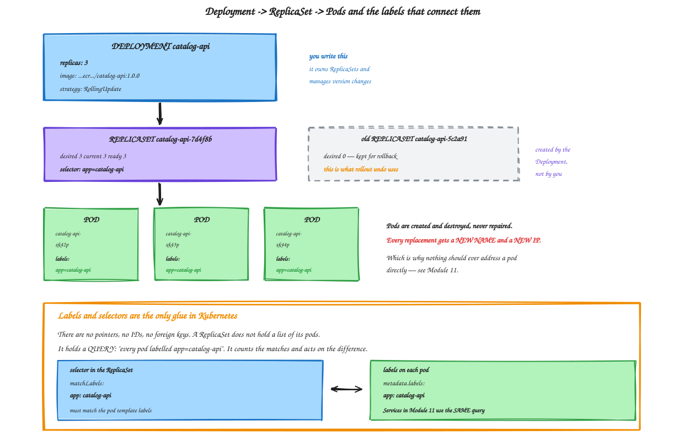
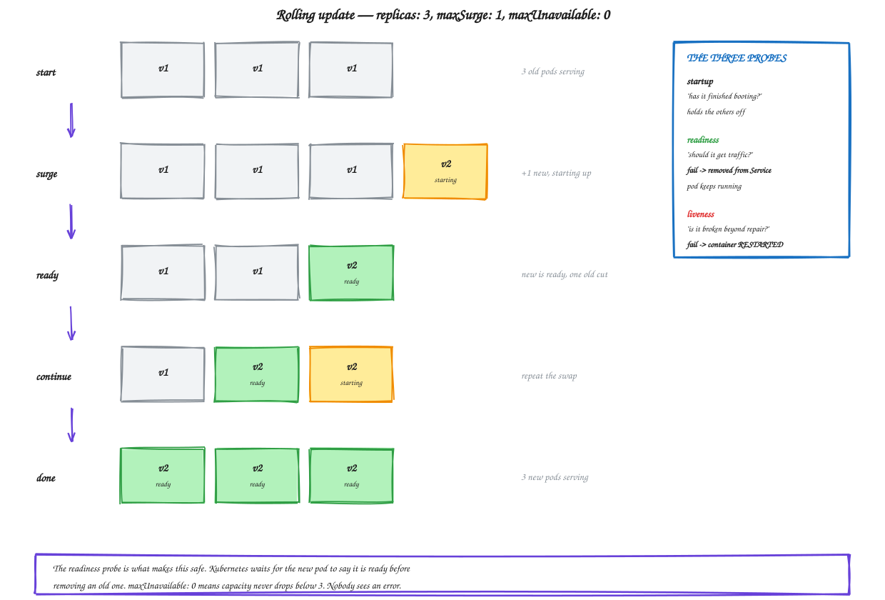

# Module 10 — Kubernetes Deployments

**Duration:** 70 minutes
**You will finish this module with:** both services running as Deployments on EKS, self-healing, scaled in seconds, updated without downtime, rolled back in one command, and restarting themselves when the application goes sick.

---

## Context

Module 09 ended on a deliberate anticlimax. You created a pod, deleted it, and it stayed deleted.

That is the same position Docker was in throughout Module 08. Kubernetes on its own does not give you self-healing. Something has to be **watching**, holding a record of what should be true and comparing it against what is.

That something is a controller, and the controller you will use for almost everything is a **Deployment**.

Once it exists, four things you have wanted since Module 03 arrive at once, and they arrive as consequences of the same mechanism rather than as separate features. Delete a pod and it comes back. Change a number and capacity follows. Change an image tag and versions roll over without dropping a request. Change your mind and one command puts the old version back.

### The specific failure we are fixing today

Module 08, Step 5. You broke one container from the inside — the process kept running, but the application returned 500s. Docker's health check noticed and marked it `(unhealthy)`, and then Docker did precisely nothing. It never restarted it and never stopped sending it traffic. A third of requests failed indefinitely until a human intervened.

Today a **liveness probe** fixes the restart half of that. Module 11's readiness probe fixes the traffic half.



<sub>Editable source: [`14-deployment-hierarchy.excalidraw`](./diagrams/excalidraw/14-deployment-hierarchy.excalidraw)</sub>

---

## Concept

### Deployment, ReplicaSet, Pod

Three objects in a chain, and you only ever write the first.

A **Deployment** describes the application: which image, how many replicas, how to update. It is the version-aware layer.

A **ReplicaSet** maintains a count of identical pods. It knows nothing about versions or updates — its entire job is "make the number of matching pods equal N."

A **Pod** runs your containers.

The Deployment creates a ReplicaSet per version of the pod template. Change the image tag and the Deployment creates a *new* ReplicaSet, scales it up while scaling the old one down, and keeps the old one around at zero replicas — which is exactly what makes rollback instant.

### Labels are the only glue

There are no pointers or IDs connecting these objects. A ReplicaSet does not hold a list of pods it owns.

It holds a **query**: every pod labelled `app=catalog-api`. It counts the matches and acts on the difference.

That has a consequence worth knowing before it bites you. If you hand-create a pod carrying the label `app=catalog-api`, the ReplicaSet counts it, decides it has one too many, and deletes one of its own. Selectors are matching, not ownership.

The same query mechanism is how Services find pods in Module 11, which is why the labels you set today matter tomorrow.

### The three probes

This is the part that fixes Module 08.

A **liveness probe** answers "is this container broken beyond recovery?" If it fails, the kubelet **kills and restarts the container**. Use it for deadlocks and unrecoverable states. Be conservative — an aggressive liveness probe on a slow service causes restart loops that look exactly like a crash.

A **readiness probe** answers "should this pod receive traffic right now?" If it fails, the pod is **removed from Service endpoints** but keeps running. Use it for temporary conditions: still warming up, dependency unavailable, overloaded.

A **startup probe** answers "has it finished booting?" While it runs, the other two are suspended. Use it for slow-starting applications so you can keep the liveness probe tight afterwards.

The distinction between the first two is the important one. **Liveness restarts. Readiness reroutes.** Getting them backwards is one of the most common Kubernetes mistakes — a readiness failure that restarts pods turns a brief dependency outage into a cluster-wide restart storm.

### Requests and limits

Two different numbers with two different jobs.

A **request** is what the scheduler uses to decide placement. Requesting 128Mi means the scheduler only puts this pod on a node with 128Mi uncommitted. It is a reservation.

A **limit** is a hard ceiling enforced by cgroups — the same cgroups from Module 05. Exceed a memory limit and the container is OOM-killed. Exceed a CPU limit and it is throttled.

Omit requests and the scheduler assumes zero, packs the node full, and everything degrades together. This is the most common cause of mysterious performance problems in a cluster.

### Security context

Every runtime flag from Module 07, Step 10 has a field here:

| Docker flag | Kubernetes field |
|---|---|
| `--user 10001` | `runAsUser: 10001` |
| `--read-only` | `readOnlyRootFilesystem: true` |
| `--cap-drop ALL` | `capabilities.drop: ["ALL"]` |
| `--security-opt no-new-privileges` | `allowPrivilegeEscalation: false` |
| (image must not be root) | `runAsNonRoot: true` |

`runAsNonRoot: true` is the one that pays back Module 07 directly. Kubernetes refuses to start the pod if the image would run as root. Because you added `USER 10001:10001` with a numeric UID, yours passes. An image using a username rather than a number fails this check, because Kubernetes cannot resolve the name to a UID without starting the container.

### Rolling updates

Two settings control the rollout:

**`maxSurge`** — how many extra pods above the replica count may exist during the update.
**`maxUnavailable`** — how many below the replica count are tolerated.

`maxSurge: 1, maxUnavailable: 0` means capacity never drops. A new pod starts, passes its readiness probe, and only then is an old one removed. This is what makes the update invisible to users, and it is only safe **because** the readiness probe exists.



<sub>Editable source: [`15-rolling-update.excalidraw`](./diagrams/excalidraw/15-rolling-update.excalidraw)</sub>

### Tags, digests, and `imagePullPolicy`

Kubernetes caches images on nodes. With `imagePullPolicy: IfNotPresent`, a pod using tag `1.0.0` will use whatever `1.0.0` meant when that node first pulled it — even if the registry has changed since.

This is exactly why Module 07 enabled **tag immutability** on ECR. With immutable tags, a tag always means the same bytes, and the cache can never serve you something unexpected.

For real production, deploy by digest — `catalog-api@sha256:abc...` — which is unambiguous by construction. Module 14's pipeline does that.

### `kubectl apply` and why it matters

`kubectl create` creates. `kubectl apply` declares — it computes the difference between your file and the cluster and changes only what differs.

Apply the same file twice and the second run does nothing. That property, called idempotency, is what lets a pipeline run `kubectl apply` on every commit without caring whether anything actually changed.

---

## Lab 10 — Deploy to Kubernetes

**Time:** 50 minutes

### Step 1 — Confirm prerequisites

```bash
export AWS_REGION=ap-south-1
export ACCOUNT_ID=$(aws sts get-caller-identity --query Account --output text)
export ECR=$ACCOUNT_ID.dkr.ecr.$AWS_REGION.amazonaws.com

kubectl get nodes
aws ecr describe-images --repository-name catalog-api --region $AWS_REGION \
  --query 'imageDetails[].imageTags' --output text
```

You need two `Ready` nodes and the `1.0.0` tag in ECR. If either is missing, go back to Module 09 Step 2 or Module 07 Step 13.

```bash
mkdir -p ~/workshop-app/k8s && cd ~/workshop-app/k8s
```

### Step 2 — Write the catalog Deployment

```bash
cat > ~/workshop-app/k8s/catalog-deployment.yaml << EOF
apiVersion: apps/v1
kind: Deployment
metadata:
  name: catalog-api
  labels:
    app: catalog-api
spec:
  replicas: 3
  revisionHistoryLimit: 5
  strategy:
    type: RollingUpdate
    rollingUpdate:
      maxSurge: 1
      maxUnavailable: 0
  selector:
    matchLabels:
      app: catalog-api
  template:
    metadata:
      labels:
        app: catalog-api
    spec:
      securityContext:
        runAsNonRoot: true
        runAsUser: 10001
        runAsGroup: 10001
        fsGroup: 10001
      containers:
        - name: catalog-api
          image: $ECR/catalog-api:1.0.0
          imagePullPolicy: IfNotPresent
          ports:
            - name: http
              containerPort: 8080
          env:
            - name: APP_VERSION
              value: "1.0.0"
          resources:
            requests:
              cpu: 50m
              memory: 96Mi
            limits:
              cpu: 300m
              memory: 192Mi
          startupProbe:
            httpGet: { path: /health, port: http }
            failureThreshold: 20
            periodSeconds: 3
          readinessProbe:
            httpGet: { path: /health, port: http }
            periodSeconds: 5
            timeoutSeconds: 2
            failureThreshold: 2
          livenessProbe:
            httpGet: { path: /health, port: http }
            periodSeconds: 10
            timeoutSeconds: 2
            failureThreshold: 3
          securityContext:
            allowPrivilegeEscalation: false
            readOnlyRootFilesystem: true
            capabilities:
              drop: ["ALL"]
          volumeMounts:
            - name: tmp
              mountPath: /tmp
      volumes:
        - name: tmp
          emptyDir: {}
EOF
```

Two details worth pausing on.

`readOnlyRootFilesystem: true` needs the `emptyDir` volume at `/tmp`, exactly like `--tmpfs /tmp` in Module 07 Step 10. Without it gunicorn cannot write and the pod crash-loops.

`runAsNonRoot: true` with `runAsUser: 10001` works only because your Module 07 Dockerfile used `USER 10001:10001` numerically.

### Step 3 — Validate before applying

```bash
kubectl apply --dry-run=server -f catalog-deployment.yaml
```

Server-side dry run sends it to the API server for full validation without creating anything. Worth doing on every new manifest.

### Step 4 — Deploy

```bash
kubectl apply -f catalog-deployment.yaml
kubectl get deploy,rs,pods -l app=catalog-api
```

Watch them come up:

```bash
kubectl get pods -l app=catalog-api -w
```

`Ctrl+C` when all three are `1/1 Running`.

Look at the chain you created with one file:

```bash
kubectl get deploy catalog-api
kubectl get rs -l app=catalog-api
kubectl get pods -l app=catalog-api -o wide
```

One Deployment, one ReplicaSet, three pods — spread across both nodes by the scheduler, each with its own VPC IP address from your private subnets.

### Step 5 — Self-healing, at last

This is the payoff for Module 09, Step 8.

```bash
kubectl get pods -l app=catalog-api
VICTIM=$(kubectl get pods -l app=catalog-api -o jsonpath='{.items[0].metadata.name}')
echo "Deleting $VICTIM"
kubectl delete pod $VICTIM
kubectl get pods -l app=catalog-api
```

A replacement is already being created. Watch it finish:

```bash
kubectl get pods -l app=catalog-api -w
```

**Time it.** Typically five to fifteen seconds.

Compare against Module 04, Step 8, where replacing a failed EC2 instance took two to four minutes. Same idea, two orders of magnitude faster, because a pod does not boot an operating system.

See the controller's reasoning:

```bash
kubectl describe rs -l app=catalog-api | grep -A 6 Events
```

Note the new pod has a **different name and a different IP**. Nothing should ever address a pod directly — Module 11.

### Step 6 — Scaling

```bash
time kubectl scale deployment catalog-api --replicas=6
kubectl get pods -l app=catalog-api
```

```bash
kubectl get pods -l app=catalog-api -o custom-columns=NAME:.metadata.name,NODE:.spec.nodeName,IP:.status.podIP
```

Six pods across two nodes in seconds. In Module 03 a third server took fifteen minutes of manual installation.

Now try to exceed the cluster:

```bash
kubectl scale deployment catalog-api --replicas=40
sleep 15
kubectl get pods -l app=catalog-api | grep -c Running
kubectl get pods -l app=catalog-api --field-selector status.phase=Pending | head -5
```

Some are `Pending`. Find out why:

```bash
kubectl describe pod $(kubectl get pods -l app=catalog-api --field-selector status.phase=Pending -o jsonpath='{.items[0].metadata.name}') | tail -8
```

`Insufficient cpu` or `Insufficient memory` — the scheduler will not place a pod on a node that cannot satisfy its **requests**. This is what those numbers are for.

```bash
kubectl scale deployment catalog-api --replicas=3
```

### Step 7 — Deploy orders-api

```bash
sed -e 's/catalog-api/orders-api/g' -e 's/8080/8081/g' -e 's/replicas: 3/replicas: 2/' \
  catalog-deployment.yaml > orders-deployment.yaml
```

Add the catalog address. For now it is a placeholder — Module 11 replaces it with a Service name.

```bash
CATALOG_POD_IP=$(kubectl get pods -l app=catalog-api -o jsonpath='{.items[0].status.podIP}')
echo "Using catalog pod IP: $CATALOG_POD_IP"

python3 - << PY
import re
p = "orders-deployment.yaml"
s = open(p).read()
s = s.replace('''            - name: APP_VERSION
              value: "1.0.0"''', '''            - name: APP_VERSION
              value: "1.0.0"
            - name: CATALOG_URL
              value: "http://$CATALOG_POD_IP:8080"''')
open(p, "w").write(s)
print("CATALOG_URL set")
PY

kubectl apply -f orders-deployment.yaml
kubectl get pods -l app=orders-api
```

Test it through a port-forward:

```bash
kubectl port-forward deployment/orders-api 8081:8081 >/dev/null 2>&1 &
sleep 3
curl -s localhost:8081/orders | head -c 300
kill %1
```

It works — **and it is wrong**. You have just hardcoded a pod IP, which is Module 02's mistake in a new costume. Prove it:

```bash
kubectl delete pod $(kubectl get pods -l app=catalog-api -o jsonpath='{.items[0].metadata.name}')
sleep 12
kubectl port-forward deployment/orders-api 8081:8081 >/dev/null 2>&1 &
sleep 3
curl -s localhost:8081/orders | head -c 200
kill %1
```

`CATALOG_UNAVAILABLE`. The pod you pointed at is gone forever, and its replacement has a different IP.

**Pods are mortal. Never address one directly.** That is the problem Module 11 exists to solve, and now you have felt it inside Kubernetes rather than just been told.

### Step 8 — Build version 1.1.0

For the update and liveness demos we need a new version. This one adds a `/break` endpoint that makes the application report itself sick while continuing to run — simulating a lost database connection.

```bash
mkdir -p /tmp/catalog-v11 && cd /tmp/catalog-v11

cat > app.py << 'EOF'
from flask import Flask, jsonify
import os, socket

app = Flask(__name__)
VERSION = os.getenv("APP_VERSION", "1.1.0")
STATE = {"healthy": True}

PRODUCTS = {
    1: {"id": 1, "name": "Wireless Earbuds",    "price": 2299,  "stock": 120},
    2: {"id": 2, "name": "Mechanical Keyboard", "price": 5999,  "stock": 34},
    3: {"id": 3, "name": "27 inch Monitor",     "price": 18999, "stock": 12},
    4: {"id": 4, "name": "USB-C Hub",           "price": 3499,  "stock": 87},
}

def meta():
    return {"service": "catalog-api", "version": VERSION, "served_by": socket.gethostname()}

@app.route("/health")
def health():
    if not STATE["healthy"]:
        return jsonify(status="unhealthy", **meta()), 500
    return jsonify(status="ok", **meta()), 200

@app.route("/break")
def break_it():
    STATE["healthy"] = False
    return jsonify(status="now unhealthy", **meta()), 200

@app.route("/products")
def products():
    return jsonify(products=list(PRODUCTS.values()), **meta())

@app.route("/products/<int:pid>")
def product(pid):
    p = PRODUCTS.get(pid)
    if not p:
        return jsonify(error="not found", **meta()), 404
    return jsonify(product=p, **meta())
EOF

cat > requirements.txt << 'EOF'
flask==3.0.3
gunicorn==22.0.0
EOF

cat > Dockerfile << 'EOF'
FROM python:3.12 AS builder
WORKDIR /build
RUN python -m venv /opt/venv
ENV PATH="/opt/venv/bin:$PATH"
COPY requirements.txt .
RUN pip install --no-cache-dir -r requirements.txt

FROM python:3.12-slim AS runtime
RUN groupadd --gid 10001 appgroup && \
    useradd --uid 10001 --gid appgroup --no-create-home --shell /usr/sbin/nologin appuser
COPY --from=builder --chown=10001:10001 /opt/venv /opt/venv
ENV PATH="/opt/venv/bin:$PATH" PYTHONDONTWRITEBYTECODE=1 PYTHONUNBUFFERED=1
WORKDIR /app
COPY --chown=10001:10001 app.py .
USER 10001:10001
EXPOSE 8080
CMD ["gunicorn","--bind","0.0.0.0:8080","--workers","2","--access-logfile","-","app:app"]
EOF

aws ecr get-login-password --region $AWS_REGION \
  | docker login --username AWS --password-stdin $ECR
docker build -t $ECR/catalog-api:1.1.0 .
docker push $ECR/catalog-api:1.1.0
cd ~/workshop-app/k8s
```

Apple Silicon: add `--platform linux/amd64` to that build.

### Step 9 — Rolling update

```bash
kubectl get pods -l app=catalog-api -o custom-columns=NAME:.metadata.name,IMAGE:.spec.containers[0].image
```

In a second terminal, watch pods live:

```bash
kubectl get pods -l app=catalog-api -w
```

In the first:

```bash
kubectl set image deployment/catalog-api catalog-api=$ECR/catalog-api:1.1.0
kubectl rollout status deployment/catalog-api
```

Watch the second terminal. A fourth pod appears — that is `maxSurge: 1`. It becomes `Running`, then `Ready`, and only then does an old one terminate. Repeat until all three are new.

**The count never drops below three.** That is `maxUnavailable: 0`, and it works because the readiness probe tells Kubernetes when the new pod can actually serve.

We cannot yet prove zero downtime with a traffic monitor, because nothing is load balancing across these pods. That proof is Module 11, Step 6.

```bash
kubectl get rs -l app=catalog-api
```

Two ReplicaSets. The old one at zero replicas, kept deliberately.

### Step 10 — Rollback

```bash
kubectl rollout history deployment/catalog-api
```

```bash
time kubectl rollout undo deployment/catalog-api
kubectl rollout status deployment/catalog-api
kubectl get pods -l app=catalog-api -o custom-columns=NAME:.metadata.name,IMAGE:.spec.containers[0].image
```

Back on 1.0.0 in seconds, because the old ReplicaSet never went away — it was scaled back up.

Compare with Module 04, Step 9: bake an AMI, create a launch template version, run an instance refresh, wait twelve to twenty-two minutes.

Roll forward again for the next step:

```bash
kubectl rollout undo deployment/catalog-api
kubectl rollout status deployment/catalog-api
kubectl get pods -l app=catalog-api -o jsonpath='{.items[0].spec.containers[0].image}{"\n"}'
```

### Step 11 — The liveness probe fixes Module 08

Confirm all pods are healthy:

```bash
kubectl get pods -l app=catalog-api
```

`RESTARTS` is 0 for all three.

Now break one from the inside — the process keeps running and answering, but it reports itself sick:

```bash
VICTIM=$(kubectl get pods -l app=catalog-api -o jsonpath='{.items[0].metadata.name}')
echo "Breaking $VICTIM"
kubectl exec $VICTIM -- python -c \
  "import urllib.request; print(urllib.request.urlopen('http://127.0.0.1:8080/break').read().decode())"
```

Watch:

```bash
kubectl get pods -l app=catalog-api -w
```

Within about thirty seconds — three failed liveness checks at ten second intervals — the container is killed and restarted. `RESTARTS` becomes 1, and it returns to `Running` and `Ready` because the restart cleared the in-memory state.

`Ctrl+C`, then read the record:

```bash
kubectl describe pod $VICTIM | grep -A 8 Events
```

You should see `Liveness probe failed` followed by `Killing container ... failed liveness probe, will be restarted`.

**Go back and compare with Module 08, Step 5.** Identical failure. Docker saw it, marked the container `(unhealthy)`, and did nothing at all — no restart, no traffic removal — until a human intervened. Kubernetes detected it and repaired it in thirty seconds with nobody watching.

Half of that Module 08 failure is now fixed. The other half — not sending traffic to a sick pod in the first place — needs a Service, which is Module 11.

### Step 12 — Prove the security context is enforced

The manifest claims a read-only root filesystem and a non-root user. Verify rather than trust:

```bash
POD=$(kubectl get pods -l app=catalog-api -o jsonpath='{.items[0].metadata.name}')
kubectl exec $POD -- id
kubectl exec $POD -- sh -c "touch /etc/pwned" 2>&1 | tail -1
kubectl exec $POD -- sh -c "touch /tmp/allowed && echo '/tmp is writable via emptyDir'"
```

uid 10001, read-only root, writable `/tmp`. Every Module 07 runtime flag, now declared in YAML and enforced by the cluster.

Now prove Kubernetes rejects a root image:

```bash
kubectl run root-test --image=nginx:1.27-alpine --restart=Never \
  --overrides='{"spec":{"securityContext":{"runAsNonRoot":true}}}'
sleep 6
kubectl get pod root-test
kubectl describe pod root-test | grep -i -A 2 "reason"
kubectl delete pod root-test
```

`CreateContainerConfigError`. The cluster refused to run it. Module 07's `USER 10001:10001` is what lets your images pass.

### Step 13 — Read the events

```bash
kubectl get events --sort-by=.lastTimestamp | tail -25
```

A narrative of everything the controllers did while you worked — scheduling decisions, image pulls, probe failures, restarts. **First place to look when something is wrong.**

### Step 14 — Where this leaves us

```bash
kubectl get deploy,rs,pods -l 'app in (catalog-api,orders-api)'
```

Two services, five pods, two nodes, self-healing, scalable in seconds, updatable and reversible.

And still unreachable. There is no stable address for anything, no load balancing, no route from outside the cluster, and `orders-api` is pointing at a pod IP that will be wrong the moment that pod is replaced.

**Do not tear down.** Module 11 continues from exactly here.

If you must stop for the day:

```bash
kubectl delete -f catalog-deployment.yaml -f orders-deployment.yaml
eksctl delete cluster -f ~/workshop-app/k8s/cluster.yaml --wait
~/workshop-app/infra/delete-network.sh
```

---

## Troubleshooting

**Pods stuck in `ImagePullBackOff`.** The node role lacks ECR permission, or the image URI is wrong. `kubectl describe pod <name>` shows the exact registry error. Check `$ECR` expanded correctly in the YAML with `grep image: catalog-deployment.yaml`.

**Pods in `CrashLoopBackOff`.** `kubectl logs <pod> --previous` shows the crashed container's output. With `readOnlyRootFilesystem: true`, the usual cause is a missing writable volume.

**`CreateContainerConfigError` with a runAsNonRoot message.** The image runs as root or uses a username instead of a numeric UID.

**Pods `Pending` forever.** `kubectl describe pod` and read Events — usually insufficient CPU or memory against the requests.

**Liveness probe restarting healthy pods.** Thresholds too aggressive for the app's response time. Raise `timeoutSeconds` or `failureThreshold`, or add a startup probe.

**`kubectl port-forward` dies immediately.** The pod is not Ready. Check with `kubectl get pods`.

---

## What you built

| Capability | Evidence |
|---|---|
| Self-healing | Step 5 — pod deleted, replaced in seconds |
| Scaling | Step 6 — 3 to 6 pods instantly |
| Scheduler-aware placement | Step 6 — Pending when requests exceed capacity |
| Zero-capacity-loss updates | Step 9 — surge before terminate |
| Instant rollback | Step 10 — old ReplicaSet scaled back up |
| Automatic repair of a sick app | Step 11 — liveness restart in 30s |
| Enforced hardening | Step 12 — non-root, read-only, root image rejected |

## Against everything before it

| | EC2 + ASG | Docker | Kubernetes |
|---|---|---|---|
| Replace a failed unit | 2–4 min | container only | **5–15 sec** |
| Add capacity | minutes | seconds, one host | **seconds, any node** |
| Deploy a change | 12–22 min | downtime | **seconds, no loss** |
| Rollback | slow refresh | none | **one command** |
| Restart a sick app | no | no | **yes** |

## What is still wrong with it

| Problem | Where | Fixed in |
|---|---|---|
| `orders-api` points at a pod IP | Step 7 | Module 11 |
| No load balancing across pods | Step 9 | Module 11 |
| Sick pods still receive traffic | Step 11 | Module 11 |
| Nothing is reachable from outside | Step 14 | Module 12 |
| Config and version baked into YAML | Step 2 | Module 12 |

---

**Next:** [Module 11 — Kubernetes Services](./11-kubernetes-services.md)
