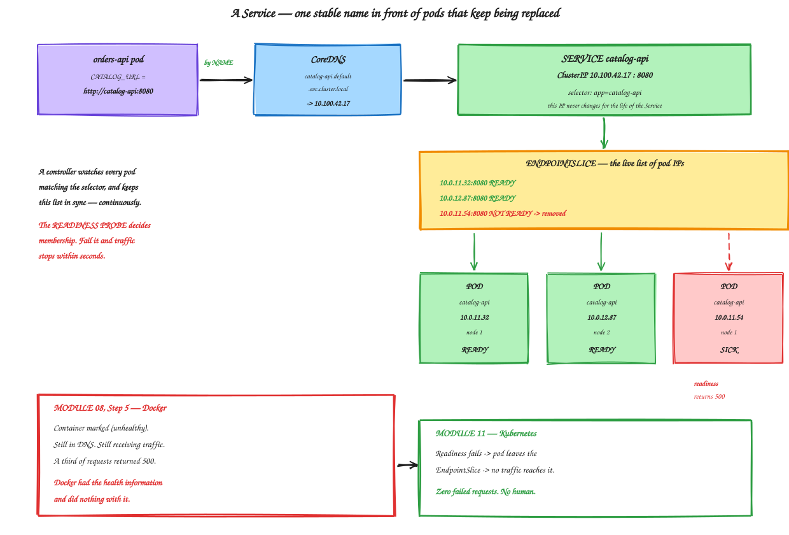
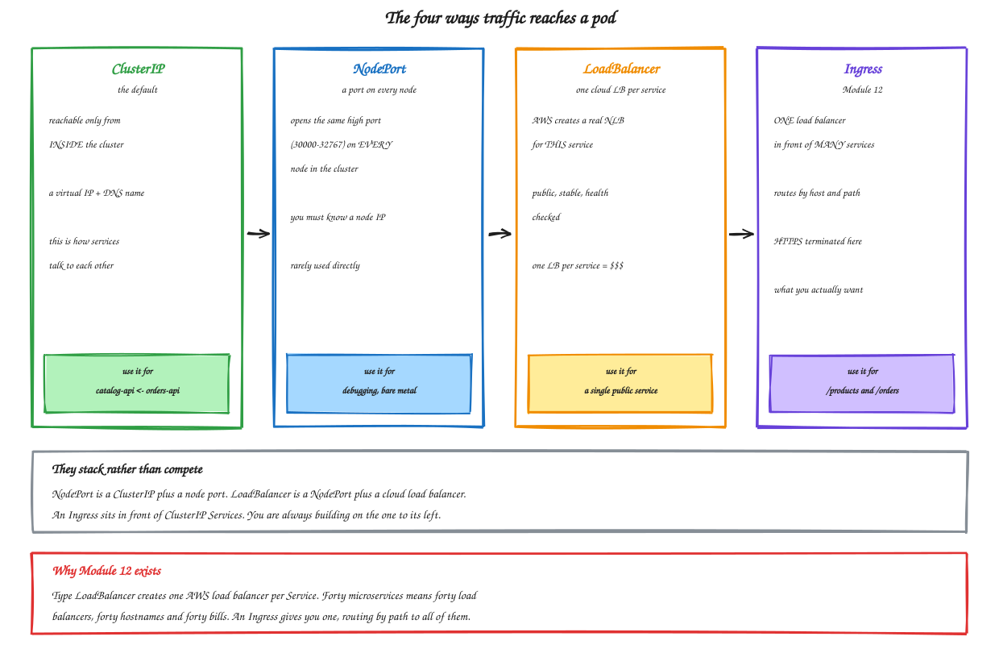

# Module 11 — Kubernetes Services

**Duration:** 65 minutes
**You will finish this module with:** the hardcoded IP address deleted for good, load balancing across pods, sick pods removed from traffic automatically, and a measured zero-downtime rolling update.

---

## Context

This module closes two threads that have been running since the start of the day.

**Thread one starts in Module 02, Step 13.** You read a private IP off the AWS console and typed `CATALOG_URL=http://10.0.11.87:8080` into a systemd unit file on a different server. I asked you to remember where it was. Module 06 fixed it on one Docker host using a container name. Module 10, Step 7 re-created the same mistake inside Kubernetes with a pod IP — and you watched it break the moment the pod was replaced.

**Thread two starts in Module 08, Step 5.** You broke one container from the inside. Docker's health check noticed and marked it `(unhealthy)`, and then Docker kept sending it traffic. A third of requests returned 500 forever. Module 10's liveness probe fixed half of that by restarting the container after thirty seconds. It did not stop traffic reaching the sick pod during those thirty seconds, because nothing was routing traffic at all.

A Service closes both. It is one object, and it does one thing: it puts a **stable name and IP in front of a changing set of healthy pods**.

Everything else in this module is a consequence of that sentence.



<sub>Editable source: [`16-service-endpoints.excalidraw`](./diagrams/excalidraw/16-service-endpoints.excalidraw)</sub>

---

## Concept

### What a Service actually is

A Service has three parts.

A **ClusterIP** — a virtual IP address that exists for the life of the Service and never changes, even as every pod behind it is replaced.

A **DNS name** — CoreDNS creates a record so `catalog-api` resolves to that ClusterIP from anywhere in the cluster.

A **selector** — the same label query a ReplicaSet uses. `app=catalog-api` means every pod carrying that label.

The ClusterIP is not assigned to any machine. No network interface holds it. It is a rule programmed into every node by kube-proxy, and traffic to it is rewritten to a real pod IP as it leaves.

### EndpointSlices — where readiness becomes routing

Behind every Service is an **EndpointSlice**: the live list of pod IPs eligible to receive traffic.

A controller watches every pod matching the selector and keeps that list in sync, continuously. And membership has one condition: **the pod must be Ready**.

That is the whole mechanism. A readiness probe failure removes the pod from the EndpointSlice, and traffic stops reaching it within seconds. Nothing restarts, nothing is deleted, the pod keeps running and can rejoin the moment it recovers.

Now compare with Module 08. Docker had exactly the same health information and no way to act on it, because acting on it requires something that owns both the health status *and* the routing decision. Kubernetes owns both.

**Liveness restarts. Readiness reroutes.** This is where that distinction pays off.

### DNS names in full

Every Service gets a name in this form:

```
<service>.<namespace>.svc.cluster.local
```

From a pod in the same namespace, `catalog-api` alone works, because the pod's `/etc/resolv.conf` has a search path. Across namespaces you need `catalog-api.production`.

Use the short name within a namespace and the fully qualified name across them. Both resolve to the same ClusterIP.

### The four service types



<sub>Editable source: [`17-service-types.excalidraw`](./diagrams/excalidraw/17-service-types.excalidraw)</sub>

**ClusterIP** is the default and internal only. This is how services talk to each other.

**NodePort** opens the same high port on every node. Useful for debugging or bare metal, rarely used directly in the cloud.

**LoadBalancer** asks the cloud provider for a real load balancer pointing at this Service. On EKS that means an AWS NLB. It works, and it costs one load balancer **per Service** — which is why forty microservices would mean forty load balancers and forty hostnames.

**ExternalName** just maps a DNS name to another DNS name. Useful for pointing at an RDS endpoint by a friendly cluster-local name.

They stack rather than compete. NodePort is a ClusterIP plus a node port; LoadBalancer is a NodePort plus a cloud load balancer.

### Headless Services

Set `clusterIP: None` and you get no virtual IP. DNS returns the pod IPs directly, all of them.

You want this for StatefulSets — databases where a client must address a *specific* replica — and for clients that do their own load balancing, such as gRPC. For ordinary HTTP services, a normal ClusterIP is right.

### How kube-proxy actually routes

kube-proxy on each node watches Services and EndpointSlices and programs the kernel — iptables rules by default, or IPVS on larger clusters.

Two consequences worth knowing.

Load balancing is **per connection**, not per request. A client holding one long-lived HTTP keep-alive connection stays pinned to one pod. This surprises people whose gRPC or connection-pooled traffic ends up unbalanced; the fix is a headless Service with client-side balancing, or a service mesh.

And the routing is **distributed**. There is no central proxy to become a bottleneck or a single point of failure. Every node routes independently.

### Services versus the ALB from Module 03

Worth stating plainly, because they are the same idea at different layers.

| | ALB target group (Module 03) | Kubernetes Service |
|---|---|---|
| Members | EC2 instances | Pods |
| Health check | ALB polls `/health` | Readiness probe |
| Removal on failure | ~20 seconds | ~5–10 seconds |
| Membership updates | Register/deregister by hand or via ASG | Automatic via label selector |
| Cost | One ALB | Free — it is kernel rules |
| Reachable from | Internet | Inside the cluster only |

The Service gives you everything the target group did, internally, for free. What it does not give you is a route in from the internet, which is Module 12.

---

## Lab 11 — Stable Names and Health-Aware Routing

**Time:** 45 minutes

Continues directly from Module 10.

### Step 1 — Confirm where you are

```bash
export AWS_REGION=ap-south-1
export ACCOUNT_ID=$(aws sts get-caller-identity --query Account --output text)
export ECR=$ACCOUNT_ID.dkr.ecr.$AWS_REGION.amazonaws.com
cd ~/workshop-app/k8s

kubectl get deploy,pods -l 'app in (catalog-api,orders-api)'
```

Three catalog pods and two orders pods, all Running. If not, re-apply Module 10's manifests.

Confirm the broken state you ended Module 10 with:

```bash
kubectl get deploy orders-api -o jsonpath='{.spec.template.spec.containers[0].env}' | python3 -m json.tool
```

`CATALOG_URL` still points at a pod IP that no longer exists.

### Step 2 — Create the catalog Service

```bash
cat > ~/workshop-app/k8s/catalog-service.yaml << 'EOF'
apiVersion: v1
kind: Service
metadata:
  name: catalog-api
  labels:
    app: catalog-api
spec:
  type: ClusterIP
  selector:
    app: catalog-api
  ports:
    - name: http
      port: 8080
      targetPort: http
      protocol: TCP
EOF

kubectl apply -f catalog-service.yaml
kubectl get svc catalog-api
```

Note `targetPort: http` — a *name*, not a number. It refers to the named port in the pod spec. Change the container port later and the Service follows without editing.

### Step 3 — Look at what was created

```bash
kubectl describe svc catalog-api
kubectl get endpointslices -l kubernetes.io/service-name=catalog-api
kubectl get endpointslices -l kubernetes.io/service-name=catalog-api \
  -o jsonpath='{range .items[*].endpoints[*]}{.addresses[0]}{"  ready="}{.conditions.ready}{"\n"}{end}'
```

Three pod IPs, all `ready=true`. Cross-check against the pods:

```bash
kubectl get pods -l app=catalog-api -o custom-columns=NAME:.metadata.name,IP:.status.podIP,READY:.status.containerStatuses[0].ready
```

The same addresses. Nobody registered them — the endpoint controller matched the label selector.

### Step 4 — Delete the hardcoded IP

```bash
sed -i 's|value: "http://[0-9.]*:8080"|value: "http://catalog-api:8080"|' orders-deployment.yaml
grep -A 1 CATALOG_URL orders-deployment.yaml
```

That should now read `http://catalog-api:8080`.

```bash
kubectl apply -f orders-deployment.yaml
kubectl rollout status deployment/orders-api
```

Test:

```bash
kubectl port-forward deployment/orders-api 8081:8081 >/dev/null 2>&1 &
sleep 3
curl -s localhost:8081/orders | head -c 300
kill %1
```

Product names and line totals are back.

**Look at the value in that variable.** In Module 02 it was `http://10.0.11.87:8080`, read off a console and typed into a file on a server. It is now a name.

### Step 5 — The moment

Destroy every catalog pod at once and watch orders keep working.

```bash
kubectl get pods -l app=catalog-api -o custom-columns=NAME:.metadata.name,IP:.status.podIP
kubectl delete pods -l app=catalog-api
sleep 20
kubectl get pods -l app=catalog-api -o custom-columns=NAME:.metadata.name,IP:.status.podIP
```

Three new pods, three new names, **three completely different IP addresses**.

```bash
kubectl port-forward deployment/orders-api 8081:8081 >/dev/null 2>&1 &
sleep 3
curl -s localhost:8081/orders | head -c 300
kill %1
```

It works.

Nothing in `orders-api` was edited. Nothing was restarted. No configuration changed. The Service's ClusterIP is unchanged:

```bash
kubectl get svc catalog-api
```

Every pod behind it was replaced and the address in front of it never moved.

**That is the thread from Module 02, closed.** Same problem, three environments, three answers: a hardcoded IP, a container name, and now a Service DNS name that works across many machines.

### Step 6 — Prove DNS and load balancing

Run a throwaway debug pod:

```bash
kubectl run netshoot --rm -it --image=nicolaka/netshoot --restart=Never -- bash
```

Inside it:

```bash
nslookup catalog-api
cat /etc/resolv.conf
nslookup catalog-api.default.svc.cluster.local
for i in $(seq 1 12); do curl -s http://catalog-api:8080/health | grep -o '"served_by":"[^"]*"'; done
exit
```

The DNS lookup returns the ClusterIP — one address, not three. And requests spread across all three pods, because kube-proxy rewrites the destination on the way out.

Compare with Module 06, Step 12, where Docker's DNS returned three addresses and let the client choose. Here the abstraction is complete: the client sees one address and knows nothing about pods.

### Step 7 — Zero-downtime rolling update, measured

Module 10 could not prove this because nothing was routing traffic. Now it can.

Start a traffic monitor from inside the cluster:

```bash
kubectl run monitor --rm -it --image=curlimages/curl --restart=Never -- sh -c \
  'while true; do
     code=$(curl -s -o /dev/null -w "%{http_code}" http://catalog-api:8080/products)
     ver=$(curl -s http://catalog-api:8080/products | sed -n "s/.*\"version\":\"\([^\"]*\)\".*/\1/p")
     echo "$code $ver"
     sleep 0.4
   done'
```

In a second terminal, roll to 1.1.0:

```bash
kubectl set image deployment/catalog-api catalog-api=$ECR/catalog-api:1.1.0
kubectl rollout status deployment/catalog-api
```

Watch the monitor. You should see an unbroken column of `200`s, with the version shifting from `1.0.0` to a mix, then to `1.1.0`.

**Count the non-200 responses.** There should be none.

| | |
|---|---|
| Failed requests during rolling update | _______ |

`Ctrl+C` to stop the monitor.

Compare with Module 08, Step 6, where `docker compose up -d` recreated containers and produced a visible gap, and with Module 04, Step 9, where the equivalent took twelve to twenty-two minutes on EC2.

### Step 8 — Readiness removes a sick pod from traffic

This closes Module 08, Step 5 completely.

Confirm three ready endpoints:

```bash
kubectl get endpointslices -l kubernetes.io/service-name=catalog-api \
  -o jsonpath='{range .items[*].endpoints[*]}{.addresses[0]}{" ready="}{.conditions.ready}{"\n"}{end}'
```

Start the traffic monitor again in a second terminal:

```bash
kubectl run monitor --rm -it --image=curlimages/curl --restart=Never -- sh -c \
  'while true; do curl -s -o /dev/null -w "%{http_code} " http://catalog-api:8080/products; sleep 0.3; done'
```

Now break one pod from the inside — the process keeps running and answering, but reports itself sick:

```bash
VICTIM=$(kubectl get pods -l app=catalog-api -o jsonpath='{.items[0].metadata.name}')
echo "Breaking $VICTIM"
kubectl exec $VICTIM -- python -c \
  "import urllib.request; print(urllib.request.urlopen('http://127.0.0.1:8080/break').read().decode())"
```

Watch the endpoints:

```bash
watch -n 2 "kubectl get endpointslices -l kubernetes.io/service-name=catalog-api \
  -o jsonpath='{range .items[*].endpoints[*]}{.addresses[0]}{\" ready=\"}{.conditions.ready}{\"\n\"}{end}'"
```

Within about ten seconds — two failed readiness checks at five second intervals — that pod's endpoint flips to `ready=false` and is removed.

**Now look at the traffic monitor.** Still all `200`s. Possibly one or two failures in the window before readiness noticed, and then nothing.

Then, about twenty seconds later, the liveness probe reaches its own threshold and restarts the container, and the pod rejoins.

```bash
kubectl get pods -l app=catalog-api
```

`RESTARTS` is now 1 on that pod, and it is Ready again.

Stop the monitor and the watch.

**Put the two side by side.**

| | Module 08 — Docker | Module 11 — Kubernetes |
|---|---|---|
| Detection | `(unhealthy)` in `docker ps` | Readiness probe fails |
| Traffic | kept flowing, ~⅓ returned 500 | stopped within 10 seconds |
| Repair | none, ever | container restarted in ~30s |
| Human needed | yes | no |
| Failed customer requests | hundreds | ~0 |

Same application. Same failure. Same instrumentation. The difference is entirely in what the platform does with the information.

### Step 9 — Add the orders Service

```bash
cat > ~/workshop-app/k8s/orders-service.yaml << 'EOF'
apiVersion: v1
kind: Service
metadata:
  name: orders-api
  labels:
    app: orders-api
spec:
  type: ClusterIP
  selector:
    app: orders-api
  ports:
    - name: http
      port: 8081
      targetPort: http
      protocol: TCP
EOF

kubectl apply -f orders-service.yaml
kubectl get svc
```

Both services now have stable internal addresses:

```bash
kubectl run netshoot --rm -it --image=nicolaka/netshoot --restart=Never -- \
  sh -c "curl -s http://orders-api:8081/orders | head -c 300; echo"
```

### Step 10 — NodePort, briefly

```bash
kubectl patch svc catalog-api -p '{"spec":{"type":"NodePort"}}'
kubectl get svc catalog-api
```

A high port in the 30000–32767 range is now open on **every** node. Confirm:

```bash
kubectl get nodes -o wide
NODEPORT=$(kubectl get svc catalog-api -o jsonpath='{.spec.ports[0].nodePort}')
echo "NodePort is $NODEPORT on every node"
```

You cannot reach it from your laptop because the nodes are in private subnets with no public IPs — deliberately, since Module 09. That is the point: NodePort would require exposing your nodes.

```bash
kubectl patch svc catalog-api -p '{"spec":{"type":"ClusterIP"}}'
kubectl get svc catalog-api
```

### Step 11 — LoadBalancer, and why it is the wrong tool here

```bash
cat > /tmp/orders-lb.yaml << 'EOF'
apiVersion: v1
kind: Service
metadata:
  name: orders-api-public
  annotations:
    service.beta.kubernetes.io/aws-load-balancer-type: "external"
    service.beta.kubernetes.io/aws-load-balancer-nlb-target-type: "ip"
    service.beta.kubernetes.io/aws-load-balancer-scheme: "internet-facing"
spec:
  type: LoadBalancer
  selector:
    app: orders-api
  ports:
    - port: 80
      targetPort: 8081
EOF

kubectl apply -f /tmp/orders-lb.yaml
kubectl get svc orders-api-public -w
```

Wait for `EXTERNAL-IP` to populate — two to four minutes. `Ctrl+C` when it does.

```bash
export LB=$(kubectl get svc orders-api-public -o jsonpath='{.status.loadBalancer.ingress[0].hostname}')
echo "http://$LB/orders"
sleep 60
curl -s http://$LB/orders | head -c 300
```

Your application is on the public internet, served from pods with no public IPs.

Now count the cost. That is **one AWS load balancer for one Service**. Add orders and catalog separately and it is two load balancers, two hostnames, two bills. Forty microservices means forty of each — and no way to serve `/products` and `/orders` from one domain.

That is precisely what an Ingress fixes, and it is Module 12.

**Delete it before moving on** — an orphaned load balancer bills continuously and blocks VPC teardown:

```bash
kubectl delete -f /tmp/orders-lb.yaml
sleep 30
aws elbv2 describe-load-balancers --region $AWS_REGION \
  --query 'LoadBalancers[].LoadBalancerName' --output text
```

### Step 12 — Where this leaves us

```bash
kubectl get svc,deploy,pods
```

Two services with stable internal names, load balanced across healthy pods, self-healing, updatable without downtime, and completely unreachable from outside the cluster.

**Do not tear down.** Module 12 continues from here.

If you must stop:

```bash
kubectl delete -f catalog-service.yaml -f orders-service.yaml \
  -f catalog-deployment.yaml -f orders-deployment.yaml
kubectl get svc
eksctl delete cluster -f ~/workshop-app/k8s/cluster.yaml --wait
~/workshop-app/infra/delete-network.sh
```

Check for stray load balancers before deleting the cluster — a leftover one will block VPC deletion.

---

## Troubleshooting

**Service has no endpoints.** The selector does not match any pod labels. Compare `kubectl get svc <name> -o jsonpath='{.spec.selector}'` with `kubectl get pods --show-labels`.

**Endpoints exist but connections are refused.** `targetPort` does not match the container's listening port, or the app binds to `127.0.0.1` instead of `0.0.0.0`.

**DNS does not resolve.** Check CoreDNS with `kubectl get pods -n kube-system -l k8s-app=kube-dns`. Confirm you are using the right namespace form.

**Traffic goes to only one pod.** Connection reuse. Each `curl` opens a new connection, so the loops in this lab do balance; a persistent client would not.

**LoadBalancer stuck in `<pending>`.** Public subnets missing the `kubernetes.io/role/elb` tag, or fewer than two AZs. Module 01's script tags them.

**`kubectl run --rm -it` hangs.** The image is pulling. Wait, or check with `kubectl get pods`.

---

## What you built

| Capability | Evidence |
|---|---|
| Stable name surviving pod replacement | Step 5 — all pods deleted, orders never noticed |
| DNS-based discovery | Step 6 |
| Load balancing across pods | Step 6 |
| Zero-downtime rolling update | Step 7 — no failed requests |
| Sick pods removed from traffic | Step 8 — endpoint removed in ~10s |
| Automatic repair and rejoin | Step 8 — restarted, back in rotation |

## Two threads closed

**The hardcoded address**, from Module 02 Step 13 through Module 06 to Module 10 Step 7 — now a DNS name that works across machines.

**The sick container**, from Module 08 Step 5 — Docker knew and did nothing; Kubernetes stops traffic in ten seconds and repairs in thirty.

## What is still missing

Nothing is reachable from the internet without paying for one load balancer per service, and there is no way to serve `/products` and `/orders` from a single domain with HTTPS.

---

**Next:** [Module 12 — Ingress and HTTPS](./12-ingress-https.md)
