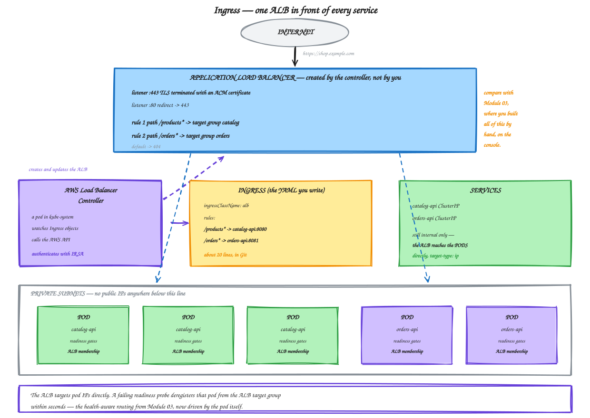
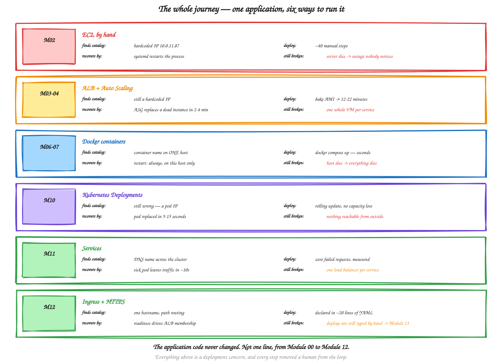

# Module 12 — Ingress and HTTPS

**Duration:** 70 minutes
**You will finish this module with:** one Application Load Balancer serving both services from a single hostname over HTTPS, path-based routing declared in twenty lines of YAML, and pods joining and leaving the ALB automatically as their readiness changes.

---

## Context

Module 03 had you build an Application Load Balancer by hand. Two target groups. Health check settings. A listener. Two path rules and a default action. Security group chaining. Manual target registration. Roughly twenty console screens, and every one of them a thing that could be done differently by the next person.

Today you get exactly the same ALB, with exactly the same path routing, from about twenty lines of YAML in Git — and it will keep itself correct as pods come and go.

That is the whole point of this module, and it is worth saying explicitly to close the loop: **Kubernetes did not replace the ALB.** It automated the operation of one. The target groups you will see in the console are real AWS target groups. The health checks are real ALB health checks. What changed is who maintains them.

### What is still wrong at the end

One thing, and it is the bridge to the next session.

Every deployment today has been you typing `kubectl apply` or `kubectl set image` from a terminal. That is faster and safer than Module 02, but it is still a human running a command from a machine, with no review, no test, no scan, and no record beyond shell history.

Module 13 onward fixes that with GitHub Actions.



<sub>Editable source: [`18-ingress-alb.excalidraw`](./diagrams/excalidraw/18-ingress-alb.excalidraw)</sub>

---

## Concept

### Ingress is two things

This distinction confuses everyone once, so get it out of the way.

An **Ingress** is a Kubernetes object — a document describing HTTP routing rules. Applying one to a cluster with nothing to act on it achieves nothing at all. It just sits there.

An **Ingress controller** is a program running in the cluster that watches for Ingress objects and makes something real happen. On EKS that is the **AWS Load Balancer Controller**, which reads your Ingress and calls the AWS API to create and configure an actual ALB.

Different controllers implement the same Ingress object differently. NGINX Ingress runs NGINX pods inside the cluster. Traefik does its own thing. The AWS controller provisions cloud infrastructure. Same YAML, very different result — which is what `ingressClassName` selects.

### IRSA — how a pod gets AWS permissions

The controller needs permission to create load balancers. How does a pod authenticate to AWS?

The lazy answer is to give the *node* an IAM role with those permissions. It works, and it means **every pod on that node** can create load balancers, including any pod an attacker manages to run.

The right answer is **IRSA** — IAM Roles for Service Accounts. The cluster has an OIDC identity provider, which you enabled with `withOIDC: true` back in Module 09. A Kubernetes ServiceAccount is annotated with an IAM role ARN. Pods using that ServiceAccount receive a projected token, exchange it with AWS STS, and get temporary credentials for that role and no other.

The result is per-pod, least-privilege AWS access with no long-lived keys anywhere. It is one of the genuinely excellent things about EKS, and it is the same principle as the OIDC federation the pipeline will use in Module 14.

### Path types

Three of them, and the middle one is what you want.

**`Prefix`** matches on path segments. `/products` matches `/products` and `/products/2` but not `/productsearch`. This is the sane default.

**`Exact`** matches the whole path and nothing else.

**`ImplementationSpecific`** hands interpretation to the controller. The AWS controller treats it as an ALB path pattern, which supports wildcards like `/products/*`.

### Ingress does not rewrite paths either

Module 03 made this point about the ALB, and it applies identically here. A request for `/products/2` reaches your pod as `/products/2`. The matched prefix is not stripped.

Our applications serve `/products` and `/orders` natively, so no rewriting is needed. If you did need it, that is an annotation the AWS controller does not support well, and a job for NGINX Ingress or a proxy in the pod.

### target-type: ip versus instance

Two ways the ALB can reach your workload.

**`instance`** registers the nodes in the target group on the Service's NodePort. Traffic hits a node, then kube-proxy forwards it to a pod, possibly on a different node — an extra hop.

**`ip`** registers **pod IPs directly** in the target group. This works because the VPC CNI gives every pod a real VPC address, as you saw in Module 09. One less hop, and the ALB's health checks talk to the pod itself.

Use `ip`. It also produces the behaviour in Step 8 that ties this module back to Module 03: a pod failing its readiness probe is deregistered from a real AWS target group within seconds.

### TLS with ACM

The ALB terminates TLS. You give it an ACM certificate ARN by annotation, and traffic from the ALB to your pods is plain HTTP inside the VPC.

Two ways to get a certificate. A real domain in Route 53 gives you a free, auto-renewing public ACM certificate — the correct answer, if you have a domain. Without one, you can import a self-signed certificate into ACM, which exercises exactly the same configuration path and produces a browser warning. We do the second, and note precisely which part is the lab shortcut.

### Ingress groups

By default each Ingress creates its own ALB. The annotation `alb.ingress.kubernetes.io/group.name` lets several Ingress objects share one.

That matters in a real organisation: each team owns its own Ingress in its own namespace, and they all land on one load balancer with one bill and one hostname. Without groups you are back to one ALB per team, which is the same cost problem as one Service of type LoadBalancer per service.

### A note on the Gateway API

You will hear that Ingress is being superseded by the **Gateway API** — a newer, more expressive standard with better separation between infrastructure and application owners.

That is true and it is worth knowing. It is also not yet what most production clusters run. Ingress remains the thing you will meet in existing systems, and the concepts transfer. Learn Ingress now; read about Gateway API when you need it.

---

## Lab 12 — One Load Balancer, Two Services, HTTPS

**Time:** 55 minutes

Continues directly from Module 11.

### Step 1 — Confirm state

```bash
export AWS_REGION=ap-south-1
export ACCOUNT_ID=$(aws sts get-caller-identity --query Account --output text)
export ECR=$ACCOUNT_ID.dkr.ecr.$AWS_REGION.amazonaws.com
export CLUSTER=workshop-eks
cd ~/workshop-app/k8s

kubectl get svc,deploy
```

Both Services and both Deployments should be present. Confirm the OIDC provider from Module 09 exists:

```bash
aws eks describe-cluster --name $CLUSTER --region $AWS_REGION \
  --query "cluster.identity.oidc.issuer" --output text
```

And confirm your subnet tags survived — the controller finds subnets by tag:

```bash
source ~/workshop-app/infra/network.env
aws ec2 describe-subnets --filters "Name=vpc-id,Values=$VPC_ID" \
  --query 'Subnets[].{Name:Tags[?Key==`Name`]|[0].Value,ELB:Tags[?Key==`kubernetes.io/role/elb`]|[0].Value}' \
  --output table
```

Public subnets must show `1` under ELB. Without that, Step 5 fails with a subnet discovery error.

### Step 2 — Create the IAM policy for the controller

```bash
curl -sO https://raw.githubusercontent.com/kubernetes-sigs/aws-load-balancer-controller/v2.8.2/docs/install/iam_policy.json

aws iam create-policy \
  --policy-name AWSLoadBalancerControllerIAMPolicy \
  --policy-document file://iam_policy.json \
  --query 'Policy.Arn' --output text 2>/dev/null \
  || aws iam list-policies --scope Local \
       --query "Policies[?PolicyName=='AWSLoadBalancerControllerIAMPolicy'].Arn" --output text
```

Have a look at what it grants:

```bash
python3 -c "
import json
d = json.load(open('iam_policy.json'))
acts = set()
for st in d['Statement']:
    a = st.get('Action', [])
    acts.update(a if isinstance(a, list) else [a])
print(len(acts), 'actions, including:')
for a in sorted(acts)[:8]: print('  ', a)
"
```

Load balancer, target group, listener and security group permissions. This is why we do not want it on the node role — every pod on that node would inherit it.

### Step 3 — Create the ServiceAccount with IRSA

```bash
eksctl create iamserviceaccount \
  --cluster=$CLUSTER \
  --namespace=kube-system \
  --name=aws-load-balancer-controller \
  --attach-policy-arn=arn:aws:iam::${ACCOUNT_ID}:policy/AWSLoadBalancerControllerIAMPolicy \
  --override-existing-serviceaccounts \
  --region $AWS_REGION \
  --approve
```

Two minutes. Then look at what was created:

```bash
kubectl get sa aws-load-balancer-controller -n kube-system -o yaml | grep -A 2 annotations
```

That `eks.amazonaws.com/role-arn` annotation is the whole mechanism. Any pod using this ServiceAccount can assume that role, and no other pod can.

### Step 4 — Install the controller

```bash
helm repo add eks https://aws.github.io/eks-charts
helm repo update

helm install aws-load-balancer-controller eks/aws-load-balancer-controller \
  -n kube-system \
  --set clusterName=$CLUSTER \
  --set serviceAccount.create=false \
  --set serviceAccount.name=aws-load-balancer-controller \
  --set region=$AWS_REGION \
  --set vpcId=$VPC_ID

kubectl -n kube-system rollout status deployment/aws-load-balancer-controller
kubectl get pods -n kube-system -l app.kubernetes.io/name=aws-load-balancer-controller
```

Confirm it authenticated to AWS:

```bash
kubectl logs -n kube-system -l app.kubernetes.io/name=aws-load-balancer-controller --tail=20
```

No `AccessDenied` or credential errors means IRSA is working.

```bash
kubectl get ingressclass
```

An `alb` IngressClass now exists.

### Step 5 — Create the Ingress

```bash
cat > ~/workshop-app/k8s/ingress.yaml << 'EOF'
apiVersion: networking.k8s.io/v1
kind: Ingress
metadata:
  name: shop-ingress
  annotations:
    alb.ingress.kubernetes.io/scheme: internet-facing
    alb.ingress.kubernetes.io/target-type: ip
    alb.ingress.kubernetes.io/listen-ports: '[{"HTTP":80}]'
    alb.ingress.kubernetes.io/healthcheck-path: /health
    alb.ingress.kubernetes.io/healthcheck-interval-seconds: '10'
    alb.ingress.kubernetes.io/healthy-threshold-count: '2'
    alb.ingress.kubernetes.io/unhealthy-threshold-count: '2'
    alb.ingress.kubernetes.io/load-balancer-name: workshop-ingress-alb
    alb.ingress.kubernetes.io/group.name: shop
spec:
  ingressClassName: alb
  rules:
    - http:
        paths:
          - path: /products
            pathType: Prefix
            backend:
              service:
                name: catalog-api
                port:
                  number: 8080
          - path: /orders
            pathType: Prefix
            backend:
              service:
                name: orders-api
                port:
                  number: 8081
EOF

kubectl apply -f ingress.yaml
kubectl get ingress shop-ingress
```

Compare those health check annotations against what you set by hand in Module 03, Step 4. Same settings, now in Git.

Watch the ALB appear:

```bash
kubectl get ingress shop-ingress -w
```

Two to three minutes for `ADDRESS` to populate. `Ctrl+C` when it does.

Watch the controller narrate it if you like:

```bash
kubectl logs -n kube-system -l app.kubernetes.io/name=aws-load-balancer-controller --tail=30 | grep -i "created\|modified"
```

### Step 6 — Test the routing

```bash
export ALB=$(kubectl get ingress shop-ingress -o jsonpath='{.status.loadBalancer.ingress[0].hostname}')
echo "http://$ALB"
sleep 45
```

The wait is for target registration and health checks to pass.

```bash
curl -s http://$ALB/products | head -c 250; echo
curl -s http://$ALB/products/2; echo
curl -s http://$ALB/orders | head -c 300; echo
curl -s -o /dev/null -w "%{http_code}\n" http://$ALB/nothing
```

Two services, one hostname, path-based routing.

**Look at the `/orders` response.** It contains product names that `orders-api` fetched from `catalog-api` using a Service DNS name, served through an ALB nobody configured, from pods with no public IP addresses.

Confirm load balancing across pods:

```bash
for i in $(seq 1 10); do curl -s http://$ALB/products | python3 -c "import sys,json; print(json.load(sys.stdin)['served_by'])"; done
```

### Step 7 — Look at what was created in AWS

This is the step that closes the Module 03 loop, and it is worth doing in the console on screen.

```bash
aws elbv2 describe-load-balancers --region $AWS_REGION \
  --query 'LoadBalancers[?LoadBalancerName==`workshop-ingress-alb`].{Name:LoadBalancerName,DNS:DNSName,Scheme:Scheme,AZs:AvailabilityZones[].ZoneName}' \
  --output json
```

```bash
aws elbv2 describe-target-groups --region $AWS_REGION \
  --query 'TargetGroups[?starts_with(TargetGroupName,`k8s-`)].{Name:TargetGroupName,Port:Port,Type:TargetType,HealthPath:HealthCheckPath}' \
  --output table
```

Two target groups, type `ip`, health check `/health`. Now look at their members:

```bash
TG=$(aws elbv2 describe-target-groups --region $AWS_REGION \
  --query 'TargetGroups[?starts_with(TargetGroupName,`k8s-catalog`)].TargetGroupArn' --output text | head -1)
aws elbv2 describe-target-health --target-group-arn $TG --region $AWS_REGION \
  --query 'TargetHealthDescriptions[].{Target:Target.Id,Port:Target.Port,State:TargetHealth.State}' \
  --output table
```

**Those are pod IP addresses registered in a real AWS target group.**

Open the EC2 console → Load Balancers → `workshop-ingress-alb`. It is the same screen you used in Module 03. Same listener, same rules, same target groups. Every one of those objects was created by a controller reading twenty lines of YAML.

Compare `kubectl get pods -l app=catalog-api -o wide` with the target list. Identical addresses.

### Step 8 — Readiness drives ALB membership

In Module 03 you removed a broken target by stopping a service on a server and waiting for the ALB health check. Watch this instead.

Start an external traffic monitor in a second terminal:

```bash
while true; do curl -s -o /dev/null -w "%{http_code} " http://$ALB/products; sleep 0.5; done
```

Break one pod from the inside:

```bash
VICTIM=$(kubectl get pods -l app=catalog-api -o jsonpath='{.items[0].metadata.name}')
VICTIM_IP=$(kubectl get pod $VICTIM -o jsonpath='{.status.podIP}')
echo "Breaking $VICTIM at $VICTIM_IP"
kubectl exec $VICTIM -- python -c \
  "import urllib.request; print(urllib.request.urlopen('http://127.0.0.1:8080/break').read().decode())"
```

Watch the AWS target group:

```bash
watch -n 5 "aws elbv2 describe-target-health --target-group-arn $TG --region $AWS_REGION \
  --query 'TargetHealthDescriptions[].{Target:Target.Id,State:TargetHealth.State}' --output table"
```

The broken pod's IP goes `unhealthy` and is then **deregistered entirely** — the ALB stops sending it traffic, and the Kubernetes readiness controller removes it from the Service endpoints too.

Meanwhile the traffic monitor stays on `200`s.

Then the liveness probe restarts the container, the pod becomes Ready, and it is **re-registered** in the target group automatically.

Stop the watch and the monitor.

**Put this next to Module 03, Step 11.** There, you stopped a service on an EC2 instance and waited twenty seconds for the ALB to notice — and the recovery was a human restarting the service. Here, detection, traffic removal, repair and re-registration all happened with nobody involved.

### Step 9 — Zero-downtime deploy, from outside

Module 11 proved this from inside the cluster. Now prove it from the internet.

```bash
while true; do
  code=$(curl -s -o /dev/null -w "%{http_code}" http://$ALB/products)
  ver=$(curl -s http://$ALB/products | python3 -c "import sys,json; print(json.load(sys.stdin)['version'])" 2>/dev/null)
  echo "$code $ver"
  sleep 0.5
done
```

In the other terminal:

```bash
kubectl set image deployment/catalog-api catalog-api=$ECR/catalog-api:1.0.0
kubectl rollout status deployment/catalog-api
```

The version shifts in the monitor with no non-200 responses. Roll forward again:

```bash
kubectl set image deployment/catalog-api catalog-api=$ECR/catalog-api:1.1.0
kubectl rollout status deployment/catalog-api
```

| | |
|---|---|
| Failed requests during deploy, from the public internet | _______ |

Stop the monitor.

### Step 10 — Add HTTPS

A real domain in Route 53 is the correct path. Without one, import a self-signed certificate — the ALB configuration is identical, only the trust is not.

```bash
mkdir -p /tmp/certs && cd /tmp/certs
openssl req -x509 -nodes -days 365 -newkey rsa:2048 \
  -keyout key.pem -out cert.pem \
  -subj "/CN=$ALB/O=Workshop" \
  -addext "subjectAltName=DNS:$ALB"

CERT_ARN=$(aws acm import-certificate \
  --certificate fileb://cert.pem \
  --private-key fileb://key.pem \
  --region $AWS_REGION \
  --query CertificateArn --output text)
echo "Certificate: $CERT_ARN"
cd ~/workshop-app/k8s
```

Update the Ingress:

```bash
kubectl annotate ingress shop-ingress \
  alb.ingress.kubernetes.io/listen-ports='[{"HTTP":80},{"HTTPS":443}]' \
  alb.ingress.kubernetes.io/certificate-arn=$CERT_ARN \
  alb.ingress.kubernetes.io/ssl-redirect='443' \
  --overwrite

sleep 60
```

```bash
curl -sk https://$ALB/products | head -c 200; echo
curl -s -o /dev/null -w "HTTP -> %{http_code} redirect to %{redirect_url}\n" http://$ALB/products
```

HTTPS serves, and plain HTTP now returns a 301 redirect to HTTPS. The `-k` is only needed because the certificate is self-signed; with a real ACM certificate for a domain you own, it would validate cleanly.

Confirm both listeners exist:

```bash
LB_ARN=$(aws elbv2 describe-load-balancers --region $AWS_REGION \
  --query 'LoadBalancers[?LoadBalancerName==`workshop-ingress-alb`].LoadBalancerArn' --output text)
aws elbv2 describe-listeners --load-balancer-arn $LB_ARN --region $AWS_REGION \
  --query 'Listeners[].{Port:Port,Protocol:Protocol}' --output table
```

### Step 11 — The full demo

Everything at once:

```bash
echo "=== catalog, over HTTPS, path-routed ==="
curl -sk https://$ALB/products | python3 -m json.tool | head -20

echo "=== orders, calling catalog by Service DNS ==="
curl -sk https://$ALB/orders | python3 -m json.tool | head -25

echo "=== load balanced across pods ==="
for i in $(seq 1 6); do curl -sk https://$ALB/products | python3 -c "import sys,json; print(json.load(sys.stdin)['served_by'])"; done

echo "=== nothing has a public IP ==="
kubectl get pods -o wide | awk '{print $1, $6, $7}'
kubectl get nodes -o wide | awk '{print $1, $6, $7}'
```

Trace what one request just did. It arrived at an ALB in two public subnets. A listener rule matched `/orders` and forwarded to a target group of pod IPs. A pod in a private subnet with no public address received it. That pod resolved `catalog-api` through CoreDNS to a ClusterIP, kube-proxy rewrote it to a healthy pod IP, and the catalog pod answered.

Every hop is health-checked, every component is replaceable, and nothing in the path was configured by hand today.



<sub>Editable source: [`19-the-journey.excalidraw`](./diagrams/excalidraw/19-the-journey.excalidraw)</sub>

### Step 12 — What is still done by hand

```bash
history | grep -c "kubectl set image\|kubectl apply" || echo "check your shell history"
```

Every deployment today was you, typing a command, from your machine.

No code review gate. No automated test. No vulnerability scan before deploy — Module 07's Trivy run was a thing you remembered to do. No record of who deployed what, when. Nothing stopping a deploy straight from an uncommitted working directory.

That is the last human in the loop, and Modules 13 to 16 remove it.

### Step 13 — Teardown

**Order matters.** The Ingress must go before the cluster, or the ALB is orphaned and blocks VPC deletion.

```bash
kubectl delete -f ingress.yaml
sleep 60
aws elbv2 describe-load-balancers --region $AWS_REGION \
  --query 'LoadBalancers[].LoadBalancerName' --output text
```

That must be empty before continuing.

```bash
kubectl delete -f catalog-service.yaml -f orders-service.yaml \
  -f catalog-deployment.yaml -f orders-deployment.yaml

helm uninstall aws-load-balancer-controller -n kube-system
eksctl delete iamserviceaccount --cluster=$CLUSTER --namespace=kube-system \
  --name=aws-load-balancer-controller --region $AWS_REGION

aws acm delete-certificate --certificate-arn $CERT_ARN --region $AWS_REGION 2>/dev/null

eksctl delete cluster -f ~/workshop-app/k8s/cluster.yaml --wait
~/workshop-app/infra/delete-network.sh
```

Verify nothing is left billing:

```bash
aws eks list-clusters --query clusters --output text
aws elbv2 describe-load-balancers --query 'LoadBalancers[].LoadBalancerName' --output text
aws ec2 describe-instances --filters "Name=instance-state-name,Values=running,stopped" \
  --query 'Reservations[].Instances[].InstanceId' --output text
aws ec2 describe-addresses --query 'Addresses[].PublicIp' --output text
aws ec2 describe-vpcs --query 'Vpcs[?Tags[?Value==`workshop-vpc`]].VpcId' --output text
```

All five empty.

**Keep your ECR repositories** if you are continuing to Module 13 next session. Otherwise:

```bash
for repo in catalog-api orders-api; do
  aws ecr delete-repository --repository-name $repo --force --region $AWS_REGION
done
aws iam delete-policy --policy-arn arn:aws:iam::${ACCOUNT_ID}:policy/AWSLoadBalancerControllerIAMPolicy
```

---

## Troubleshooting

**Ingress `ADDRESS` stays empty.** Read the controller logs: `kubectl logs -n kube-system -l app.kubernetes.io/name=aws-load-balancer-controller --tail=50`. The usual causes are missing `kubernetes.io/role/elb` subnet tags, fewer than two AZs, or IRSA permission failures.

**Controller pod in `CrashLoopBackOff`.** Wrong `clusterName` or `vpcId` in the Helm values. Reinstall with the correct ones.

**`AccessDenied` in the controller logs.** IRSA is not working. Confirm the ServiceAccount annotation exists and that the cluster has an OIDC provider.

**Targets stuck `unhealthy`.** The node security group must allow traffic from the ALB security group on the pod port. The controller normally manages this; if you edited security groups by hand, check them.

**404 from the ALB on a valid path.** The Ingress rule does not match. Remember there is no path rewriting — the app must serve the URL you sent.

**HTTPS returns a certificate error.** Expected with a self-signed certificate. `curl -k` bypasses it.

**`eksctl delete cluster` fails on the VPC.** A load balancer or security group created by the controller still exists. Delete the Ingress first and wait for the ALB to disappear.

---

## What you built

| | Module 03 (by hand) | Module 12 (declared) |
|---|---|---|
| Creating the ALB | ~20 console screens | 20 lines of YAML |
| Target groups | created and registered manually | created automatically |
| Adding a backend | launch, install, register | change `replicas` |
| Removing a sick backend | ALB health check, human repair | readiness probe, automatic repair |
| Health check settings | console form | annotations in Git |
| Reviewable | no | yes, it is a file |
| Reproducible | no | `kubectl apply` |

## The whole day

The application code never changed. Not one line, from Module 00 to Module 12.

Everything you did was a deployment concern, and every module removed one more human from the loop.

## What is left

Deployment itself. Every `kubectl apply` today came from a person at a terminal, with no review, no test, no scan and no audit trail.

---

**Next:** [Module 13 — GitHub Actions Fundamentals](./13-github-actions-fundamentals.md)
