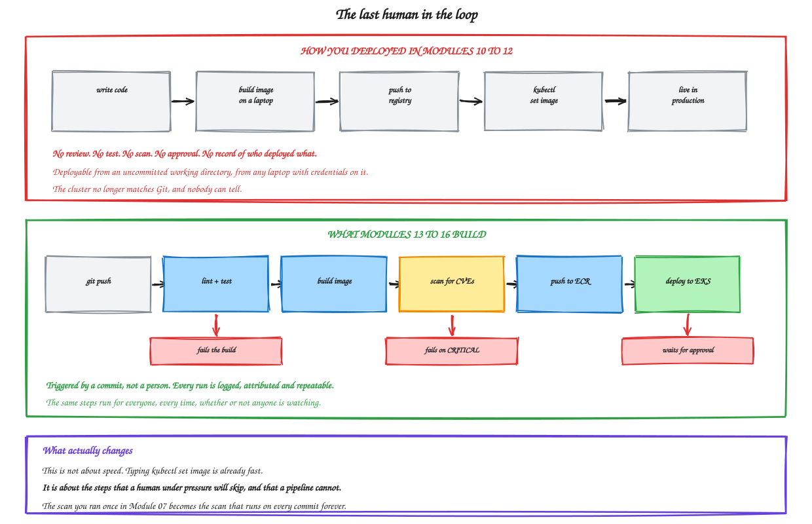
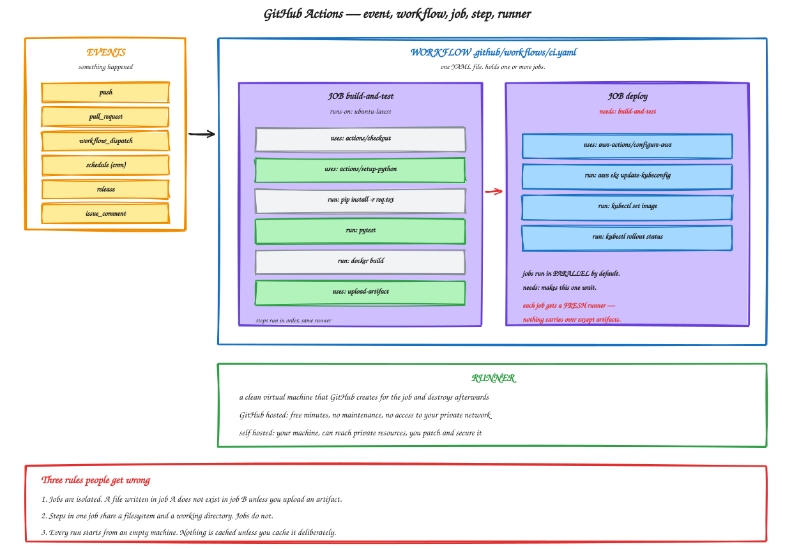

# Module 13 — GitHub Actions Fundamentals

**Duration:** 65 minutes
**You will finish this module with:** a working CI workflow that runs tests, builds both images, caches dependencies and uploads artifacts — triggered by a commit rather than a person.

---

## Context

Look back at how every deployment in this workshop actually happened.

Module 02: you SSHed into a server and typed forty commands. Module 04: you clicked through the console to bake an AMI and start an instance refresh. Module 10: you ran `kubectl apply`. Module 12: you ran `kubectl set image`.

Every single one required a human with credentials, at a terminal, remembering the right sequence.

The Kubernetes ones are enormously better than the EC2 ones — seconds instead of twenty minutes, with rollback. But the shape of the problem never changed. There was no review, no test, no scan, and no record of who deployed what. You could deploy from an uncommitted working directory. Nothing verified that the cluster matched Git, and nothing would have noticed if it did not.

That is the last human in the loop, and it is what the remaining modules remove.

### The part people get wrong about CI/CD

The usual pitch is speed. That pitch is weak, because `kubectl set image` is already fast — you measured it.

The real argument is different. **A pipeline runs the steps a human under pressure will skip.**

You ran Trivy once in Module 07 because the lab told you to. Nobody ran it in Module 10, or 11, or 12. Not through carelessness — because it was a separate thing to remember, and there was always something more urgent. A pipeline runs it on every commit, at 3 AM on a Friday, whether anyone is watching or not.

That is the value. Consistency, not speed.



<sub>Editable source: [`21-manual-vs-pipeline.excalidraw`](./diagrams/excalidraw/21-manual-vs-pipeline.excalidraw)</sub>

---

## Concept

### The four nouns

**A workflow** is a YAML file in `.github/workflows/`. One file, one or more jobs.

**A job** is a set of steps that run on one machine. Jobs in a workflow run **in parallel** by default.

**A step** is one thing: either a shell command (`run:`) or a prebuilt action (`uses:`).

**A runner** is the machine a job executes on. GitHub creates a clean virtual machine, runs the job, and destroys it.



<sub>Editable source: [`20-actions-anatomy.excalidraw`](./diagrams/excalidraw/20-actions-anatomy.excalidraw)</sub>

### Three rules that catch everyone

**Jobs are isolated.** A file written in job A does not exist in job B. If you build an image in one job and want it in the next, you upload an artifact or push it to a registry. This is the single most common surprise.

**Steps within a job share everything** — filesystem, working directory, environment. That is why a job is the right unit for "checkout, install, test."

**Every run starts empty.** No dependencies, no Docker layer cache, nothing from last time — unless you cache it deliberately.

### Events

A workflow declares what triggers it under `on:`.

| Event | Fires when |
|---|---|
| `push` | Commits are pushed. Filter by branch, tag, or path. |
| `pull_request` | A PR is opened or updated |
| `workflow_dispatch` | A human clicks Run workflow. Can take inputs. |
| `schedule` | Cron. Useful for nightly scans. |
| `release` | A GitHub release is published |

The `push` and `pull_request` split matters. `pull_request` runs against the merge result and is where your quality gates belong. `push` to `main` is where deployment belongs.

### Path filters

```yaml
on:
  push:
    paths:
      - 'catalog-api/**'
```

Without this, editing a README rebuilds and redeploys everything. In a repository with several services this is the difference between a two-minute and a twenty-minute feedback loop.

### Actions from the marketplace

`uses: actions/checkout@v4` pulls in a prebuilt action. This is other people's code running with access to your repository and your secrets.

Pin by version tag for convenience, or by full commit SHA for security. Tags can move; SHAs cannot. For anything touching credentials, pin the SHA.

### Contexts and expressions

`${{ }}` evaluates an expression. The useful contexts:

| Context | Holds |
|---|---|
| `github` | Event data, `sha`, `ref`, `actor`, `repository` |
| `env` | Environment variables you defined |
| `secrets` | Repository and environment secrets |
| `job` / `steps` | Status and outputs of earlier steps |
| `runner` | OS, architecture, temp paths |

`github.sha` is the one you will use constantly — it becomes your image tag in Module 14, so any running container traces back to an exact commit.

### Job dependencies and conditionals

`needs: build` makes a job wait for another and inherit its success or failure.

`if:` controls whether a step or job runs at all. `if: github.ref == 'refs/heads/main'` is how you gate deployment to one branch.

### Matrix builds

A matrix runs the same job several times with different inputs — Python versions, operating systems, or in our case two services from one job definition.

### Caching

`actions/cache` persists a directory between runs, keyed on something that changes when the contents should change — usually a hash of your lockfile. This is the same layer-ordering logic as Module 06, applied to CI.

### Artifacts

`upload-artifact` and `download-artifact` move files between jobs and make them downloadable from the run page. Use them for test reports, scan results, and build outputs.

### Permissions and GITHUB_TOKEN

Every run gets an automatic `GITHUB_TOKEN`. By default it may have more permissions than the job needs.

Set them explicitly:

```yaml
permissions:
  contents: read
```

Start at read-only and add only what a job requires. Module 15 goes further into this.

---

## Lab 13 — Build a CI Pipeline

**Time:** 45 minutes
**Where:** your laptop or the workshop EC2 box, plus a GitHub account.

Nothing in this lab touches AWS.

### Step 1 — Create the repository

On GitHub: **New repository** → name `shop-cicd` → **Private** → do not add a README → **Create**.

Then locally:

```bash
rm -rf ~/shop-cicd && mkdir -p ~/shop-cicd && cd ~/shop-cicd
git init -b main
```

```bash
git config user.name "Your Name"
git config user.email "you@example.com"
```

### Step 2 — Create the application files

```bash
mkdir -p catalog-api orders-api
```

```bash
cat > catalog-api/app.py << 'EOF'
from flask import Flask, jsonify
import os, socket

app = Flask(__name__)
VERSION = os.getenv("APP_VERSION", "1.0.0")
STATE = {"healthy": True}

PRODUCTS = {
    1: {"id": 1, "name": "Wireless Earbuds",    "price": 2499,  "stock": 120},
    2: {"id": 2, "name": "Mechanical Keyboard", "price": 5999,  "stock": 34},
    3: {"id": 3, "name": "27 inch Monitor",     "price": 18999, "stock": 12},
    4: {"id": 4, "name": "USB-C Hub",           "price": 3499,  "stock": 87},
}

def meta():
    return {"service": "catalog-api", "version": VERSION, "served_by": socket.gethostname()}

@app.route("/health")
def health():
    if not STATE["healthy"]:
        return jsonify(status="unhealthy", **meta()), 500
    return jsonify(status="ok", **meta()), 200

@app.route("/break")
def break_it():
    STATE["healthy"] = False
    return jsonify(status="now unhealthy", **meta()), 200

@app.route("/products")
def products():
    return jsonify(products=list(PRODUCTS.values()), **meta())

@app.route("/products/<int:pid>")
def product(pid):
    p = PRODUCTS.get(pid)
    if not p:
        return jsonify(error="not found", **meta()), 404
    return jsonify(product=p, **meta())
EOF

cat > catalog-api/requirements.txt << 'EOF'
flask==3.0.3
gunicorn==22.0.0
EOF
```

```bash
cat > orders-api/app.py << 'EOF'
from flask import Flask, jsonify
import os, socket, requests

app = Flask(__name__)
VERSION = os.getenv("APP_VERSION", "1.0.0")
CATALOG_URL = os.getenv("CATALOG_URL", "http://localhost:8080")

ORDERS = [
    {"order_id": "ORD-1001", "product_id": 1, "qty": 2, "status": "DELIVERED"},
    {"order_id": "ORD-1002", "product_id": 3, "qty": 1, "status": "IN_TRANSIT"},
    {"order_id": "ORD-1003", "product_id": 2, "qty": 1, "status": "PLACED"},
]

def meta():
    return {"service": "orders-api", "version": VERSION,
            "served_by": socket.gethostname(), "catalog_url": CATALOG_URL}

@app.route("/health")
def health():
    return jsonify(status="ok", **meta()), 200

@app.route("/orders")
def orders():
    out = []
    for o in ORDERS:
        i = dict(o)
        try:
            r = requests.get(f"{CATALOG_URL}/products/{o['product_id']}", timeout=2)
            if r.status_code == 200:
                p = r.json()["product"]
                i["product_name"] = p["name"]
                i["unit_price"] = p["price"]
                i["line_total"] = p["price"] * o["qty"]
            else:
                i["product_name"] = "CATALOG_ERROR_" + str(r.status_code)
        except Exception as e:
            i["product_name"] = "CATALOG_UNAVAILABLE"
            i["error"] = str(e.__class__.__name__)
        out.append(i)
    return jsonify(orders=out, **meta())
EOF

cat > orders-api/requirements.txt << 'EOF'
flask==3.0.3
gunicorn==22.0.0
requests==2.32.3
EOF
```

### Step 3 — Add tests

A pipeline with no tests is just a slower way to deploy.

```bash
mkdir -p catalog-api/tests orders-api/tests
```

```bash
cat > catalog-api/tests/test_app.py << 'EOF'
import sys, os, json
sys.path.insert(0, os.path.dirname(os.path.dirname(os.path.abspath(__file__))))
from app import app
import pytest

@pytest.fixture
def client():
    app.config["TESTING"] = True
    with app.test_client() as c:
        yield c

def test_health_ok(client):
    r = client.get("/health")
    assert r.status_code == 200
    assert r.get_json()["status"] == "ok"

def test_health_reports_service_name(client):
    assert client.get("/health").get_json()["service"] == "catalog-api"

def test_products_returns_four(client):
    r = client.get("/products")
    assert r.status_code == 200
    assert len(r.get_json()["products"]) == 4

def test_single_product(client):
    r = client.get("/products/2")
    assert r.status_code == 200
    assert r.get_json()["product"]["name"] == "Mechanical Keyboard"

def test_missing_product_is_404(client):
    assert client.get("/products/999").status_code == 404

def test_every_product_has_required_fields(client):
    for p in client.get("/products").get_json()["products"]:
        for field in ("id", "name", "price", "stock"):
            assert field in p

def test_prices_are_positive(client):
    for p in client.get("/products").get_json()["products"]:
        assert p["price"] > 0
EOF
```

```bash
cat > orders-api/tests/test_app.py << 'EOF'
import sys, os
sys.path.insert(0, os.path.dirname(os.path.dirname(os.path.abspath(__file__))))
from app import app
import pytest

@pytest.fixture
def client():
    app.config["TESTING"] = True
    with app.test_client() as c:
        yield c

def test_health_ok(client):
    r = client.get("/health")
    assert r.status_code == 200
    assert r.get_json()["service"] == "orders-api"

def test_orders_returns_three(client):
    r = client.get("/orders")
    assert r.status_code == 200
    assert len(r.get_json()["orders"]) == 3

def test_orders_degrade_gracefully_without_catalog(client):
    # catalog is not running during unit tests
    for o in client.get("/orders").get_json()["orders"]:
        assert o["product_name"] in ("CATALOG_UNAVAILABLE", "UNKNOWN")

def test_orders_have_ids(client):
    for o in client.get("/orders").get_json()["orders"]:
        assert o["order_id"].startswith("ORD-")
EOF
```

Test requirements:

```bash
for s in catalog-api orders-api; do
cat > $s/requirements-dev.txt << 'EOF'
pytest==8.3.2
flake8==7.1.1
EOF
done
```

### Step 4 — Add Dockerfiles

```bash
cat > catalog-api/Dockerfile << 'EOF'
FROM python:3.12 AS builder
WORKDIR /build
RUN python -m venv /opt/venv
ENV PATH="/opt/venv/bin:$PATH"
COPY requirements.txt .
RUN pip install --no-cache-dir -r requirements.txt

FROM python:3.12-slim AS runtime
RUN groupadd --gid 10001 appgroup && \
    useradd --uid 10001 --gid appgroup --no-create-home --shell /usr/sbin/nologin appuser
COPY --from=builder --chown=10001:10001 /opt/venv /opt/venv
ENV PATH="/opt/venv/bin:$PATH" PYTHONDONTWRITEBYTECODE=1 PYTHONUNBUFFERED=1
WORKDIR /app
COPY --chown=10001:10001 app.py .
USER 10001:10001
EXPOSE 8080
CMD ["gunicorn","--bind","0.0.0.0:8080","--workers","2","--access-logfile","-","app:app"]
EOF

sed 's/8080/8081/g' catalog-api/Dockerfile > orders-api/Dockerfile

for s in catalog-api orders-api; do
cat > $s/.dockerignore << 'EOF'
__pycache__
*.pyc
.git
.env
venv
tests
Dockerfile*
EOF
done
```

```bash
cat > .gitignore << 'EOF'
__pycache__/
*.pyc
.pytest_cache/
venv/
.env
EOF
```

### Step 5 — First commit and push

```bash
git add .
git commit -m "initial: two services with tests and dockerfiles"
git remote add origin https://github.com/<YOUR_USERNAME>/shop-cicd.git
git branch -M main
git push -u origin main
```

If prompted for a password, use a **personal access token**, not your account password. GitHub → Settings → Developer settings → Personal access tokens → Fine-grained → repo access.

### Step 6 — Your first workflow

```bash
mkdir -p .github/workflows

cat > .github/workflows/hello.yaml << 'EOF'
name: 00 Hello

on:
  workflow_dispatch:

jobs:
  say-hello:
    runs-on: ubuntu-latest
    steps:
      - name: Print context
        run: |
          echo "Repository : ${{ github.repository }}"
          echo "Triggered  : ${{ github.event_name }}"
          echo "Actor      : ${{ github.actor }}"
          echo "Branch ref : ${{ github.ref }}"
          echo "Commit SHA : ${{ github.sha }}"
          echo "Short SHA  : ${GITHUB_SHA::7}"

      - name: Show the runner
        run: |
          echo "OS       : ${{ runner.os }}"
          echo "Arch     : ${{ runner.arch }}"
          uname -a
          df -h / | tail -1
          docker --version
          python3 --version
EOF
```

```bash
git add .github && git commit -m "ci: hello workflow" && git push
```

On GitHub: **Actions** tab → **00 Hello** → **Run workflow** → **Run workflow**.

Open the run and expand the steps. **Point out:** the runner is a full VM with Docker and Python already installed, created for this job and destroyed after it.

### Step 7 — Prove that jobs are isolated

```bash
cat > .github/workflows/isolation.yaml << 'EOF'
name: 01 Job isolation

on:
  workflow_dispatch:

jobs:
  job-a:
    runs-on: ubuntu-latest
    steps:
      - name: Write a file
        run: |
          echo "written by job-a" > /tmp/shared.txt
          cat /tmp/shared.txt
      - name: Same job, still there
        run: cat /tmp/shared.txt

  job-b:
    runs-on: ubuntu-latest
    needs: job-a
    steps:
      - name: Try to read job-a's file
        run: |
          cat /tmp/shared.txt || echo "NOT FOUND - different machine entirely"
EOF

git add . && git commit -m "ci: demonstrate job isolation" && git push
```

Run it. **Point out:** `job-b` cannot see the file. Different runner, different machine.

### Step 8 — The real CI workflow

```bash
cat > .github/workflows/ci.yaml << 'EOF'
name: CI

on:
  push:
    branches: [main]
  pull_request:
    branches: [main]
  workflow_dispatch:

permissions:
  contents: read

env:
  PYTHON_VERSION: "3.12"

jobs:
  lint-and-test:
    name: Test ${{ matrix.service }}
    runs-on: ubuntu-latest
    strategy:
      fail-fast: false
      matrix:
        service: [catalog-api, orders-api]

    steps:
      - name: Checkout
        uses: actions/checkout@v4

      - name: Set up Python
        uses: actions/setup-python@v5
        with:
          python-version: ${{ env.PYTHON_VERSION }}
          cache: pip
          cache-dependency-path: ${{ matrix.service }}/requirements.txt

      - name: Install dependencies
        working-directory: ${{ matrix.service }}
        run: |
          python -m pip install --upgrade pip
          pip install -r requirements.txt
          pip install -r requirements-dev.txt

      - name: Lint
        working-directory: ${{ matrix.service }}
        run: |
          flake8 app.py --max-line-length=120 --statistics

      - name: Run tests
        working-directory: ${{ matrix.service }}
        run: |
          pytest tests/ -v --junitxml=test-results.xml

      - name: Upload test results
        if: always()
        uses: actions/upload-artifact@v4
        with:
          name: test-results-${{ matrix.service }}
          path: ${{ matrix.service }}/test-results.xml
          retention-days: 7

  build:
    name: Build ${{ matrix.service }}
    runs-on: ubuntu-latest
    needs: lint-and-test
    strategy:
      matrix:
        service: [catalog-api, orders-api]

    steps:
      - name: Checkout
        uses: actions/checkout@v4

      - name: Set up Buildx
        uses: docker/setup-buildx-action@v3

      - name: Build image
        uses: docker/build-push-action@v6
        with:
          context: ./${{ matrix.service }}
          push: false
          load: true
          tags: ${{ matrix.service }}:${{ github.sha }}
          cache-from: type=gha,scope=${{ matrix.service }}
          cache-to: type=gha,mode=max,scope=${{ matrix.service }}

      - name: Inspect the image
        run: |
          docker images ${{ matrix.service }}
          echo "--- runs as ---"
          docker run --rm ${{ matrix.service }}:${{ github.sha }} id

      - name: Smoke test the container
        run: |
          PORT=$( [ "${{ matrix.service }}" = "catalog-api" ] && echo 8080 || echo 8081 )
          docker run -d --name smoke -p $PORT:$PORT ${{ matrix.service }}:${{ github.sha }}
          sleep 5
          curl -sf http://localhost:$PORT/health || (docker logs smoke && exit 1)
          echo "health check passed"
          docker rm -f smoke

  summary:
    name: Pipeline summary
    runs-on: ubuntu-latest
    needs: [lint-and-test, build]
    if: always()
    steps:
      - name: Write summary
        run: |
          {
            echo "## Pipeline result"
            echo ""
            echo "| Stage | Result |"
            echo "|---|---|"
            echo "| Tests | ${{ needs.lint-and-test.result }} |"
            echo "| Build | ${{ needs.build.result }} |"
            echo ""
            echo "Commit: \`${{ github.sha }}\`"
            echo "Actor: ${{ github.actor }}"
          } >> $GITHUB_STEP_SUMMARY
EOF

git add . && git commit -m "ci: lint, test, build and smoke test both services" && git push
```

Watch it in the Actions tab.

**Point out on screen:**
- The matrix produced four jobs from two definitions.
- `build` waited for `lint-and-test` because of `needs`.
- The two services tested in parallel.
- The summary job wrote a table to the run page.
- Test result artifacts are downloadable from the run.

### Step 9 — Break a test and watch the gate hold

```bash
sed -i 's/"price": 2499/"price": -100/' catalog-api/app.py
git add . && git commit -m "bug: negative price" && git push
```

Watch the run fail at `test_prices_are_positive`, and note that **the build job never runs** because `needs` blocked it.

Fix it:

```bash
sed -i 's/"price": -100/"price": 2499/' catalog-api/app.py
git add . && git commit -m "fix: restore price" && git push
```

Green again.

**This is the whole point.** Nobody remembered to run the tests. They ran because a commit happened.

### Step 10 — Prove the cache works

Look at the timings of the last two runs — the second `Build image` step should be significantly faster, and the log will show cache imports.

Now force a cache miss:

```bash
echo "python-json-logger==2.0.7" >> catalog-api/requirements.txt
git add . && git commit -m "deps: add a dependency" && git push
```

The catalog build slows down; the orders build stays fast, because they use separate cache scopes.

```bash
git revert --no-edit HEAD && git push
```

### Step 11 — Path filters

Right now editing a README rebuilds everything. Fix that.

```bash
cat > .github/workflows/ci-filtered.yaml << 'EOF'
name: CI (path filtered)

on:
  push:
    branches: [main]
    paths:
      - 'catalog-api/**'
      - 'orders-api/**'
      - '.github/workflows/ci-filtered.yaml'

permissions:
  contents: read

jobs:
  changed:
    runs-on: ubuntu-latest
    steps:
      - run: echo "Application code changed, so this ran."
EOF

cat > README.md << 'EOF'
# shop-cicd

Two services, one pipeline.
EOF

git add . && git commit -m "docs: readme and filtered workflow" && git push
```

Then edit only the README:

```bash
echo "" >> README.md
echo "Updated docs." >> README.md
git add . && git commit -m "docs: update readme only" && git push
```

**Point out:** `CI (path filtered)` did not run. In a repo with ten services this is the difference between a two-minute and a twenty-minute feedback loop.

### Step 12 — Manual trigger with inputs

```bash
cat > .github/workflows/manual.yaml << 'EOF'
name: Manual run with inputs

on:
  workflow_dispatch:
    inputs:
      service:
        description: 'Which service'
        required: true
        default: 'catalog-api'
        type: choice
        options:
          - catalog-api
          - orders-api
      environment:
        description: 'Target environment'
        required: true
        default: 'staging'
        type: choice
        options:
          - staging
          - production
      dry_run:
        description: 'Dry run only'
        required: false
        default: true
        type: boolean

jobs:
  show:
    runs-on: ubuntu-latest
    steps:
      - name: Show inputs
        run: |
          echo "Service     : ${{ inputs.service }}"
          echo "Environment : ${{ inputs.environment }}"
          echo "Dry run     : ${{ inputs.dry_run }}"

      - name: Production guard
        if: inputs.environment == 'production' && inputs.dry_run == false
        run: echo "This is where a real production deploy would happen."

      - name: Dry run notice
        if: inputs.dry_run == true
        run: echo "Dry run - nothing was changed."
EOF

git add . && git commit -m "ci: manual workflow with inputs" && git push
```

Run it from the Actions tab with different inputs. **Point out:** conditional steps and typed inputs give you a controlled manual escape hatch without anyone touching a terminal.

### Step 13 — Branch protection

Settings → **Branches** → **Add branch ruleset** (or Add rule) for `main`:

- Require a pull request before merging
- Require status checks to pass before merging
- Select `Test catalog-api`, `Test orders-api`, `Build catalog-api`, `Build orders-api`

Test it:

```bash
git checkout -b feature/bad-change
sed -i 's/"price": 5999/"price": 0/' catalog-api/app.py
git add . && git commit -m "test: zero price" && git push -u origin feature/bad-change
```

Open a pull request on GitHub. The checks run against the merge result, `test_prices_are_positive` fails, and **the merge button is blocked**.

```bash
git checkout main
git branch -D feature/bad-change
git push origin --delete feature/bad-change
```

**Point out:** the workflow is only advisory until branch protection makes it a gate.

### Step 14 — What is still missing

```bash
ls .github/workflows/
```

You have tests, linting, builds, smoke tests, caching, artifacts and a merge gate.

What is not there yet:

| Missing | Module |
|---|---|
| Vulnerability scanning as a gate | 14 |
| Pushing images to a registry | 14 |
| AWS credentials without long-lived keys | 14 |
| Deploying to EKS | 14 |
| Environment approvals | 15 |
| Concurrency control | 15 |
| Reusable workflows | 15 |

### Step 15 — Clean up

Nothing to tear down — no cloud resources were used.

Keep the repository. Module 14 adds the deployment half.

If you want to reduce noise:

```bash
git rm .github/workflows/hello.yaml .github/workflows/isolation.yaml
git commit -m "ci: remove teaching workflows" && git push
```

---

## Troubleshooting

**Workflow does not appear in the Actions tab.** It must be in `.github/workflows/` with a `.yaml` or `.yml` extension, and on the default branch for some trigger types.

**`workflow_dispatch` shows no Run button.** The workflow must exist on the default branch.

**`flake8` fails on unused imports.** Fix the code or adjust the flags. Do not disable linting to make a build pass.

**`pytest` cannot import `app`.** Check the `sys.path` line at the top of the test file and that `working-directory` is set.

**Cache never hits.** The cache key is wrong, or the first run had nothing to save. Check `cache-dependency-path`.

**Docker build fails on the runner but works locally.** Usually `.dockerignore` differences or a file that exists locally but is not committed.

**Branch protection does not block the merge.** The status check names must match the job names exactly, and they must have run at least once for GitHub to offer them.

---

## What you built

| Capability | Where |
|---|---|
| Tests run on every commit | Step 8 |
| Two services from one job definition | Step 8, matrix |
| Build waits for tests | Step 8, `needs` |
| Dependency and layer caching | Step 8, Step 10 |
| Downloadable test reports | Step 8, artifacts |
| Container smoke test before it is trusted | Step 8 |
| A failing test blocks the build | Step 9 |
| Irrelevant changes do not trigger builds | Step 11 |
| Controlled manual runs | Step 12 |
| Broken code cannot reach main | Step 13 |

## The one sentence

A pipeline is not faster than you. It is the thing that runs the steps you would have skipped.

---

**Next:** [Module 14 — End-to-End CI/CD](./14-end-to-end-cicd.md)
