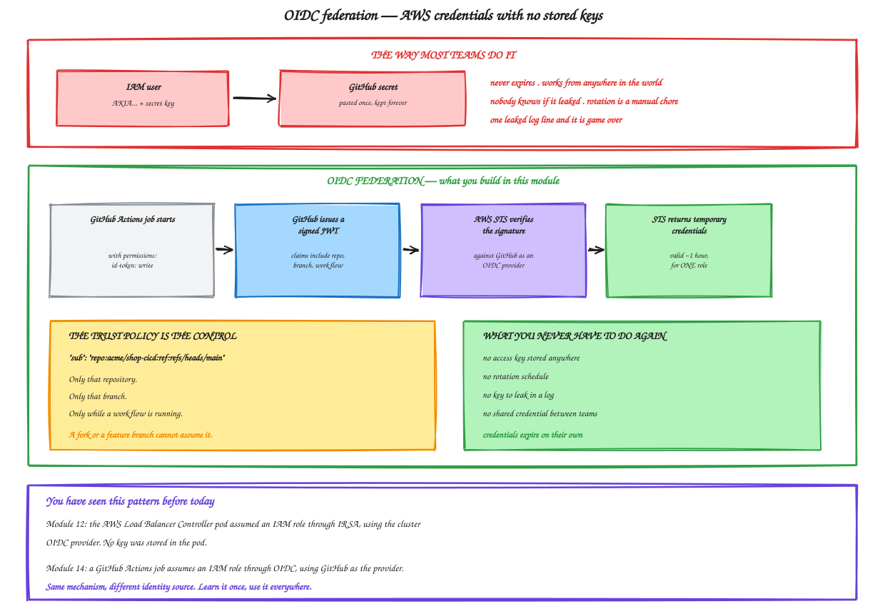
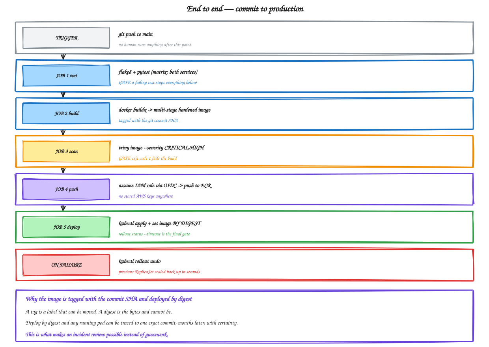

# Module 14 — End-to-End CI/CD

**Duration:** 80 minutes
**You will finish this module with:** a pipeline that tests, builds, scans, pushes to ECR and deploys to EKS on every commit to main, authenticating to AWS with no stored keys, and rolling itself back if the deployment fails.

> **Cost warning.** This module needs the EKS cluster from Modules 09 to 12 running. If you tore it down, rebuild it before starting.

---

## Context

Module 13 built a real pipeline. Tests ran, images were built, a smoke test passed, and a failing test blocked a merge.

And then the images were thrown away. The runner was destroyed and nothing left the machine.

Today the pipeline reaches production, and doing that safely means solving one problem first.

### The credentials problem

To push to ECR and deploy to EKS, the pipeline needs AWS permissions. The obvious approach is to create an IAM user, generate an access key, and paste it into GitHub secrets.

Almost everyone does this. It is also the single most common way AWS accounts get compromised through CI.

An access key never expires. It works from anywhere in the world. It is not scoped to a branch, a repository, or a workflow run. If it appears in a log line, in a fork, or in a compromised marketplace action, it is still valid tomorrow, and nobody will know.

The alternative is **OIDC federation**, and you have already met the mechanism. In Module 12 the load balancer controller got AWS permissions through IRSA — a pod presented a signed token, AWS verified it against an OIDC provider, and returned temporary credentials. Same idea here, with GitHub as the identity provider instead of your cluster.



<sub>Editable source: [`22-oidc-federation.excalidraw`](./diagrams/excalidraw/22-oidc-federation.excalidraw)</sub>

---

## Concept

### How the OIDC exchange works

The job declares `permissions: id-token: write`. GitHub then issues a short-lived signed JWT whose claims include the repository, the branch, the workflow and the actor.

The AWS credentials action sends that token to STS with `AssumeRoleWithWebIdentity`. AWS verifies the signature against the GitHub OIDC provider registered in your account, checks the token's claims against the role's trust policy, and returns temporary credentials valid for about an hour.

**The trust policy is where the security lives.** This condition is the whole control:

```
"sub": "repo:youruser/shop-cicd:ref:refs/heads/main"
```

That role can be assumed only by workflows in that repository, running on that branch. A fork cannot assume it. A feature branch cannot assume it. A pull request from outside cannot assume it.

Get that condition wrong — for example `repo:youruser/*:*` — and anyone who can open a pull request against any of your repositories can assume the role. This is a real and repeated mistake.

### Image tagging strategy

Three tags, three jobs.

**The commit SHA** is the immutable identity. `catalog-api:a3f9c21` refers to one build of one commit and always will.

**A semantic version** is for humans releasing deliberately.

**`latest`** is a convenience that means nothing. Never deploy from it.

### Deploy by digest, not by tag

The pipeline pushes a tag and then deploys using the digest that the push returned.

A tag is a label that can be moved. A digest is a hash of the content and cannot. Deploying by digest means that six months later you can point at a running pod and say with certainty which commit produced it, regardless of what happened to tags in between.

That is the difference between an incident review and guesswork.

### Trivy as a gate

Module 07 ran Trivy once because the lab said so. Nobody ran it in Modules 10, 11 or 12.

As a pipeline job with `exit-code: 1`, it stops being something to remember.

Two settings matter for keeping it useful rather than ignored:

`severity: CRITICAL,HIGH` — fail on what matters, report the rest.

`ignore-unfixed: true` — do not fail a build for a vulnerability with no available fix. Without this, developers learn that the scanner is noise, and then they ignore the finding that mattered.

### Giving the pipeline access to the cluster

IAM authenticates you to the EKS API server. Kubernetes RBAC decides what you may do. The CI role needs both.

Modern clusters use **EKS access entries** through the AWS API. Older clusters use the `aws-auth` ConfigMap. We use access entries with a fallback.

For the workshop the CI role gets cluster admin. In production it would get a namespace-scoped Role permitting exactly `get`, `patch` and `apply` on Deployments in one namespace.

### Verifying the deployment actually worked

`kubectl set image` returns immediately. It means the desired state was recorded, not that anything is running.

`kubectl rollout status --timeout=180s` waits for the new pods to become Ready and returns non-zero if they do not. That is your final gate — and because a step returning non-zero fails the job, a broken deployment fails the pipeline instead of silently sitting there.

Paired with `if: failure()` running `kubectl rollout undo`, a bad deploy rolls itself back before anyone is paged.



<sub>Editable source: [`23-end-to-end-pipeline.excalidraw`](./diagrams/excalidraw/23-end-to-end-pipeline.excalidraw)</sub>

---

## Lab 14 — Commit to Production

**Time:** 60 minutes

### Step 1 — Prerequisites

```bash
export AWS_REGION=ap-south-1
export ACCOUNT_ID=$(aws sts get-caller-identity --query Account --output text)
export CLUSTER=workshop-eks
export GH_USER=<your-github-username>
export GH_REPO=shop-cicd

kubectl get nodes
aws ecr describe-repositories --region $AWS_REGION --query 'repositories[].repositoryName' --output text
```

You need a running cluster and the `catalog-api` and `orders-api` ECR repositories. If ECR is missing:

```bash
for repo in catalog-api orders-api; do
  aws ecr create-repository --repository-name $repo --region $AWS_REGION \
    --image-scanning-configuration scanOnPush=true \
    --query 'repository.repositoryUri' --output text
done
```

You also need the `shop-cicd` repository from Module 13.

### Step 2 — Register GitHub as an OIDC provider in AWS

One provider per AWS account, shared by every repository.

```bash
aws iam create-open-id-connect-provider \
  --url https://token.actions.githubusercontent.com \
  --client-id-list sts.amazonaws.com \
  --thumbprint-list 6938fd4d98bab03faadb97b34396831e3780aea1 \
  --query 'OpenIDConnectProviderArn' --output text 2>/dev/null \
  || aws iam list-open-id-connect-providers \
       --query "OpenIDConnectProviderList[?contains(Arn,'token.actions.githubusercontent.com')].Arn" \
       --output text
```

```bash
export OIDC_ARN=$(aws iam list-open-id-connect-providers \
  --query "OpenIDConnectProviderList[?contains(Arn,'token.actions.githubusercontent.com')].Arn" --output text)
echo $OIDC_ARN
```

AWS now manages the thumbprint for GitHub automatically, but the CLI still requires the argument.

### Step 3 — Create the IAM role with a scoped trust policy

```bash
cat > /tmp/trust-policy.json << EOF
{
  "Version": "2012-10-17",
  "Statement": [
    {
      "Effect": "Allow",
      "Principal": { "Federated": "$OIDC_ARN" },
      "Action": "sts:AssumeRoleWithWebIdentity",
      "Condition": {
        "StringEquals": {
          "token.actions.githubusercontent.com:aud": "sts.amazonaws.com"
        },
        "StringLike": {
          "token.actions.githubusercontent.com:sub": "repo:${GH_USER}/${GH_REPO}:*"
        }
      }
    }
  ]
}
EOF

cat /tmp/trust-policy.json
```

**Read the `sub` condition aloud.** Only that repository. For a production role you would tighten it further to `:ref:refs/heads/main`.

```bash
aws iam create-role \
  --role-name github-actions-shop-cicd \
  --assume-role-policy-document file:///tmp/trust-policy.json \
  --description "GitHub Actions deploy role for shop-cicd" \
  --query 'Role.Arn' --output text
```

```bash
export ROLE_ARN=$(aws iam get-role --role-name github-actions-shop-cicd --query 'Role.Arn' --output text)
echo $ROLE_ARN
```

### Step 4 — Attach permissions

```bash
cat > /tmp/ci-policy.json << EOF
{
  "Version": "2012-10-17",
  "Statement": [
    {
      "Sid": "ECRAuth",
      "Effect": "Allow",
      "Action": "ecr:GetAuthorizationToken",
      "Resource": "*"
    },
    {
      "Sid": "ECRPush",
      "Effect": "Allow",
      "Action": [
        "ecr:BatchCheckLayerAvailability",
        "ecr:CompleteLayerUpload",
        "ecr:InitiateLayerUpload",
        "ecr:PutImage",
        "ecr:UploadLayerPart",
        "ecr:BatchGetImage",
        "ecr:GetDownloadUrlForLayer",
        "ecr:DescribeImages"
      ],
      "Resource": [
        "arn:aws:ecr:${AWS_REGION}:${ACCOUNT_ID}:repository/catalog-api",
        "arn:aws:ecr:${AWS_REGION}:${ACCOUNT_ID}:repository/orders-api"
      ]
    },
    {
      "Sid": "EKSDescribe",
      "Effect": "Allow",
      "Action": "eks:DescribeCluster",
      "Resource": "arn:aws:eks:${AWS_REGION}:${ACCOUNT_ID}:cluster/${CLUSTER}"
    }
  ]
}
EOF

aws iam put-role-policy \
  --role-name github-actions-shop-cicd \
  --policy-name shop-cicd-ci-policy \
  --policy-document file:///tmp/ci-policy.json

aws iam list-role-policies --role-name github-actions-shop-cicd
```

Note that ECR push is scoped to two named repositories, not `*`.

### Step 5 — Give the role access to the cluster

```bash
aws eks create-access-entry \
  --cluster-name $CLUSTER \
  --region $AWS_REGION \
  --principal-arn $ROLE_ARN \
  --type STANDARD 2>/dev/null || echo "access entry may already exist"

aws eks associate-access-policy \
  --cluster-name $CLUSTER \
  --region $AWS_REGION \
  --principal-arn $ROLE_ARN \
  --policy-arn arn:aws:eks::aws:cluster-access-policy/AmazonEKSClusterAdminPolicy \
  --access-scope type=cluster 2>/dev/null || echo "policy may already be associated"

aws eks list-access-entries --cluster-name $CLUSTER --region $AWS_REGION --output table
```

If access entries are not supported on your cluster, use the older mapping:

```bash
eksctl create iamidentitymapping \
  --cluster $CLUSTER --region $AWS_REGION \
  --arn $ROLE_ARN --group system:masters --username github-actions
```

### Step 6 — Add repository variables in GitHub

None of these are secret. The role ARN is useless without a matching OIDC token.

GitHub → your `shop-cicd` repo → **Settings** → **Secrets and variables** → **Actions** → **Variables** tab → **New repository variable**:

| Name | Value |
|---|---|
| `AWS_REGION` | `ap-south-1` |
| `AWS_ROLE_ARN` | the output of `echo $ROLE_ARN` |
| `ECR_REGISTRY` | `<account-id>.dkr.ecr.ap-south-1.amazonaws.com` |
| `EKS_CLUSTER` | `workshop-eks` |

Print them to copy:

```bash
echo "AWS_REGION   = $AWS_REGION"
echo "AWS_ROLE_ARN = $ROLE_ARN"
echo "ECR_REGISTRY = ${ACCOUNT_ID}.dkr.ecr.${AWS_REGION}.amazonaws.com"
echo "EKS_CLUSTER  = $CLUSTER"
```

**Point out:** the Secrets tab is empty. There is nothing to leak.

### Step 7 — Add Kubernetes manifests to the repository

The pipeline should apply manifests from Git, not rely on what happens to be in the cluster.

```bash
cd ~/shop-cicd
mkdir -p k8s

cat > k8s/catalog.yaml << 'EOF'
apiVersion: apps/v1
kind: Deployment
metadata:
  name: catalog-api
  labels:
    app: catalog-api
spec:
  replicas: 2
  strategy:
    type: RollingUpdate
    rollingUpdate:
      maxSurge: 1
      maxUnavailable: 0
  selector:
    matchLabels:
      app: catalog-api
  template:
    metadata:
      labels:
        app: catalog-api
    spec:
      securityContext:
        runAsNonRoot: true
        runAsUser: 10001
        runAsGroup: 10001
      containers:
        - name: catalog-api
          image: PLACEHOLDER
          ports:
            - name: http
              containerPort: 8080
          resources:
            requests: { cpu: 50m, memory: 96Mi }
            limits:   { cpu: 300m, memory: 192Mi }
          readinessProbe:
            httpGet: { path: /health, port: http }
            periodSeconds: 5
            failureThreshold: 2
          livenessProbe:
            httpGet: { path: /health, port: http }
            periodSeconds: 10
            failureThreshold: 3
          securityContext:
            allowPrivilegeEscalation: false
            capabilities:
              drop: ["ALL"]
---
apiVersion: v1
kind: Service
metadata:
  name: catalog-api
spec:
  type: ClusterIP
  selector:
    app: catalog-api
  ports:
    - name: http
      port: 8080
      targetPort: http
EOF

sed -e 's/catalog-api/orders-api/g' -e 's/8080/8081/g' -e 's/replicas: 2/replicas: 1/' \
  k8s/catalog.yaml > k8s/orders.yaml

python3 - << 'PY'
p = "k8s/orders.yaml"
s = open(p).read()
s = s.replace("""          resources:""", """          env:
            - name: CATALOG_URL
              value: "http://catalog-api:8080"
          resources:""", 1)
open(p, "w").write(s)
print("CATALOG_URL added")
PY

grep -A 2 CATALOG_URL k8s/orders.yaml
```

The `image: PLACEHOLDER` is deliberate. The pipeline substitutes the real digest at deploy time, so the manifest in Git never contains a hardcoded image reference that goes stale.

### Step 8 — The deployment workflow

```bash
cat > .github/workflows/deploy.yaml << 'EOF'
name: Deploy to EKS

on:
  push:
    branches: [main]
    paths:
      - 'catalog-api/**'
      - 'orders-api/**'
      - 'k8s/**'
      - '.github/workflows/deploy.yaml'
  workflow_dispatch:

permissions:
  contents: read
  id-token: write

jobs:
  test:
    name: Test ${{ matrix.service }}
    runs-on: ubuntu-latest
    strategy:
      fail-fast: false
      matrix:
        service: [catalog-api, orders-api]
    steps:
      - uses: actions/checkout@v4

      - uses: actions/setup-python@v5
        with:
          python-version: '3.12'
          cache: pip
          cache-dependency-path: ${{ matrix.service }}/requirements.txt

      - name: Install
        working-directory: ${{ matrix.service }}
        run: |
          pip install -r requirements.txt -r requirements-dev.txt

      - name: Lint and test
        working-directory: ${{ matrix.service }}
        run: |
          flake8 app.py --max-line-length=120
          pytest tests/ -v

  build-scan-push:
    name: Build, scan and push ${{ matrix.service }}
    runs-on: ubuntu-latest
    needs: test
    strategy:
      fail-fast: false
      matrix:
        service: [catalog-api, orders-api]
    outputs:
      catalog_digest: ${{ steps.collect.outputs.catalog_digest }}
      orders_digest: ${{ steps.collect.outputs.orders_digest }}
    steps:
      - uses: actions/checkout@v4

      - name: Configure AWS credentials via OIDC
        uses: aws-actions/configure-aws-credentials@v4
        with:
          role-to-assume: ${{ vars.AWS_ROLE_ARN }}
          aws-region: ${{ vars.AWS_REGION }}
          role-session-name: gha-${{ github.run_id }}

      - name: Show who we are
        run: aws sts get-caller-identity

      - name: Log in to ECR
        uses: aws-actions/amazon-ecr-login@v2

      - uses: docker/setup-buildx-action@v3

      - name: Build image locally
        uses: docker/build-push-action@v6
        with:
          context: ./${{ matrix.service }}
          push: false
          load: true
          tags: ${{ matrix.service }}:${{ github.sha }}
          cache-from: type=gha,scope=${{ matrix.service }}
          cache-to: type=gha,mode=max,scope=${{ matrix.service }}

      - name: Scan image with Trivy
        uses: aquasecurity/trivy-action@0.24.0
        with:
          image-ref: ${{ matrix.service }}:${{ github.sha }}
          format: table
          severity: CRITICAL,HIGH
          ignore-unfixed: true
          exit-code: '1'

      - name: Generate SBOM
        if: success()
        uses: aquasecurity/trivy-action@0.24.0
        with:
          image-ref: ${{ matrix.service }}:${{ github.sha }}
          format: cyclonedx
          output: sbom-${{ matrix.service }}.json

      - name: Upload SBOM
        if: success()
        uses: actions/upload-artifact@v4
        with:
          name: sbom-${{ matrix.service }}
          path: sbom-${{ matrix.service }}.json
          retention-days: 30

      - name: Push to ECR
        id: push
        run: |
          SRC=${{ matrix.service }}:${{ github.sha }}
          DEST=${{ vars.ECR_REGISTRY }}/${{ matrix.service }}
          docker tag $SRC $DEST:${{ github.sha }}
          docker tag $SRC $DEST:latest
          docker push $DEST:${{ github.sha }}
          docker push $DEST:latest
          DIGEST=$(docker inspect --format='{{index .RepoDigests 0}}' $DEST:${{ github.sha }} | cut -d@ -f2)
          echo "digest=$DIGEST" >> $GITHUB_OUTPUT
          echo "Pushed $DEST@$DIGEST"

      - name: Collect digest for the deploy job
        id: collect
        run: |
          if [ "${{ matrix.service }}" = "catalog-api" ]; then
            echo "catalog_digest=${{ steps.push.outputs.digest }}" >> $GITHUB_OUTPUT
          else
            echo "orders_digest=${{ steps.push.outputs.digest }}" >> $GITHUB_OUTPUT
          fi

  deploy:
    name: Deploy to EKS
    runs-on: ubuntu-latest
    needs: build-scan-push
    steps:
      - uses: actions/checkout@v4

      - name: Configure AWS credentials via OIDC
        uses: aws-actions/configure-aws-credentials@v4
        with:
          role-to-assume: ${{ vars.AWS_ROLE_ARN }}
          aws-region: ${{ vars.AWS_REGION }}
          role-session-name: gha-deploy-${{ github.run_id }}

      - name: Update kubeconfig
        run: |
          aws eks update-kubeconfig --name ${{ vars.EKS_CLUSTER }} --region ${{ vars.AWS_REGION }}
          kubectl get nodes

      - name: Resolve image digests from ECR
        id: digests
        run: |
          for svc in catalog-api orders-api; do
            D=$(aws ecr describe-images \
                  --repository-name $svc \
                  --image-ids imageTag=${{ github.sha }} \
                  --region ${{ vars.AWS_REGION }} \
                  --query 'imageDetails[0].imageDigest' --output text)
            echo "${svc//-/_}=$D" >> $GITHUB_OUTPUT
            echo "$svc -> $D"
          done

      - name: Apply manifests
        run: |
          kubectl apply -f k8s/catalog.yaml
          kubectl apply -f k8s/orders.yaml

      - name: Deploy by digest
        run: |
          CAT="${{ vars.ECR_REGISTRY }}/catalog-api@${{ steps.digests.outputs.catalog_api }}"
          ORD="${{ vars.ECR_REGISTRY }}/orders-api@${{ steps.digests.outputs.orders_api }}"
          echo "catalog: $CAT"
          echo "orders : $ORD"
          kubectl set image deployment/catalog-api catalog-api=$CAT
          kubectl set image deployment/orders-api  orders-api=$ORD

      - name: Wait for rollout
        run: |
          kubectl rollout status deployment/catalog-api --timeout=180s
          kubectl rollout status deployment/orders-api  --timeout=180s

      - name: Verify
        run: |
          kubectl get pods -o wide
          kubectl get deploy -o custom-columns=NAME:.metadata.name,IMAGE:.spec.template.spec.containers[0].image

      - name: Roll back on failure
        if: failure()
        run: |
          echo "Deployment failed. Rolling back."
          kubectl rollout undo deployment/catalog-api || true
          kubectl rollout undo deployment/orders-api  || true
          kubectl rollout status deployment/catalog-api --timeout=120s || true

      - name: Summary
        if: always()
        run: |
          {
            echo "## Deployment"
            echo ""
            echo "| Field | Value |"
            echo "|---|---|"
            echo "| Commit | \`${{ github.sha }}\` |"
            echo "| Actor | ${{ github.actor }} |"
            echo "| Cluster | ${{ vars.EKS_CLUSTER }} |"
            echo "| catalog digest | \`${{ steps.digests.outputs.catalog_api }}\` |"
            echo "| orders digest | \`${{ steps.digests.outputs.orders_api }}\` |"
          } >> $GITHUB_STEP_SUMMARY
EOF

git add . && git commit -m "ci: deploy to EKS with OIDC, trivy gate and digest deploy" && git push
```

### Step 9 — Watch it run

GitHub → Actions → the run.

**Point out as it goes:**

In `build-scan-push`, the `Show who we are` step prints an assumed-role ARN with a session name containing the run ID. No key was stored.

Trivy runs against the image before it is pushed. A bad image never reaches the registry.

The push output shows layers uploading, and the digest is captured.

In `deploy`, the manifests are applied from Git, then the image is set **by digest**.

`rollout status` waits for Ready pods. If it times out, the step fails and the rollback step fires.

### Step 10 — Verify from the cluster

```bash
kubectl get deploy -o custom-columns=NAME:.metadata.name,IMAGE:.spec.template.spec.containers[0].image
kubectl get pods -o wide
```

The image reference contains an `@sha256:` digest, not a tag.

If your Ingress from Module 12 is still up:

```bash
export ALB=$(kubectl get ingress shop-ingress -o jsonpath='{.status.loadBalancer.ingress[0].hostname}' 2>/dev/null)
[ -n "$ALB" ] && curl -s http://$ALB/products | head -c 200; echo
```

### Step 11 — The full loop, live

Change the application, push, and watch it reach production with nobody touching kubectl.

```bash
cd ~/shop-cicd
sed -i 's/"name": "USB-C Hub"/"name": "USB-C Hub PRO"/' catalog-api/app.py
git add . && git commit -m "feat: rename USB-C Hub to PRO" && git push
```

Watch the Actions tab. Meanwhile, if you have the Ingress:

```bash
while true; do curl -s http://$ALB/products | python3 -c "
import sys,json
d=json.load(sys.stdin)
print([p['name'] for p in d['products']][-1])" 2>/dev/null; sleep 3; done
```

The product name changes mid-stream with no failed requests.

Stop with `Ctrl+C`.

**Say it plainly:** a git push became a tested, scanned, signed-off production deployment. Nobody ran a command.

### Step 12 — Prove the security gate works

Introduce a genuinely vulnerable base image:

```bash
cd ~/shop-cicd
cp catalog-api/Dockerfile /tmp/Dockerfile.good

cat > catalog-api/Dockerfile << 'EOF'
FROM python:3.9-slim
WORKDIR /app
COPY requirements.txt .
RUN pip install --no-cache-dir -r requirements.txt
COPY app.py .
EXPOSE 8080
CMD ["gunicorn","--bind","0.0.0.0:8080","app:app"]
EOF

git add . && git commit -m "chore: switch base image" && git push
```

Watch the run. **The Trivy step fails**, the push step never runs, and nothing reaches ECR or the cluster.

```bash
kubectl get deploy catalog-api -o jsonpath='{.spec.template.spec.containers[0].image}{"\n"}'
```

Production is untouched.

Restore:

```bash
cp /tmp/Dockerfile.good catalog-api/Dockerfile
git add . && git commit -m "fix: restore hardened dockerfile" && git push
```

**This is the module's point.** In Module 07 the scan was a thing you remembered to do. Now it is a wall.

### Step 13 — Prove the rollback works

Break the application so it starts but never becomes Ready:

```bash
cd ~/shop-cicd
python3 - << 'PY'
p = "catalog-api/app.py"
s = open(p).read()
s = s.replace('''@app.route("/health")
def health():
    if not STATE["healthy"]:''', '''@app.route("/health")
def health():
    return jsonify(status="deliberately broken", **meta()), 500
    if not STATE["healthy"]:''', 1)
open(p, "w").write(s)
print("health endpoint broken")
PY

sed -i 's/assert r.get_json()\["status"\] == "ok"/assert True/' catalog-api/tests/test_app.py
sed -i 's/assert r.status_code == 200/assert True/' catalog-api/tests/test_app.py

git add . && git commit -m "bug: health endpoint always fails" && git push
```

Watch the deploy job. New pods start but never become Ready, `rollout status` times out after 180 seconds, the step fails, and **the rollback step fires**.

```bash
kubectl get pods -l app=catalog-api
kubectl get deploy catalog-api -o jsonpath='{.spec.template.spec.containers[0].image}{"\n"}'
curl -s http://$ALB/products | head -c 150; echo
```

The previous version is serving. The pipeline caught it and reverted before anyone noticed.

Restore properly:

```bash
git revert --no-edit HEAD
git push
```

### Step 14 — Prove the trust policy is scoped

Try assuming the role from your own machine:

```bash
aws sts assume-role --role-arn $ROLE_ARN --role-session-name manual-test 2>&1 | tail -3
```

Access denied. The trust policy only accepts a web identity token from that GitHub repository. Your own admin credentials cannot assume it.

```bash
aws iam get-role --role-name github-actions-shop-cicd \
  --query 'Role.AssumeRolePolicyDocument.Statement[0].Condition' --output json
```

### Step 15 — What is still missing

| Missing | Module |
|---|---|
| Approval before production | 15 |
| Preventing two deploys running at once | 15 |
| Separate staging and production environments | 15 |
| Secrets management for the application | 15 |
| Reusable workflows across repositories | 15 |
| Least privilege instead of cluster admin | 15 |

### Step 16 — Teardown

Keep everything if you are continuing to Module 15.

To remove just the CI access:

```bash
aws iam delete-role-policy --role-name github-actions-shop-cicd --policy-name shop-cicd-ci-policy
aws iam delete-role --role-name github-actions-shop-cicd
aws eks delete-access-entry --cluster-name $CLUSTER --region $AWS_REGION --principal-arn $ROLE_ARN 2>/dev/null
```

Full teardown is in Module 12, Step 13.

---

## Troubleshooting

**`Not authorized to perform sts:AssumeRoleWithWebIdentity`.** The trust policy `sub` does not match. Print the claim from the run with a debug step, and compare exactly — the repository name is case sensitive.

**`Credentials could not be loaded`.** The job is missing `permissions: id-token: write`.

**`error: You must be logged in to the server (Unauthorized)`.** The IAM role has no access entry on the cluster. Re-run Step 5.

**ECR push denied.** The policy resource ARNs do not match your repository names or region.

**Trivy fails on a clean image.** The vulnerability database changed. That is the point of `ignore-unfixed`, but sometimes a genuine new CRITICAL appears in the base image and you must update it.

**`describe-images` returns nothing in the deploy job.** The push job failed, or the tag does not match. Both jobs use `github.sha`.

**Rollout times out but the app is fine.** The readiness probe path or port is wrong in the manifest.

**Deploy runs before the push finishes.** Check `needs:` is set on the deploy job.

---

## What you built

| Capability | Evidence |
|---|---|
| No AWS keys anywhere | Step 6 — the Secrets tab is empty |
| Role scoped to one repository | Step 14 — even you cannot assume it |
| Tests gate the build | Step 8 |
| Scan gates the push | Step 12 — bad image never reached ECR |
| SBOM produced on every build | Step 8 |
| Deploy by immutable digest | Step 10 |
| Rollout verified, not assumed | Step 8 — `rollout status` |
| Automatic rollback | Step 13 |
| Commit to production, hands off | Step 11 |

## The whole journey, one more time

| | Deploy a one-line change |
|---|---|
| Module 02 — EC2 by hand | ~40 manual steps |
| Module 04 — AMI and ASG | 12 to 22 minutes |
| Module 06 — Docker | `docker compose up`, with downtime |
| Module 10 — Kubernetes | seconds, but a human types it |
| Module 14 — pipeline | `git push`, and nobody types anything |

---

**Next:** [Module 15 — Optimization and DevSecOps](./15-cicd-optimization-devsecops.md)
